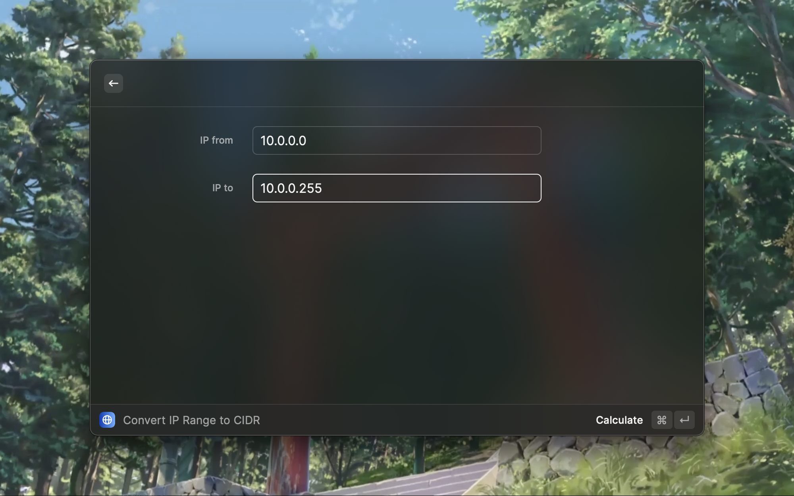
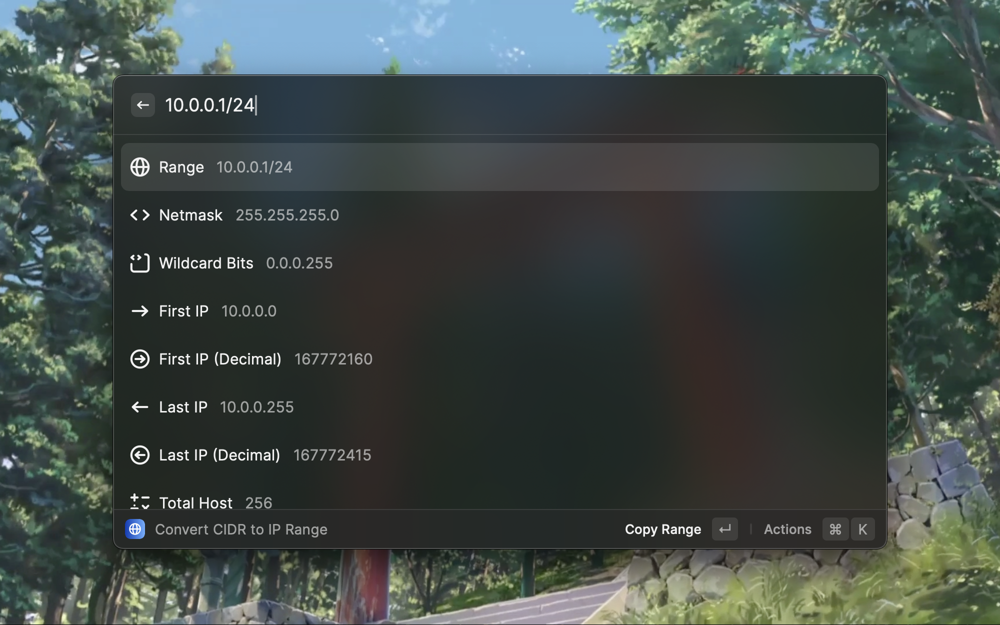

# CIDR to IPv4 info





## description

Input one CIDR string, and it will help you convert it to more detailed info.

## Example

### Convert CIDR to IP range

input: `10.0.0.0/24`

output:

| header         | content         |
| -------------- | --------------- |
| `range`        | `10.0.0.0/24`   |
| `netmask`      | `255.255.255.0` |
| `wildcardBits` | `0.0.0.255`     |
| `firstIp`      | `10.0.0.0`      |
| `firstIpInt`   | `167772160`     |
| `lastIp`       | `10.0.0.255`    |
| `lastIpInt`    | `167772415`     |
| `totalHost`    | `256`           |

### Convert IP range to CIDR

input:

- `10.0.0.0`
- `10.0.0.255`

output:

```markdown
## Result:

- 10.0.0.0/32
```
