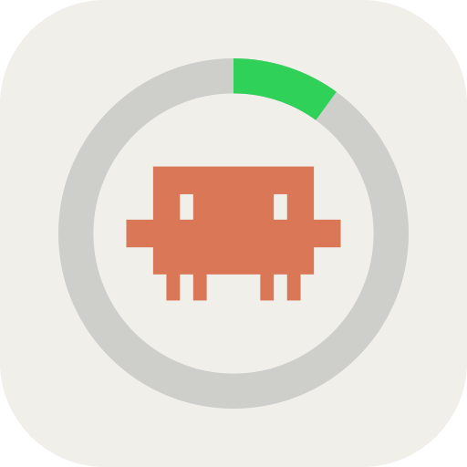

  

<h1 align="center">Claude Code Usage</h1>

  Monitor your Claude Code rate limits, session quotas, and extra usage spending in real time — right from your macOS menu bar or inside Raycast.

  
  
  

## Features

- **Menu Bar Monitor**: Live metrics right in your menu bar with customizable styles (icon, percentage, spent amount) and smart metric auto-selection (session, weekly, or spend).
- **Detailed Dashboard**: Comprehensive breakdown of your 5-hour rolling session, 7-day quota, 7-day Sonnet limit, and countdown reset timers.
- **Extra Usage & Spend**: Real-time spending versus your monthly budget limit in your local currency.
- **Account Details**: Plan type (Pro, Team, Enterprise, Max), organization, rate limit tier, and account email.
- **Background Sync**: Automatic background refresh with resilient offline cache fallback.

## Getting Started

1. Run **View Usage** or **Menu Bar Usage** in Raycast.
2. Click **Sign In with Claude…** and authorize in your browser.
3. Return to Raycast — your live metrics are immediately available!

> **Note**: Requires an active Claude subscription (Pro, Team, or Enterprise). To track extra usage spend, ensure Extra Usage is enabled in your [Claude Settings](https://claude.ai/settings/usage).

## Commands

| Command | Mode | Description |
| :--- | :--- | :--- |
| **Menu Bar Usage** | Menu Bar | Displays live usage, limits, and countdown reset timers in your menu bar. |
| **View Usage** | View | Detailed dashboard view with progress bars, plan info, and reset details. |

## Privacy & Security

- **Direct Communication**: Connects directly to official Anthropic API endpoints. No intermediate servers or proxies.
- **Local Storage**: OAuth tokens are stored locally on your machine using Raycast's sandboxed storage.
- **No Analytics**: Zero telemetry, tracking, or third-party data collection.