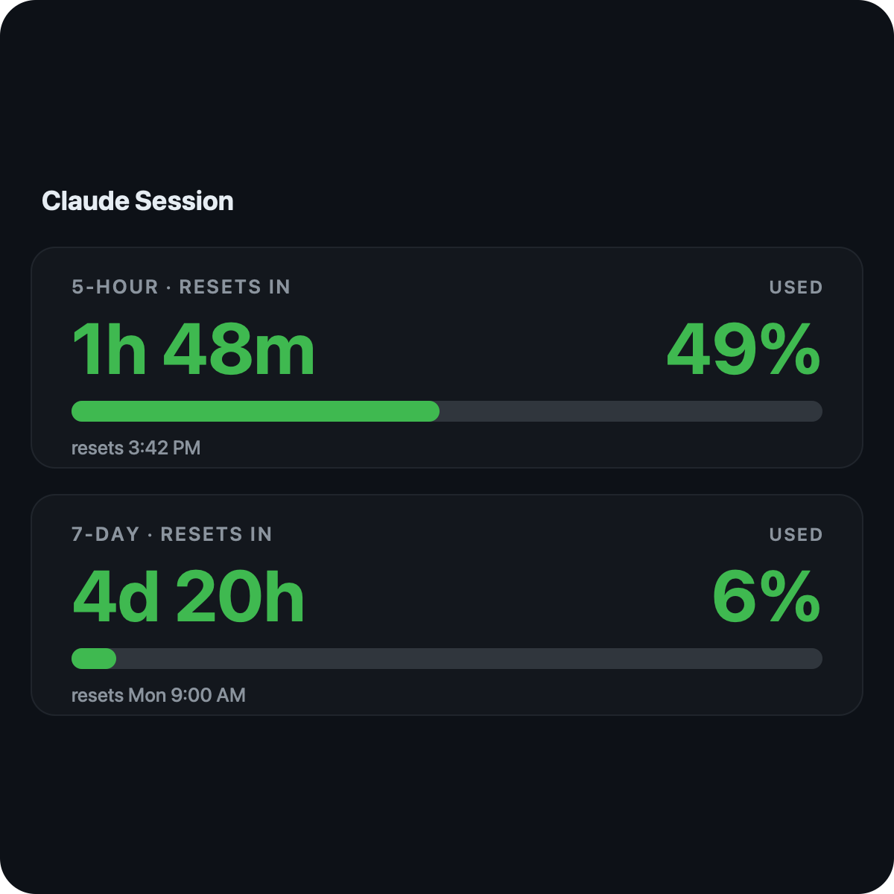
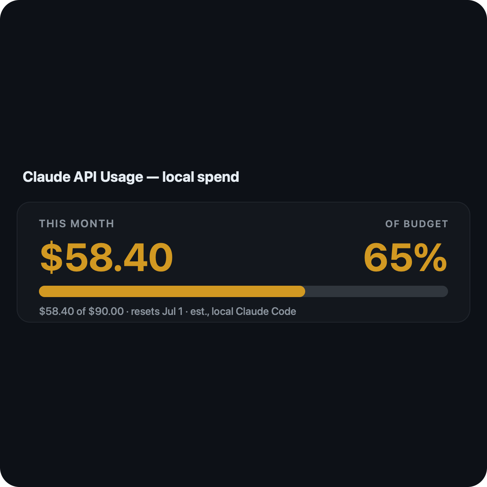
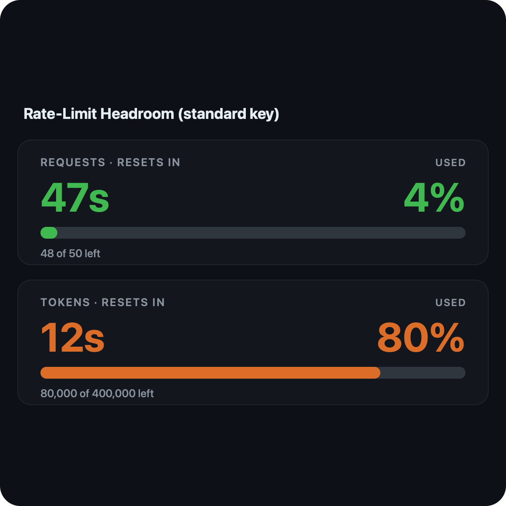

# Claude Gauge

마우스 없이 키보드만으로 쓰는 Claude 사용량 Raycast 대시보드 — 구독 한도, 로컬 Claude Code 비용, Anthropic API 사용량을 모두 단축키로 확인합니다.

**[English](README.md) · [한국어](README.ko.md)**

[](https://github.com/sponsors/zzaisang)
[](./LICENSE)

## 스크린샷

| Claude Session | Claude API Usage | Rate-Limit Headroom |
| --- | --- | --- |
|  |  |  |

## 무엇을 하나요

이름 또는 단축키로 실행하는 두 개의 Raycast 명령:

- **Claude Session** — Claude **구독** 사용량: 5시간·7일 한도와 리셋 카운트다운, 활성 블록의 번레이트 요약, 이번 주 토큰.
- **Claude API Usage** — Anthropic API 토큰·비용. 키가 없으면 로컬 Claude Code 비용(추정치)을, API 키가 있으면 조직 청구 사용량(**Admin** 키) 또는 레이트리밋 여유(**표준** 키)를 보여 줍니다.

## 설치

아직 Raycast 스토어에 없습니다 — 소스에서 실행하세요:

```sh
npm install
npm run dev
```

`npm run dev`를 켜 둔 채로 Raycast에서 **Claude Session** 또는 **Claude API Usage**를 실행합니다.

## 설정

- **Claude Session**은 Claude Code 상태줄이 기록하는 작은 캐시에서 한도를 읽습니다. 첫 실행 시 1회용 **Set Up Status Line** 액션이 나옵니다 — 누르고, Claude Code를 한 번 실행한 뒤 **⌘R**을 누르세요. 정상적인 1회 설정 단계이며 에러가 아닙니다. (`jq` 필요)
- **Claude API Usage**는 키 없이도 동작합니다(로컬 추정치). 더 보려면 **⌘,** 로 환경설정을 열고 **Anthropic API 키**를 넣으세요 — 조직 청구 사용량은 Admin 키(`sk-ant-admin01-…`), 레이트리밋 상태는 표준 키(`sk-ant-api…`).

## 환경설정

명령이 선택된 상태에서 **⌘,** 로 엽니다:

- **Anthropic API Key** — 선택. Admin 또는 표준 키(macOS Keychain에 저장).
- **Currency** — USD(기본) 또는 근사 KRW 환산(환율 설정 가능).
- **Monthly Budget (USD)** — API Usage에 비용/예산 게이지를 그립니다.
- **ccusage Runner** — `npx`(기본) 또는 `bunx`.
- **Claude Config Directory** — 기본 `~/.claude`.

## 프라이버시

Claude Session은 완전히 로컬입니다. Claude API Usage는 API 키를 설정했을 때만 `api.anthropic.com`에 접속하며, 키는 macOS Keychain에 저장됩니다. 로컬 비용 수치는 `ccusage` 추정치이며 실제 청구액이 아닙니다.

## 후원

Claude Gauge는 무료이며 MIT 라이선스입니다. 도움이 되었다면 개발을 후원할 수 있습니다:

[](https://github.com/sponsors/zzaisang)

## 라이선스

[MIT](./LICENSE)
