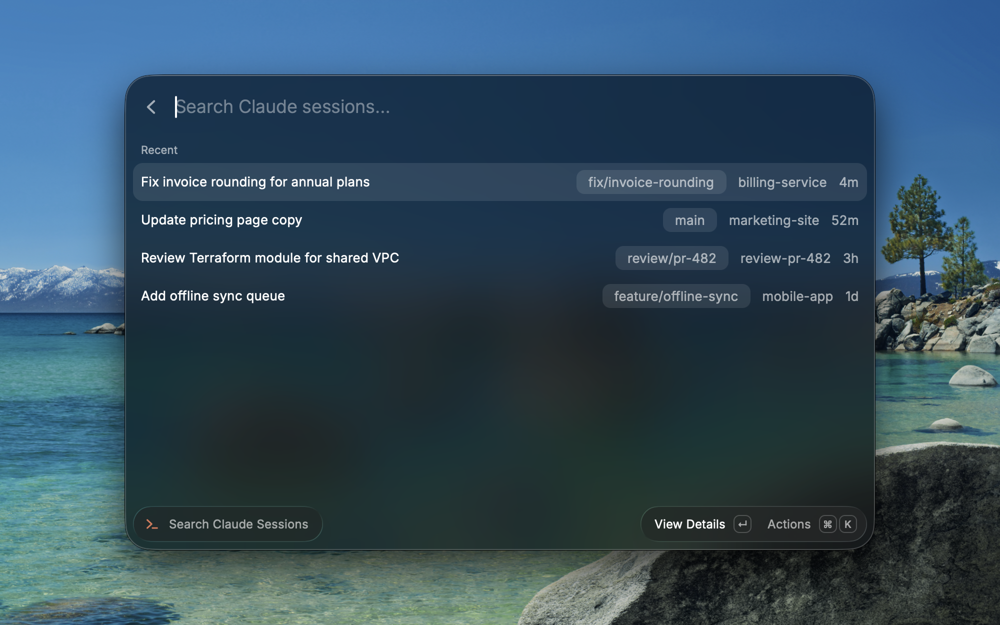

# Claude Sessions

Search, pin, and resume your [Claude Code](https://claude.com/claude-code) sessions from Raycast.

## Screenshots



## Requirements

- The `claude` CLI must be installed and on your `PATH`.
- macOS only — session resumption relies on AppleScript and app-specific terminal integrations.

## How it works

The extension reads session history from `~/.claude/projects`, letting you search by session title,
project, or branch. Selecting a session opens a detail view with its last exchange; resuming from
there launches your chosen terminal app and runs `claude --resume <session-id>` in that session's
original working directory.

## Install without the Raycast Store

If you'd rather not wait for the Store listing (or just want to run it from source):

```bash
git clone https://github.com/imranismail/raycast-claude-session-manager.git
cd raycast-claude-session-manager
npm install
npm run dev
```

`npm run dev` builds the extension and registers it with Raycast as a development
extension — it'll show up in Raycast's root search as **"Search Claude Sessions"**
(marked with a "Development" badge) as soon as the build finishes. Once it appears,
you can stop the command (`Ctrl+C`) — the extension stays installed and usable;
you only need `npm run dev` running again if you want to make further changes
with live reload.

To update later, `git pull` and run `npm run dev` again to rebuild.

## Preferences

- **Terminal** — the app used to resume a session. Terminal.app, iTerm, and Ghostty run the resume
  command automatically. Any other terminal app opens at the session's folder with the resume
  command copied to your clipboard to paste in yourself.
