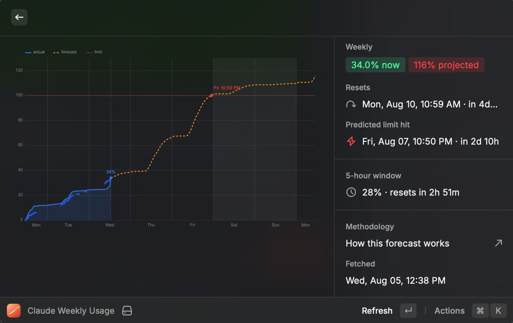

# Claude Usage Forecast

Raycast extension that shows how much of your **weekly Claude Code rate limit** you have burned, and predicts **when you will hit 100%** based on your own weekday rhythm.

## Why not just use ccusage

`ccusage` counts tokens in your local transcripts. Your weekly limit is a server-side, model-weighted budget — token totals correlate with it but drift, so a token-only forecast disagrees with what `/usage` reports.

This extension uses both, for the thing each is actually good for:

| Source | Used for |
| --- | --- |
| `api.anthropic.com/api/oauth/usage` | the **real** current utilization % and the exact reset time |
| `~/.claude/projects/**/*.jsonl` | the **shape** of usage — which hours and weekdays you actually work |

The two are stitched with one calibration constant:

```
k = utilizationNow / costInsideThisWindowSoFar     [% per $]
```

so the absolute accuracy of the local cost model is irrelevant — only the ratios between models and token kinds matter, and the displayed percentage always matches Claude Code.

## Forecast model

- **Day-of-week profile** — weighted mean cost per weekday over the lookback window, with a 21-day half-life so recent weeks dominate. Days with zero usage count (a quiet Sunday is signal). Each weekday's single largest day is dropped once there are 5+ observations, so one runaway session cannot skew the pattern.
- **Hour-of-day profile** — normalized share of a day's usage per local hour, so a forecast made at 09:00 knows most of the day is still ahead, and one made at 22:00 knows it is not.
- **Projection** — walks forward hour by hour to the reset, accumulating `k × dowWeight × hourWeight`, and reports the first hour that crosses 100%.

## Commands

- **Claude Usage Menu Bar** — `87%` in the menu bar, green/orange/red by threshold. Refreshes every 10 minutes; **this background poll is what builds the real observation history**, since the API only ever reports "right now".
- **Claude Weekly Usage** — SVG graph (actual, forecast, limit, weekend shading, predicted crossing), per-day table for the current window, and your learned weekly pattern.
- **Claude Forecast Methodology** — a read-only view of how the forecast is built: real vs projected split, the day-by-day breakdown, and what was learned per weekday and per hour.

## Screenshots




## Getting started (local development)

### Prerequisites

- **macOS** with the [Raycast](https://raycast.com) app installed and open.
- **Node.js 22** (this repo is developed on `22.22`). `nvm use 22` if you use nvm.
- A **signed-in Claude Code** (`claude`) — the extension reads the OAuth token from the Keychain item `Claude Code-credentials`, or `~/.claude/.credentials.json` as a fallback. Nothing is sent anywhere except the usage endpoint.

### Run the dev server

```bash
git clone <this-repo>
cd claude-usage-forecast
npm install      # .npmrc enforces a 3-day min-release-age on packages
npm run dev      # ray develop — builds, hot-reloads, and registers the extension with Raycast
```

`npm run dev` runs the Raycast CLI in watch mode: it compiles the extension, injects it into your local Raycast, and recompiles on every save. **Leave it running** while you work — the three commands appear in Raycast search immediately.

Then in Raycast:

1. Search **Claude Usage Menu Bar** and run it once to enable the menu-bar command. This is also the background poll that **builds the real observation history** (the API only ever reports "right now"), so let it tick a few times.
2. Search **Claude Weekly Usage** for the graph, or **Claude Forecast Methodology** for the breakdown.
3. Adjust behaviour under **Extensions → Claude Usage Forecast** (see [Preferences](#preferences)).

Stop the dev server with `Ctrl-C`; the extension stays installed in Raycast until you remove it from the Extensions list.

### Scripts

| Script | What it does |
| --- | --- |
| `npm run dev` | `ray develop` — hot-reloading dev server (primary workflow) |
| `npm run build` | `ray build -e dist` — production build into `dist/` |
| `npm run lint` | `ray lint` — ESLint + Prettier check |
| `npm run fix-lint` | `ray lint --fix` — auto-fix lint issues |

### Project layout

```
src/
  menu-bar.tsx        menu-bar command (background poll + history capture)
  weekly-usage.tsx    graph view command
  methodology.tsx     methodology view command
  lib/
    usage-api.ts      calls api.anthropic.com/api/oauth/usage, reads the OAuth token
    load.ts           orchestrates a full read: API + history + forecast
    history.ts        scans ~/.claude/projects/**/*.jsonl (cached by size + mtime)
    jsonl.ts          streaming JSONL parser
    pricing.ts        model / token-kind cost weights
    forecast.ts       day-of-week + hour-of-day model and projection
    chart.ts          SVG chart rendering
    types.ts          shared types
```

`package.json` declares the three `commands` and all user `preferences`; `raycast-env.d.ts` is generated from it by the Raycast CLI — do not edit it by hand.

## Preferences

| Preference | Default | Notes |
| --- | --- | --- |
| History Lookback (days) | 70 | How far back to learn the weekday pattern |
| Warn / Danger Threshold | 75 / 90 | Menu bar colour |
| Chart Rendering | SVG data URI | Switch to *temp file* or *text blocks* if the image does not render |
| Menu Bar Title | Weekly % | Or `% → projected %`, or `%` + sparkline |

## Caveats

- The forecast assumes next week looks like recent weeks. A day off or an unusually heavy session moves it.
- Only calendar days present in the transcripts feed the pattern; with under 14 days of history the extension says so.
- Scoped Opus / Sonnet weekly quotas are shown when the API reports them, but the forecast tracks the overall weekly limit.
- The first scan reads every transcript touched in the lookback window (a few seconds on a large `~/.claude`). Results are cached per file by size and mtime, so later runs are near-instant.
