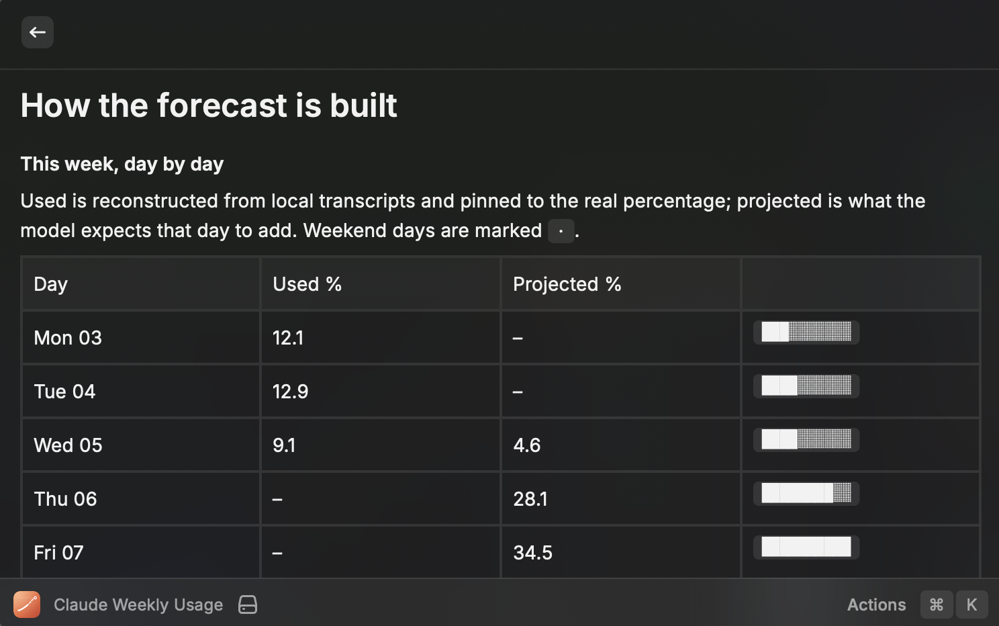

# Claude Usage Forecast

Raycast extension that shows how much of your **weekly Claude Code rate limit** you have burned, and predicts **when you will hit 100%** based on your own weekday rhythm.

## Requirements

- **macOS**, with a **signed-in Claude Code** (`claude`).
- The extension reads your OAuth token from the Keychain item `Claude Code-credentials`, falling back to `~/.claude/.credentials.json`. Nothing leaves your machine except the request to Anthropic's own usage endpoint.

## Commands

- **Usage Menu Bar** — `87%` in the menu bar, green/orange/red by threshold. Refreshes every 10 minutes; **this background poll is what builds the real observation history**, since the API only ever reports "right now".
- **Weekly Usage** — SVG graph (actual, forecast, limit, weekend shading, predicted crossing), per-day table for the current window, and your learned weekly pattern.
- **Forecast Methodology** — a read-only view of how the forecast is built: today's live estimate and what moved it, the day-by-day breakdown, and what was learned per weekday and per hour.

## Screenshots




## Why not just use ccusage

`ccusage` counts tokens in your local transcripts. Your weekly limit is a server-side, model-weighted budget — token totals correlate with it but drift, so a token-only forecast disagrees with what `/usage` reports.

This extension uses both, for the thing each is actually good for:

| Source | Used for |
| --- | --- |
| `api.anthropic.com/api/oauth/usage` | the **real** current utilization % and the exact reset time |
| `~/.claude/projects/**/*.jsonl` | the **shape** of usage — which hours and weekdays you actually work |

The two are stitched with one calibration constant:

```
k = utilizationNow / costInsideThisWindowSoFar     [% per $]
```

so the absolute accuracy of the local cost model is irrelevant — only the ratios between models and token kinds matter, and the displayed percentage always matches Claude Code.

## Forecast model

- **Day-of-week profile** — weighted mean cost per weekday over the lookback window, with a 21-day half-life so recent weeks dominate. Days with zero usage count (a quiet Sunday is signal). Each weekday's single largest day is dropped once there are 5+ observations, so one runaway session cannot skew the pattern.
- **Hour-of-day profile** — normalized share of a day's usage per local hour, so a forecast made at 09:00 knows most of the day is still ahead, and one made at 22:00 knows it is not.
- **Live correction, today** — the weekday weight is only a prior. What matters is the *pattern* of a day, not its position in the week: today is re-classified by its own pace (spend so far ÷ share of a usual day elapsed), blended geometrically with the prior. The pace's share of the blend grows as the day goes on, passing half around mid-morning — once 15% of a usual day's usage has elapsed. A quiet Wednesday that turns intensive is forecast as an intensive day within the hour; a normally busy day that stays idle stops predicting a busy day. On a weekday that is normally idle there is no prior to blend against, so the pace is used alone and scaled down instead.
- **Live correction, rest of week** — the same ratio one level up, from *completed* days in the window only, so today's shift is never counted twice. A week running hot keeps running hot.
- **Day ceiling** — both corrections are capped at the recency-weighted 90th percentile of your active days plus 15% headroom (or, with fewer than five active days on record, your heaviest single day plus the same headroom), and never below what today already spent. Today can be told it looks like your heaviest kind of day, not like a day you have never had.
- **Projection** — walks forward hour by hour to the reset, accumulating `k × dayWeight × hourWeight`, and reports the first hour that crosses 100%.

The **Forecast Methodology** command shows all of this against your own current numbers.

## Preferences

| Preference | Default | Notes |
| --- | --- | --- |
| History Lookback (days) | 70 | How far back to learn the weekday pattern |
| Warn / Danger Threshold | 75 / 90 | Menu bar colour |
| Chart Rendering | SVG data URI | Switch to *temp file* or *text blocks* if the image does not render |
| Menu Bar Title | Weekly % | Or `% → projected %`, or `%` + sparkline |

## Caveats

- The forecast assumes next week looks like recent weeks, corrected by how this week and today are actually going. The live correction assumes a day's *shape* is normal even when its size is not — a day that is heavy only because you started six hours earlier than usual reads as heavier than it will end up.
- Only calendar days present in the transcripts feed the pattern; with under 14 days of history the extension says so.
- Transcripts only cover this machine. Usage from the web app or another device shows in the real percentage but not in the learned pattern.
- Scoped Opus / Sonnet weekly quotas are shown when the API reports them, but the forecast tracks the overall weekly limit.
- The first scan reads every transcript touched in the lookback window (a few seconds on a large `~/.claude`). Results are cached per file by size and mtime, so later runs are near-instant.

## Development

See [CONTRIBUTING.md](CONTRIBUTING.md) for local setup, scripts, and project layout.
