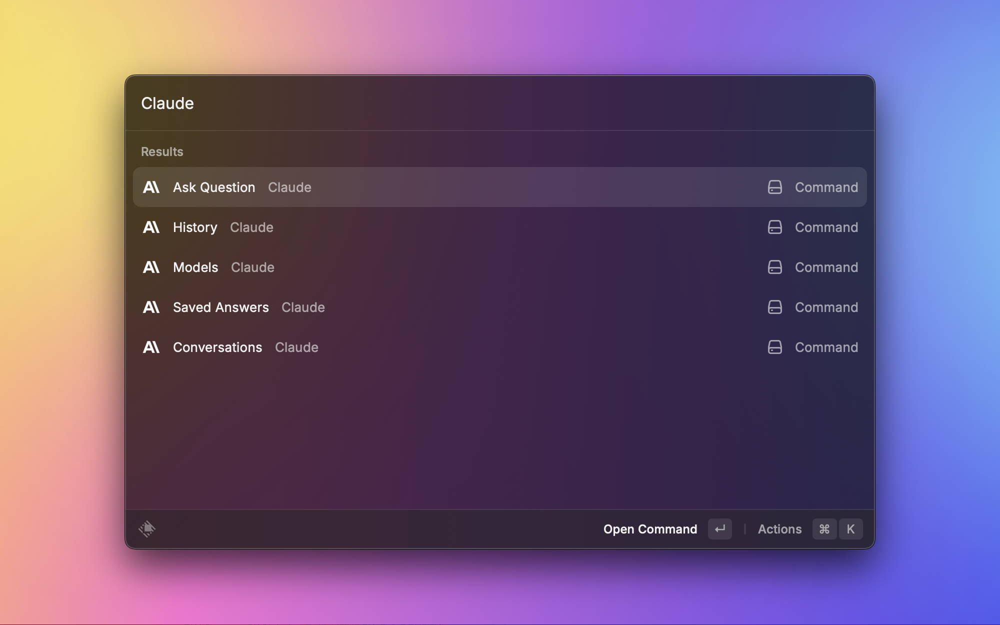
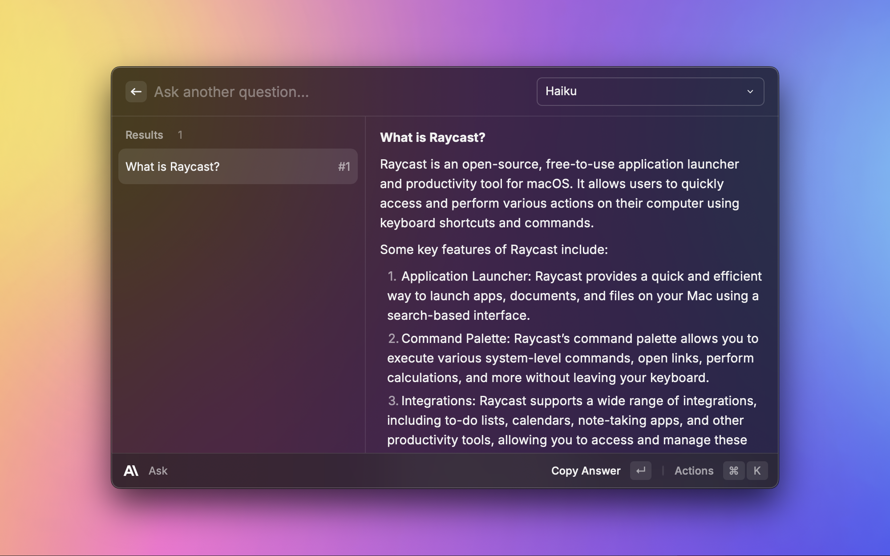
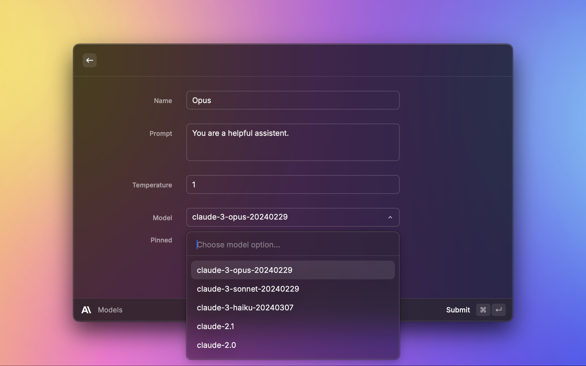
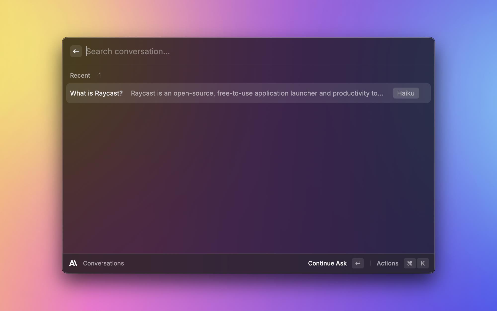
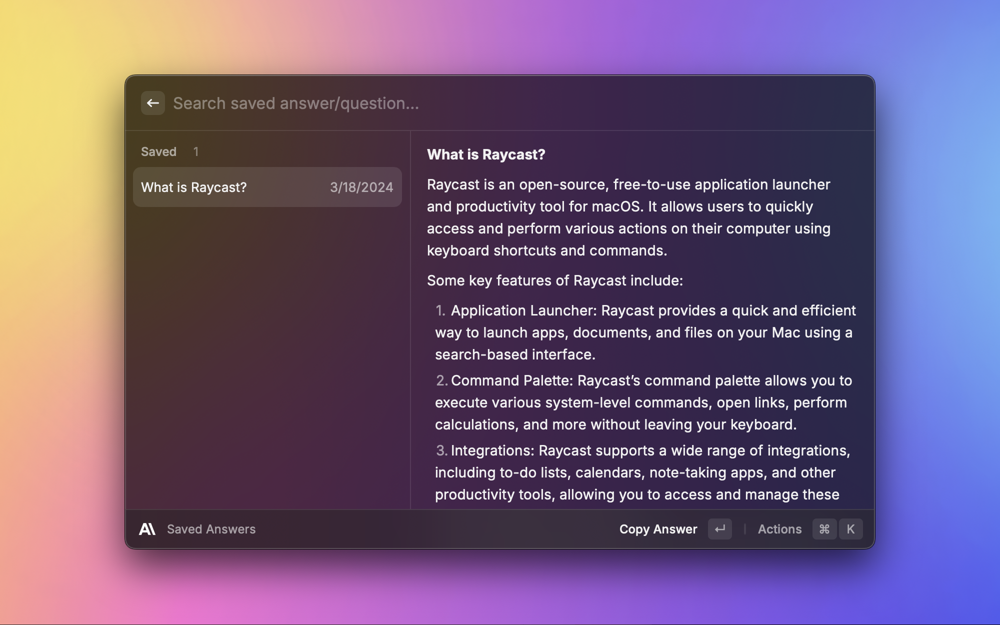
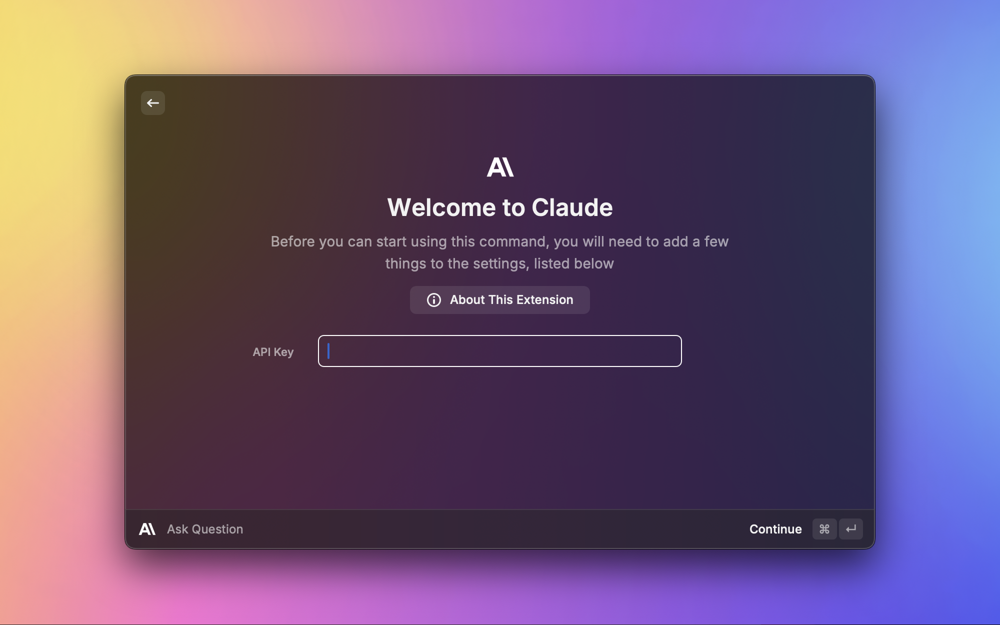

<h1 align="center">Claude by Anthropic</h1>

<h3 align="center">
Interact with Anthropic's Claude right from your command bar
</h3>

<a href="https://github.com/raycast/extensions/tree/main/extensions/claude" title="Claude Raycast extension latest source code">Latest source code
</a>

# Features

## Ask anything

Straight from your command bar, ask anything you want answered.

## Personalized for you

Customize the model to your liking.

## Continue talking

Continue talking, right from where you left off.

## Save answers

Got the answer that you wanted? Great.

# Models available

## Claude 4

- `claude-sonnet-4-20250514`

## Claude 3.7

- `claude-3-7-sonnet-latest`
- `claude-3-7-sonnet-20250219`

## Claude 3.5

- `claude-3-5-haiku-latest`
- `claude-3-5-haiku-20241022`
- `claude-3-5-sonnet-latest`
- `claude-3-5-sonnet-20241022`
- `claude-3-5-sonnet-20240620`

## Claude 3

- `claude-3-haiku-20240307`
- `claude-3-sonnet-20240229`
- `claude-3-opus-20240229`

## Claude 2

- `claude-2.0`
- `claude-2.1`

# How to use

This package requires a valid API key from [Anthropic](https://docs.anthropic.com/claude/reference/getting-started-with-the-api).

> All the preferences value will be stored locally using [Preferences API](https://developers.raycast.com/api-reference/preferences)

# Preferences

All preferences properties list that can be customize through `Raycast Settings > Extensions > Claude`

| Properties               | Label                  | Value                               | Required | Default | Description                                                                                                      |
| ------------------------ | ---------------------- | ----------------------------------- | -------- | ------- | ---------------------------------------------------------------------------------------------------------------- |
| `apiKey`                 | API Key                | `string`                            | `true`   | `empty` | Your personal Anthropic API key |
| `useStream`              | Stream Responses        | `boolean`                           | `true`   | `true`  | Stream responses from Claude in real-time |                                                                         
| `isAutoLoadText`         | Auto-load              | `boolean`                           | `false`  | `false` | Load selected text from your front most application to the `question bar` or `full text input form` automatically |
| `isAutoFullInput`        | Use Full Text Input    | `boolean`                           | `false`  | `false` | Switch to `full text input form` from `question bar` automatically whenever you want to ask or type a question   |
---
