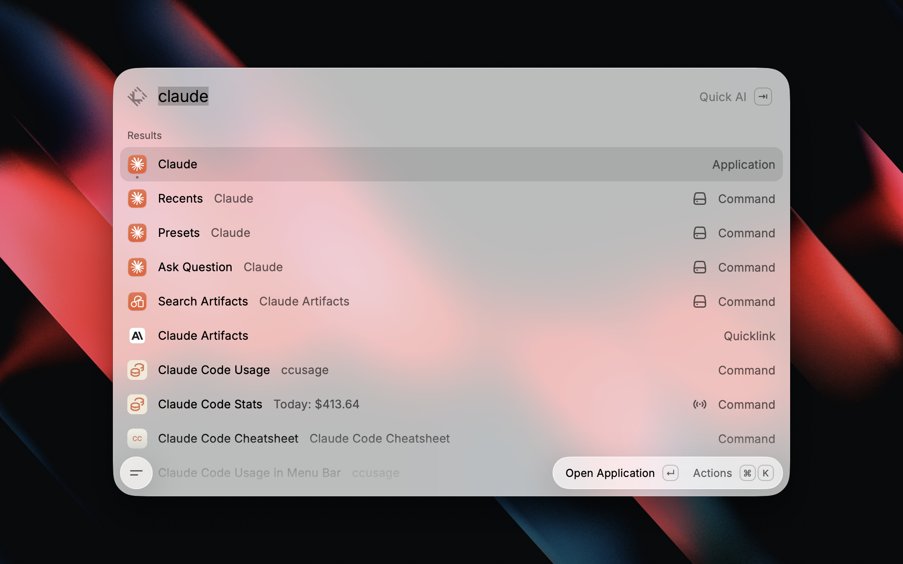
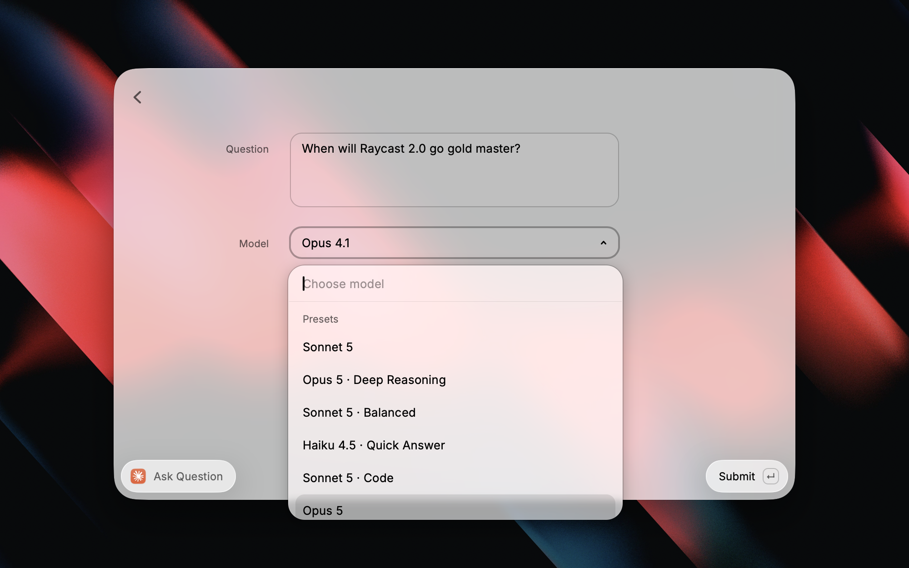
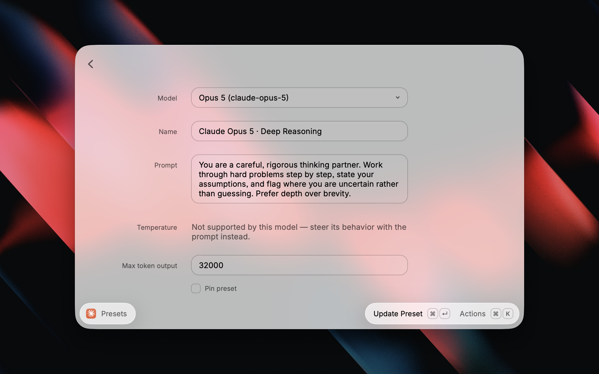
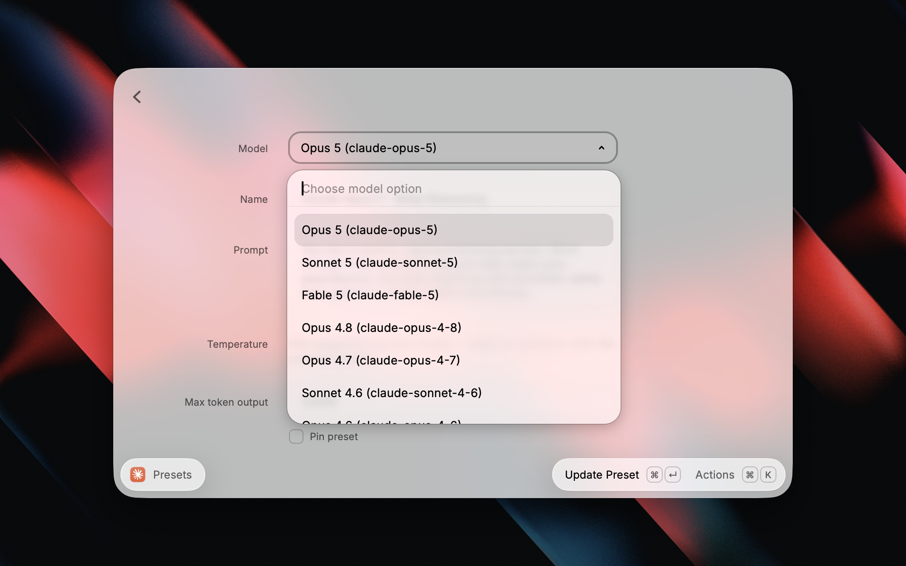
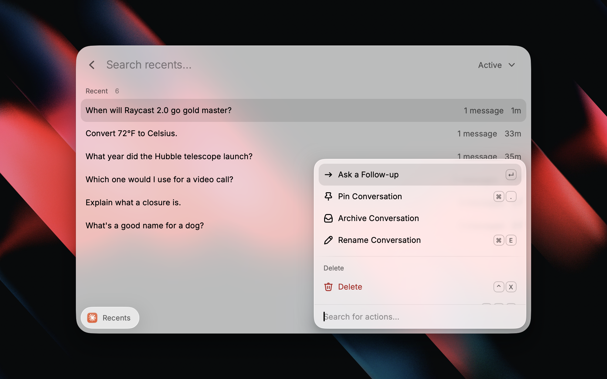
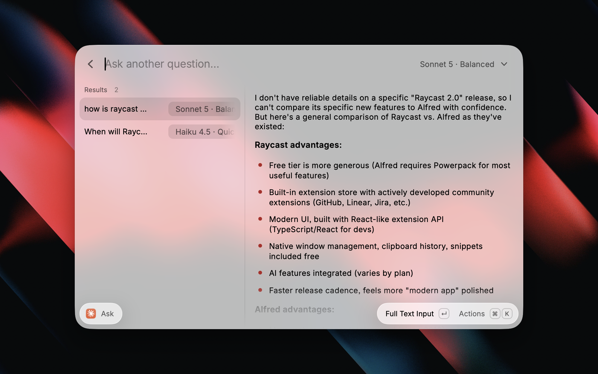
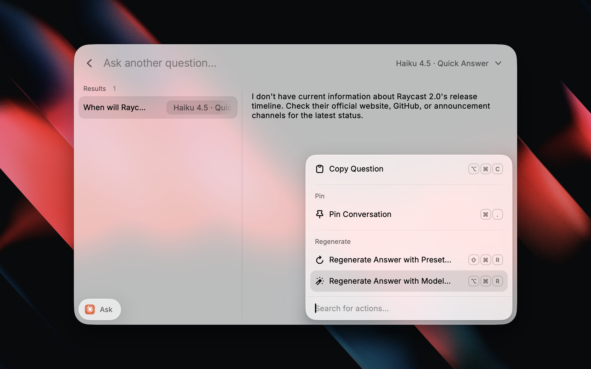

<h1 align="center">Claude by Anthropic</h1>

<h3 align="center">
Interact with Claude right from Raycast
</h3>

# Features

## Ask anything

Straight from your command bar, ask anything you want answered.

## Personalized for you

Customize the model to your liking.

Each preset pairs a model with a system prompt, temperature, and output limit. The model
picker also offers every model your key can reach, so you can ask a one-off question
without creating a preset for it.

## Continue talking

Continue talking, right from where you left off. **Recents** replaces the old
Conversations command, and folds in Saved Answers and History — pin, archive, rename, or
delete a conversation right from the list, with an Active/Archived/All filter.

Ask a follow-up in an existing conversation — the new answer is selected as it streams,
and each turn shows the model or preset it was asked with.

Not happy with an answer? Regenerate it with a different preset or model — the new answer
is appended, so you keep both and can compare.

## Exporting your history

Deleting a conversation in Recents is permanent — it's removed everywhere, including
anything carried over from an earlier version, with nothing left behind to recover. **Export History to
JSON** (⌘⇧E) writes every conversation — active and archived, regardless of the current
filter — to a timestamped file in your Downloads folder before you delete anything, or
just to keep a copy of your data. There is no import for this file yet; it's export only.

If Recents ever comes up empty when it shouldn't, that same shortcut offers **Export
Stored Data to JSON** instead, which writes everything the extension has in storage —
including anything an upgrade could not fully read and set aside — so your conversations
are recoverable by hand rather than only visible through a list that isn't showing them.

# Models and presets

Models are fetched live from the Anthropic API, so new releases appear without an
extension update. The model picker has two sections:

- **Presets** — a saved model pairing: a system prompt, temperature, and max output
  tokens. The extension ships starter presets (Deep Reasoning, Balanced, Quick Answer,
  Code) built from the newest Opus, Sonnet, and Haiku your account can access. Manage
  them with the **Presets** command.
- **Models** — every model available to your API key, for a one-off question using the
  default prompt.

## Backing up and sharing presets

Presets can leave the extension as a YAML file and come back in, so you can keep a backup,
edit them in a text editor, or move them to another machine. Both actions live in the
**Presets** command:

- **Export Presets to YAML** (⌘⇧E) writes every preset — name, model, system prompt,
  temperature, and max output tokens — to a file you choose.
- **Import Presets…** (⌘⇧I) reads one back. When a preset in the file has the same name as
  one you already have, the importer asks what to do rather than overwriting silently:
  skip the incoming one or replace yours. Whichever you choose applies to every name
  collision in that file, and the result is reported as a tally.

The importer also accepts a **Raycast Agent JSON** file, mapping each agent's instructions
and model onto a preset. Treat this as provisional: it is built from sample export files
rather than a verified round trip against Raycast itself, so an agent file whose shape
differs may import incompletely. Plain YAML is the supported path, and there is no Agent
JSON export — only import.

# How to use

This extension requires a valid Anthropic API key. Create one at
[console.anthropic.com/settings/keys](https://console.anthropic.com/settings/keys).

> All the preferences value will be stored locally using [Preferences API](https://developers.raycast.com/api-reference/preferences)

# Preferences

All preferences properties list that can be customize through `Raycast Settings > Extensions > Claude`

| Properties        | Label               | Value     | Required | Default | Description                                                                                                       |
| ----------------- | ------------------- | --------- | -------- | ------- | ----------------------------------------------------------------------------------------------------------------- |
| `apiKey`          | API Key             | `string`  | `true`   | `empty` | Create a key at console.anthropic.com/settings/keys, then paste it here.                                          |
| `useStream`       | Stream Responses    | `boolean` | `true`   | `true`  | Stream responses from Claude in real-time                                                                         |
| `isAutoLoad`      | Auto-load           | `boolean` | `false`  | `false` | Load selected text from your front most application to the question bar automatically                             |
| `isAutoFullInput` | Full Text Input     | `boolean` | `false`  | `false` | Always start questions in the multi-line form instead of the search bar                                           |
