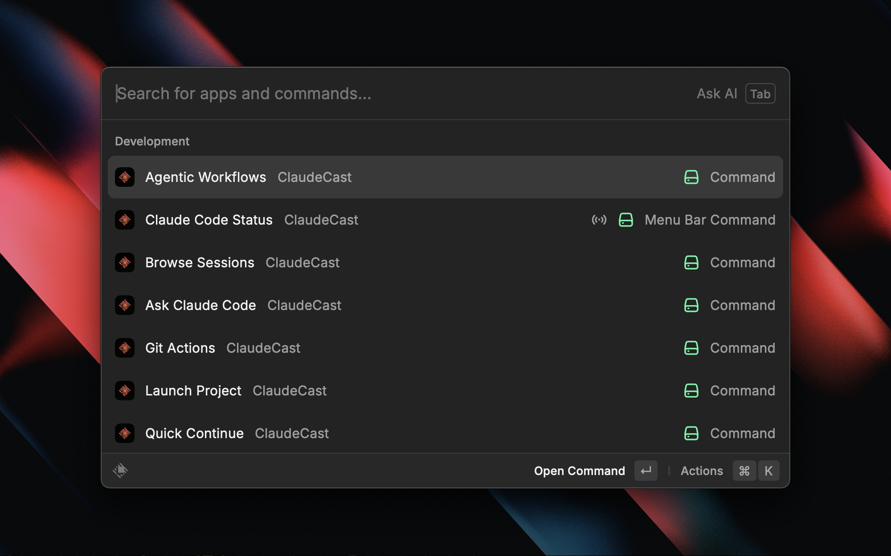
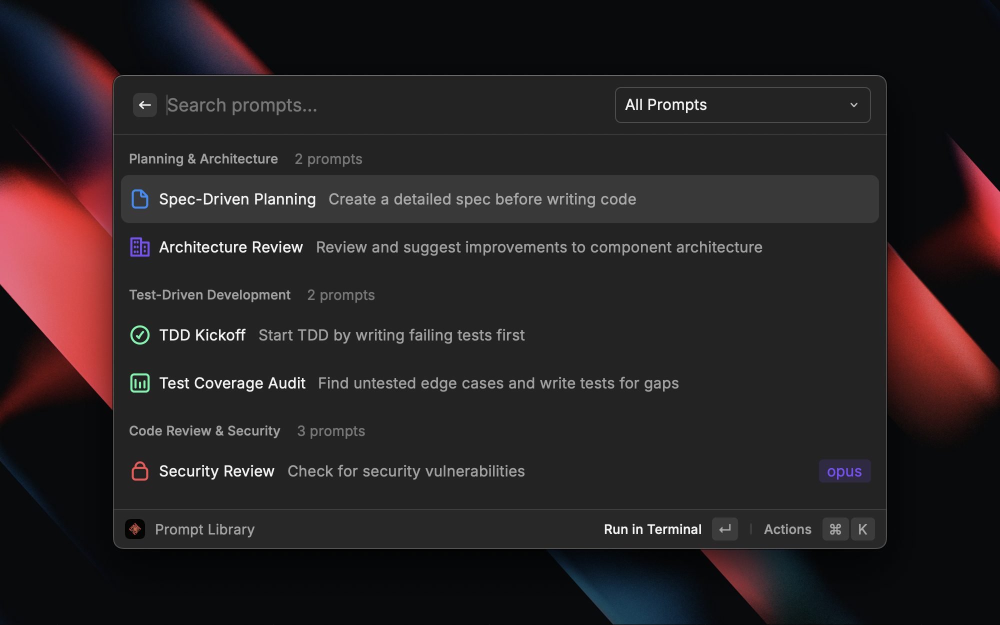
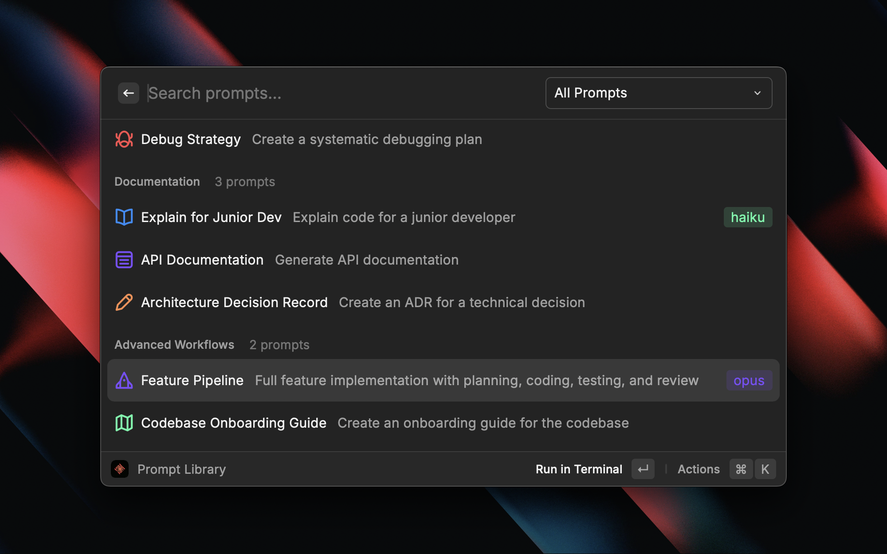
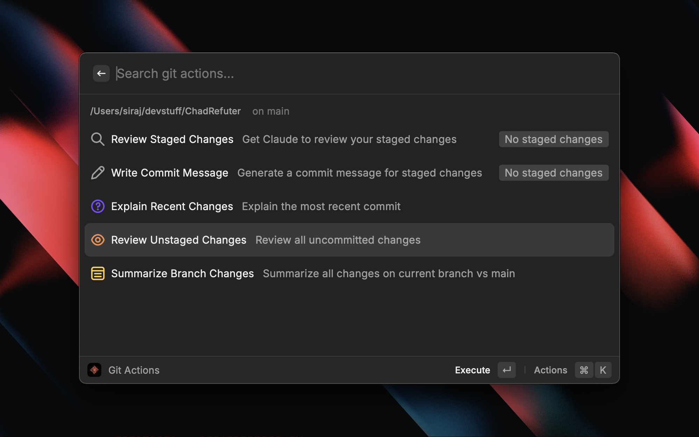
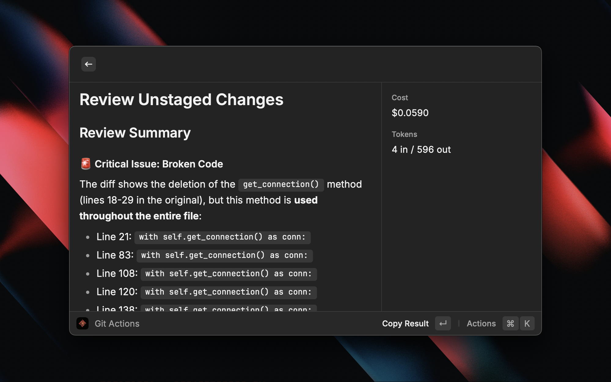
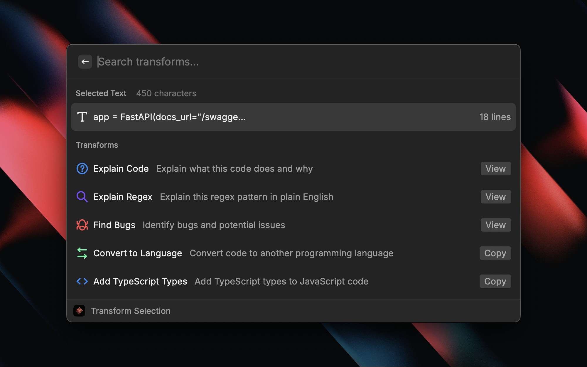
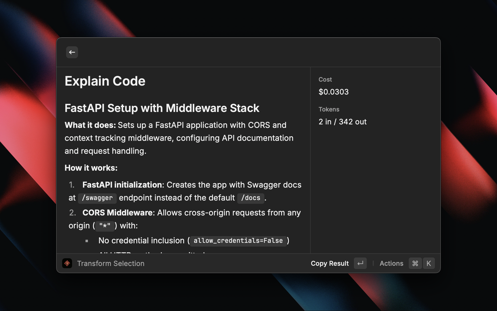

<p align="center">
  
</p>

<h1 align="center">ClaudeCast</h1>

<p align="center">
  <strong>Discover, resume, and automate Claude Code sessions</strong><br>
  Background agent control, deep session search, one-keystroke resume, agentic loops, usage analytics, and quick prompts on macOS and Windows.
</p>



---

## Features

### Manage Agents

Dispatch and control Claude Code's native background agents from one list.

- Separate sections for agents that need input, are working, completed, stopped, failed, or running in a foreground terminal
- Safe background dispatch with project, name, model, effort, and permission settings
- View logs, attach in a terminal, stop, restart, or remove a background agent
- Respects Claude Code's background-isolation setting, which uses worktrees by default in Git repositories
- Manual refresh avoids running a Claude CLI process every few seconds

Manage Agents requires Claude Code 2.1.169 or later and uses the CLI's own login and billing source. Saved ClaudeCast API credentials are reserved for in-Raycast prompt commands.

### Launch Project

Fast project switching for Claude Code. Browse all your projects with favorites, recents, and session counts.

- Discovers projects from Claude Code history
- Integrates with VS Code recent workspaces
- Launch a new session, start an isolated worktree session, or continue existing work
- Open in VS Code, Finder, or File Explorer
- Manage favorites

### Deep Search Sessions

Full-text search across every Claude Code conversation on disk.

- Stores a versioned search index in Raycast's private support directory
- Reads unchanged transcripts once, then indexes only appended or rewritten content
- Recovers interrupted updates from the last committed corpus boundary
- Removes deleted sessions from results without rescanning the remaining transcripts
- Shows Initial Indexing, Updating Index, and Searching states
- Supports `dir:project-name` and `project:project-name` query filters
- Extracts mentioned file paths and adds Open File actions when the files still exist
- Opens the exact matching message with three bounded messages before and after it
- Keeps duplicate session IDs distinct by transcript path
- Embeds screenshots only when their real paths remain inside approved transcript or project roots
- Bounds result count, match snippets, transcript context, JSONL lines, and corpus segments
- Debounced search with cancellation when the query changes
- Resume, fork, or delete any matched session in place
- Cleans `<local-command-*>` and short slash-only prompts out of the result list

### Permission Inbox

Handle Claude questions, tool permissions, plan approval, and agent waiting states through Raycast.

- Install or repair the ClaudeCast hooks from the Permission Inbox command
- Answer single-choice, multi-select, and freeform questions in one form
- Allow a tool or deny it with a required reason
- Approve, deny, or defer an `ExitPlanMode` request
- Open Manage Agents from an `agent_needs_input` request
- Keep concurrent mixed requests in a first-in queue
- Use each event's current documented Claude hook response contract
- Write request and response files atomically with random request IDs and nonces
- Return a clear failure to Claude when Raycast is unavailable or no answer arrives within five minutes
- Preserve every existing Claude hook and create a one-time settings backup before the first install

The installer edits the selected Claude config directory's `settings.json`. Uninstall removes ClaudeCast's command handler and leaves other hook events, matchers, commands, and settings unchanged.

### Browse Sessions

Use one session inbox for Claude CLI transcripts and validated metadata from Claude Desktop, VS Code, and Conductor.

- Filter by project
- Show source, branch, workspace, title, and archive metadata when available
- Keep duplicate session IDs from separate transcript paths visible
- Inline conversation preview with the most recent 20 messages and a "Showing last N of M messages" notice for long sessions
- Resume, fork, or delete sessions
- See cost and token usage per session
- Restores the original permission mode and model on resume

### Agentic Workflows

Curated collection of production-tested prompts with variable substitution.



**Categories**

- Planning & Architecture
- Test-Driven Development
- Code Review & Security
- Refactoring
- Debugging
- Documentation
- Advanced Multi-Step Workflows



### Ralph Loop

Autonomous agentic execution that breaks down complex tasks and runs them with fresh context per iteration.


**How It Works**

1. Describe your task and requirements
2. Claude creates a plan with atomic, self-contained tasks
3. Each task runs in a fresh Claude session (~176K tokens available)
4. Watch Claude work with full TUI visibility
5. Resume anytime if max iterations reached

**Features**

- Fresh context per task prevents degradation at high token counts
- Full terminal UI visibility during execution
- Graceful stop by creating `.ralph/stop`
- Resume on macOS with `bash .ralph/resume.sh 10`
- Resume on Windows with `powershell -ExecutionPolicy Bypass -File .ralph\resume.ps1 10`

### Git Actions

Git-aware Claude Code workflows for common tasks.



- Review staged changes
- Generate commit messages
- Explain recent diffs
- Review unstaged changes
- Summarize branch changes



### Ask Claude Code

Quick prompt with automatic context capture from VS Code. Select text anywhere, hit the hotkey, and get answers without opening a terminal.

- Auto-detects current project from VS Code
- Captures selected text and clipboard
- Shows git branch context
- Supports all Claude models (Sonnet, Opus, Haiku)
- Continue conversation in terminal

### Transform Selection

One-keystroke code transformations from any app.



- Explain code
- Explain regex
- Find bugs
- Convert to another language
- Add TypeScript types
- Optimize performance
- Add comments
- Write tests



### Quick Continue

One keystroke to continue your last Claude Code session. No UI - just launches directly.

### Menu Bar Monitor

Real-time Claude Code status in your menu bar.

- Active session indicator
- Today's cost and session count
- Quick access to all commands
- Cached five-hour and weekly subscription percentages when configured

Raycast does not expose menu-bar commands on Windows. Windows users can open Manage Agents and Usage Dashboard from Raycast.

### Manage Worktrees

Inspect Git worktrees used by Claude Code and its background agents.

- Read Git's stable NUL-delimited worktree porcelain format
- Show branch, HEAD, lock state, dirty counts, diff summary, agent ownership, and recent activity
- Launch Claude or open the worktree in the system file browser
- Lock and unlock linked worktrees
- Remove only clean, unlocked, non-main worktrees without force
- Preview every prunable record, confirm the exact preview, then reject cleanup if the record set changes
- Limit Git discovery to four child processes and cancel superseded refreshes

### WSL Sessions

Windows users can browse and launch Claude Code histories inside installed WSL distributions.

- Discover non-system distributions from `wsl.exe --list --quiet`
- Read only `$HOME/.claude/projects` after realpath containment checks
- Preserve the WSL distribution and Linux project path with every session
- Open native Windows and WSL sessions in one Browse and Deep Search result set
- Resume, fork, continue, and launch projects through fixed `wsl.exe` argument arrays
- Move large prompts through a private temporary file instead of the Windows process command line
- Map WSL project paths to `\\wsl.localhost` or `\\wsl$` for Windows file actions

### Usage Dashboard

Local cost estimates and server-side Claude subscription limits in one dashboard.

- Five-hour and weekly subscription utilization, remaining percentage, reset time, and refresh age
- Explicit stale-data display when the latest Anthropic request fails
- Periodic local snapshots with bounded 70-day retention
- Weekly exhaustion forecast based on recent local weekday and hour usage rates
- Forecast confidence, sample count, method, and a clear collecting-history state
- A 10-minute network cache shared with the macOS menu bar refresh
- Range tabs adapt the chart granularity: Today/Week (daily bars), Month (weekly), All Time (up to 12 monthly bars)
- Per-range totals, token breakdown (input, output, cache read, cache write)
- Top projects as colored tags; "Cost by Project" and "Top Sessions" tables
- Streaming-chunk dedup so cumulative usage reports match Anthropic's actual billing
- Per-model pricing for Fable 5, limited Mythos 5, Opus 5 through 4.1, Sonnet 5, Haiku, separate 5-minute and 1-hour cache writes, standard Sonnet 4.6 long context, and the legacy Sonnet 4.5 200K-token tier

## Installation

### Prerequisites

1. **Claude Code CLI**: Install the native Claude Code build.

   macOS:

   ```bash
   curl -fsSL https://claude.ai/install.sh | bash
   ```

   Windows:

   ```powershell
   winget install Anthropic.ClaudeCode
   ```

2. **Raycast**: Download from [raycast.com](https://raycast.com)

3. **Node.js 22.22.2 or Later**: Required only when importing or developing ClaudeCast from source.

### Install Extension

1. Clone this repository or download the extension
2. Open Raycast and search for "Import Extension"
3. Select the `claude-cast` directory
4. Or run in development mode:

   ```bash
   cd claude-cast
   npm install
   npm run dev
   ```

## Setup

### OAuth Token (Required for API Features)

Some features (Ask Claude Code, Transform Selection, Git Actions) require an OAuth token to work in Raycast's sandboxed environment:

1. Generate a long-lived OAuth token:

   ```bash
   claude setup-token
   ```

2. Copy the token and add it to ClaudeCast preferences:
   - Open Raycast, search for "ClaudeCast," and open its preferences
   - Paste the token in the "OAuth Token" field

### Subscription Usage Token

Subscription limits use Anthropic's OAuth usage endpoint and require a separate OAuth access token with the `user:profile` scope. ClaudeCast does not reuse an Anthropic API key or the token produced by `claude setup-token` for this request.

Add the compatible access token to the password field named Subscription Usage OAuth Token. Raycast stores password preferences securely. ClaudeCast sends this token only to `https://api.anthropic.com/api/oauth/usage`, never writes it to the support directory, and never includes it in errors or logs.

Raycast cannot read Claude Code credentials from the macOS Keychain. If this preference is empty, the Usage Dashboard continues to show local token and cost estimates without subscription data.

### Claude Question Hook

Open Permission Inbox and run Install Claude Hooks from the Action Panel. ClaudeCast creates a private Node runner in Raycast's support directory, backs up an existing Claude `settings.json` once, and appends identifiable handlers for `AskUserQuestion`, `ExitPlanMode`, `PermissionRequest`, and agent waiting notifications.

Use Repair Claude Hooks after moving Raycast support data or changing the Claude config directory. Use Uninstall Claude Hooks to remove only ClaudeCast's handlers.

### Configuration

Open Raycast preferences and configure ClaudeCast:

- **Default Model**: Choose Fable for long-running agents, Sonnet for balanced work, Opus for complex reasoning, or Haiku for speed
- **Terminal Application**: macOS supports Terminal, iTerm, Warp, kitty, Ghostty, and cmux. Windows supports Windows Terminal, PowerShell 7, Windows PowerShell, and Command Prompt.
- **Open In**: Windows Terminal and most macOS terminals support windows and tabs. PowerShell, Command Prompt, and Warp open windows.
- **Claude Code Path**: Optionally specify a custom path to the Claude CLI binary
- **Claude Config Directory**: Optionally point ClaudeCast and Claude Code at a custom data directory. The default follows `CLAUDE_CONFIG_DIR`, then `~/.claude`.
- **Anthropic API Key / OAuth Token**: For API features (Ask Claude Code, Git Actions, Transform Selection, Agentic Workflows). Either preference works. The auth gate also accepts `ANTHROPIC_API_KEY`, `ANTHROPIC_AUTH_TOKEN`, or `CLAUDE_CODE_OAUTH_TOKEN` env vars, or existing `claude auth login` credentials.
- **Subscription Usage OAuth Token**: A separate OAuth access token with `user:profile`, used only for five-hour and weekly subscription limits.

## Usage

### Keyboard Shortcuts (Suggested)

Set these in Raycast preferences:

| Command             | macOS | Windows        |
| ------------------- | ----- | -------------- |
| Ask Claude Code     | `⌘⇧C` | `Ctrl+Shift+C` |
| Quick Continue      | `⌘⌥R` | `Ctrl+Alt+R`   |
| Browse Sessions     | `⌘⌥S` | `Ctrl+Alt+S`   |
| Launch Project      | `⌘⌥L` | `Ctrl+Alt+L`   |
| Manage Agents       | `⌘⌥A` | `Ctrl+Alt+A`   |
| Git Actions         | `⌘⇧G` | `Ctrl+Shift+G` |
| Agentic Workflows   | `⌘⌥P` | `Ctrl+Alt+P`   |
| Transform Selection | `⌘⇧T` | `Ctrl+Shift+T` |

### Tips

1. **Context Capture**: For best results, select code in VS Code before triggering Ask Claude Code
2. **Project Detection**: Keep VS Code open in your project for automatic project detection
3. **Quick Continue**: Use this when you step away and want to resume your last conversation
4. **Agentic Workflows**: Start with built-in prompts, then create custom ones for your workflows
5. **Git Actions**: Stage your changes first, then use "Write Commit Message" for AI-generated commits

## Development

```bash
# Install dependencies
npm install

# Start development
npm run dev

# Build for production
npm run build

# Lint code
npm run lint

# Run unit tests
npm test

# Fix lint issues
npm run fix-lint
```

## Project Structure

```
claude-cast/
├── src/
│   ├── ask-claude.tsx            # Quick Prompt command
│   ├── browse-sessions.tsx       # Session Browser
│   ├── deep-search-sessions.tsx  # Full-text Deep Search
│   ├── launch-project.tsx        # Project Launcher
│   ├── quick-continue.tsx        # Quick Continue
│   ├── git-actions.tsx           # Git Actions
│   ├── prompt-library.tsx        # Agentic Workflows
│   ├── transform-selection.tsx   # Transform Selection
│   ├── menu-bar-monitor.tsx      # Menu Bar Monitor
│   ├── usage-dashboard.tsx       # Usage Dashboard
│   ├── claude-questions.tsx       # Permission Inbox UI
│   ├── manage-agents.tsx         # Native Background Agent Control
│   ├── manage-worktrees.tsx      # Git Worktree Control
│   └── lib/
│       ├── agent-control.ts       # Claude Agent JSON and Command Integration
│       ├── claude-question-store.ts # Hook Setup And Question Storage
│       ├── session-search-index.ts  # Persistent Incremental Search Index
│       ├── session-inbox.ts         # Desktop, VS Code, and Conductor Metadata
│       ├── subscription-usage.ts    # Subscription Parsing And Forecasting
│       ├── claude-cli.ts         # Claude CLI integration and auth gate
│       ├── session-parser.ts     # JSONL session parsing and streaming usage scanner
│       ├── project-discovery.ts  # Project detection
│       ├── context-capture.ts    # VS Code context capture
│       ├── terminal.ts           # Cross-Platform Terminal Launch Utilities
│       ├── windows-runtime.ts    # Windows PATH and Terminal Integration
│       ├── worktree-control.ts   # Git Worktree Discovery and Actions
│       ├── wsl-runtime.ts        # WSL Store Discovery
│       ├── svg-chart.ts          # SVG bar chart for the Usage Dashboard
│       ├── prompts.ts            # Built-in prompts
│       └── usage-stats.ts        # Usage statistics
├── assets/
│   ├── command-icon.png          # Extension Icon
│   └── hooks/                    # Cross-Platform Claude Hook Runner
├── package.json
├── tsconfig.json
└── README.md
```

## License

MIT

## Contributing

Contributions welcome! Please read the contributing guidelines first.

## Credits

Built with [Raycast](https://raycast.com) and [Claude Code](https://anthropic.com/claude-code). Subscription behavior research was informed by [CodexBar](https://github.com/steipete/CodexBar) and recent Claude usage extensions in [raycast/extensions](https://github.com/raycast/extensions).
