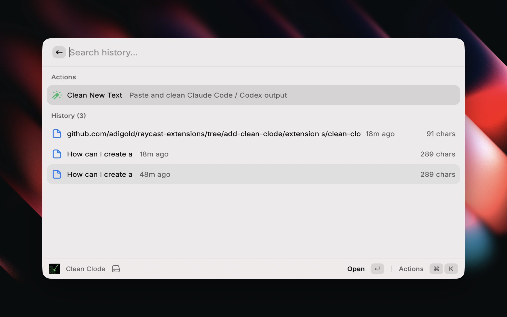
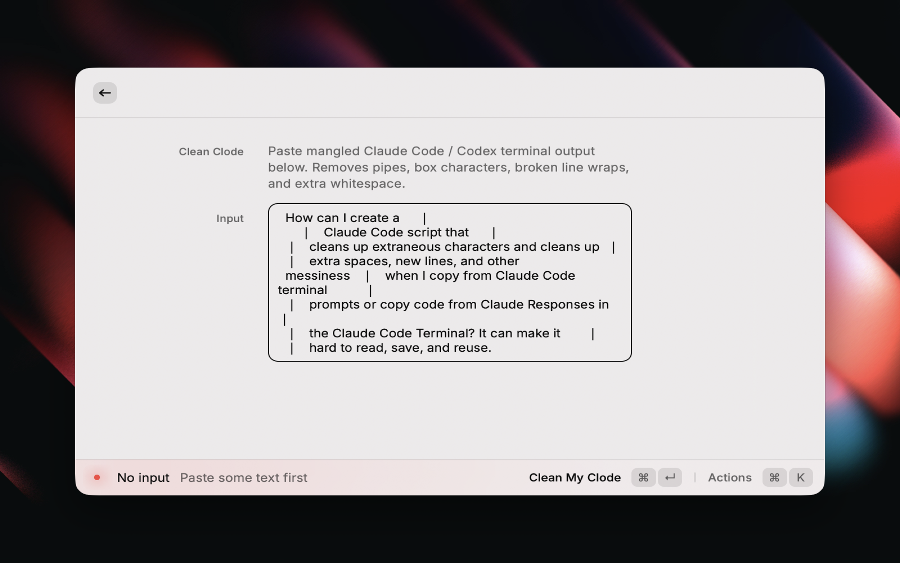
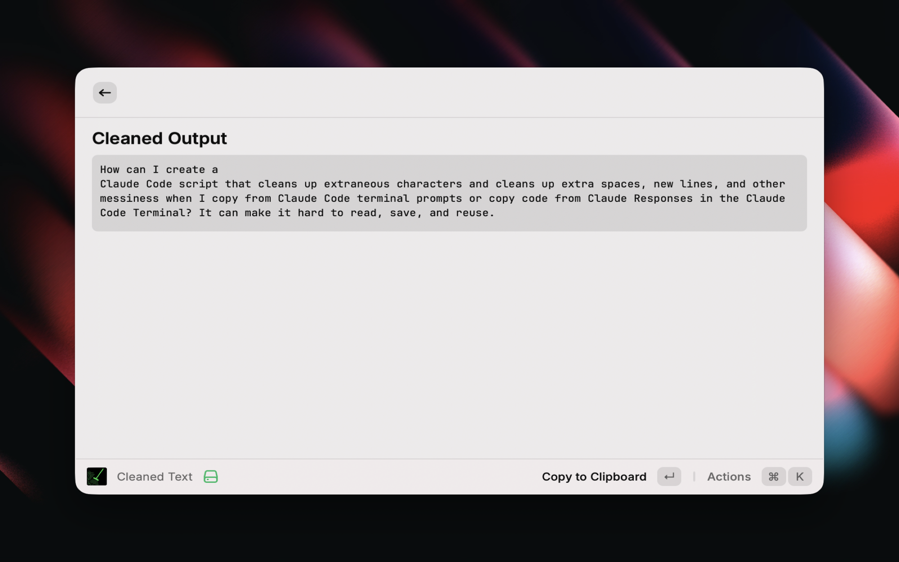

# Claude Code Cleaner (CCC)

Clean mangled Claude Code and Codex terminal output into readable text — instantly.

When you copy text from the Claude Code terminal, it often looks like this:

```
How can I create a     │
    │   Claude Code script that     │
│   cleans up extraneous characters and cleans up  │
│   extra spaces, new lines, and other
messiness   │   when I copy from Claude Code terminal
```

Clean Clode removes the pipes, box characters, broken line wraps, and extra whitespace — giving you clean, readable text ready to use.

## Screenshots







## Commands

### Clean Text
Paste mangled terminal output into a form, hit **⌘↩**, and get clean text back instantly. The result is automatically copied to your clipboard. Cleaned items are saved to a searchable local history.

### Clean Clipboard
One-keystroke command. Cleans whatever text is currently in your clipboard and copies the result back — no UI, just a HUD notification confirming it's done. Assign a hotkey to this for the fastest possible workflow.

## Features

- Removes pipes (`|`), box-drawing characters (`│ ┃ ╏`), and broken line wraps
- Intelligently detects content type: regular text, git diffs, or Claude terminal dumps
- Preserves bullet points, numbered lists, code blocks, and paragraph structure
- Searchable local history with copy and delete per item
- 100% local — no network requests, no data collection

## Usage Tips

- **Fastest workflow:** assign a hotkey to **Clean Clipboard**, then just copy from the terminal and trigger the hotkey — done in under a second
- **Clean Text** is great when you want to review the output before copying
- History is searchable — useful for reusing cleaned prompts

## Privacy

All processing happens locally on your Mac. Nothing is sent anywhere.
