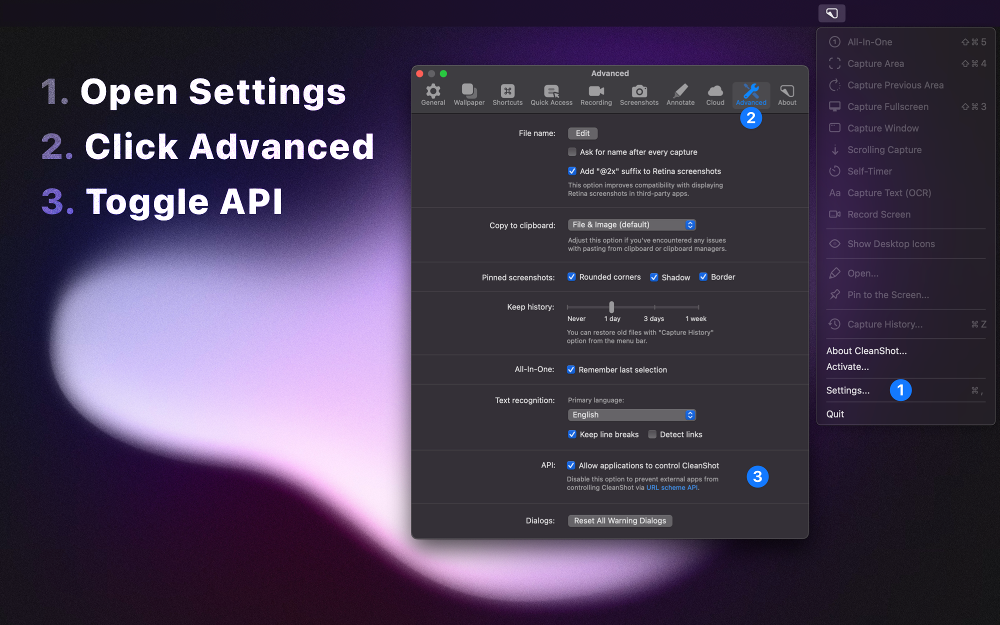

# CleanShot X Extension User Guide

TLDR;

1. Open CleanShot X Settings
2. Goto Advanced Tab
3. Toggle API

---

CleanShot X is a versatile screen capture and recording tool designed to make capturing, recording, and enhancing your screenshots as easy and efficient as possible. This user guide provides detailed instructions on how to use the CleanShot X Extension for Raycast.

## Table of Contents

- [Introduction](#introduction)
- [Installation and Setup](#installation-and-setup)
- [Using CleanShot X](#using-cleanshot-x)
  - [Screen Capture Features](#screen-capture-features)
  - [Recording Features](#recording-features)
  - [Annotation and Editing Tools](#annotation-and-editing-tools)
- [Troubleshooting](#troubleshooting)
- [Feedback and Support](#feedback-and-support)

## Introduction

CleanShot X offers a wide range of features from capturing screenshots, recording your screen, to annotating and quick editing. Integrated with Raycast, it offers an enhanced experience with streamlined access and additional functionality.

## Installation and Setup

Before using the CleanShot X Extension:

1. Make sure Raycast is installed on your system.
2. Download and install CleanShot X.
3. Enable API access in CleanShot X settings.
4. Install the CleanShot X Extension for Raycast from the Raycast store.
5. Once installed, you will find various commands under the CleanShot X Extension in Raycast.

## Using CleanShot X

### Screen Capture Features

- **Open History**: Access your screenshots history.
- **Capture Fullscreen/Area/Previous Area/Window**: Different modes for capturing your screen.
- **Scrolling Capture**: Capture content beyond the screen view.
- **Capture Text (OCR)**: Use OCR to capture text from your screen.

### Recording Features

- **Record Screen**: Record your entire screen.
- **Self Timer**: Set a timer for screen captures.

### Annotation and Editing Tools

- **Annotate**: Annotate your screenshots with various tools.
- **Pin Screenshot**: Pin screenshots to your screen for easy reference.

## Troubleshooting

If you encounter issues:

1. Check for updates to CleanShot X and the Raycast Extension.
2. Restart Raycast or your computer if the extension is not responding.
3. Create an issue and reach out via the [Raycast Slack](https://www.raycast.com/community).
