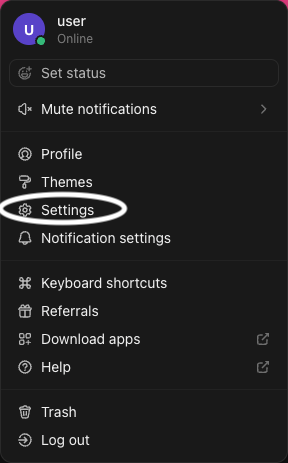

    

# ClickUp - Tasks & Docs Explorer

Extension for Raycast to explore your [ClickUp](https://clickup.com/) Tasks & Docs.

## How to obtain an API Token (Personal)

1. `Log in` to [ClickUp](https://app.clickup.com/).
2. In the upper-right corner, `click` your avatar.
3. `Select` Settings. 

4. In the sidebar, `click` [Apps](https://app.clickup.com/settings/apps).
5. Under API Token, `click` "Generate" or "Regenerate".
6. `Click` Copy to copy the personal token to your clipboard.

> ❗ Make sure to generate a "Personal Token". You do NOT need to create an "OAuth App" (token should begin with "pk_").

## Features (to be added as standalone commands or as a single command group)

- [x] List and explore Your teams, spaces, folders, lists and tasks
- [x] Get a birds eye of number of tasks in each folder and list
- [x] List, search and preview contents of each task in Tasks View
- [x] View each tasks by priority
- [x] Open each task via the browser
- [x] Set your default team ID and space IDs
- [ ] Search and order all of your ClickUp Team and space tasks by any filters or query (e.g. due date, priority, status, duration in progress etc.)
- [ ] List and view tasks assigned to you ordered by priority and due date
- [ ] View and browse subtasks
- [ ] Copy task links to clipboard
- [ ] View assignees from Tasks view
- [ ] Set assignees, sprint scores, time estimates, priorities, tags and due dates from Raycast
- [ ] Update status and priority of tasks from Raycast
- [ ] Add subtasks and checklists from Raycast
- [ ] Add Task dependencies from Raycast
- [ ] Create folders, lists and tasks from Raycast
- [ ] List Tasks by sprints
- [ ] Search tasks comments from Raycast
- [ ] Search, view and download task attachments from Raycast
- [ ] Comment on tasks from Raycast
- [ ] Move tasks between lists and sprints from Raycast
- [ ] Delete and archive tasks from Raycast
- [ ] Assign Github PR IDs to your tasks from Raycast (Requires Github Token)
- [ ] Other cool features? Open an issue or PR!

## Installing

Make sure Raycast is installed and go to https://www.raycast.com/aparandeh/manage-clickup-tasks.

> ✨ AI Tools Supported!