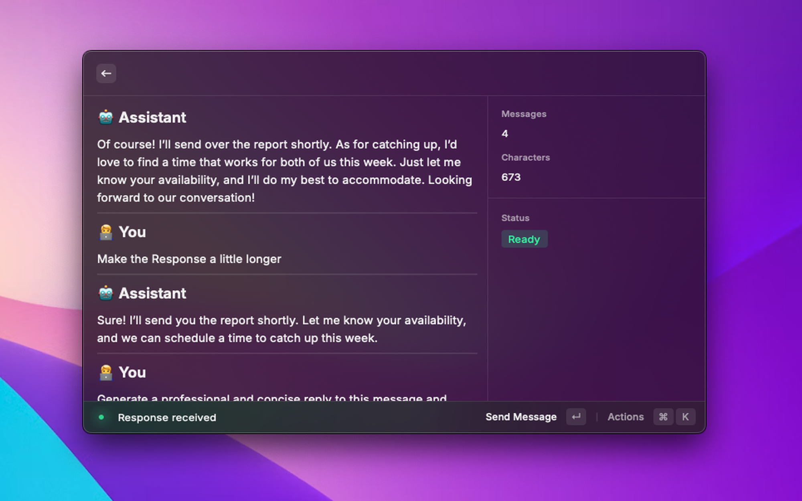
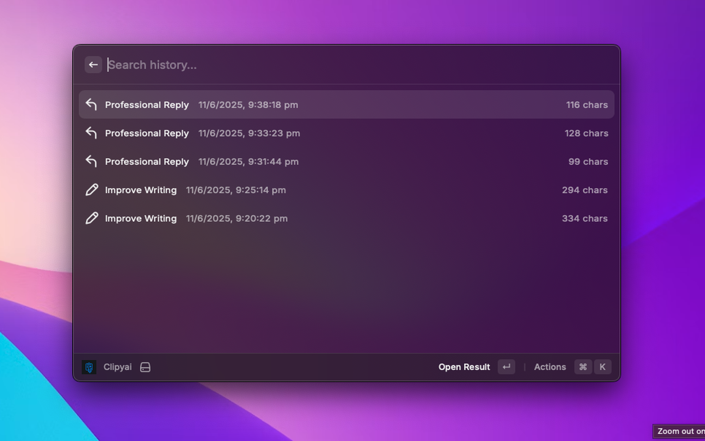

# ClipyAI

A powerful Raycast extension that brings AI-powered clipboard enhancement to your workflow. ClipyAI seamlessly integrates with OpenAI's GPT models to help you process both text and images directly from your clipboard.

## Features

- 🤖 **AI-Powered Processing**: Leverage OpenAI's GPT models for intelligent text and image processing
- 🖼️ **Image Support**: Automatically switches to vision-enabled models when processing images
- ⚡ **Quick Actions**: Customizable hotkeys for common tasks
- 📝 **Action History**: Keep track of your last 20 actions (configurable)
- 💬 **Interactive Chat**: Start conversations with your clipboard content
- 🎨 **Beautiful UI**: Clean and intuitive Raycast interface
- 🔄 **Real-time Processing**: Instant clipboard content analysis

## Requirements

- Raycast
- OpenAI API Key
- macOS

## Setup

1. Install the extension through Raycast
2. Set your OpenAI API key in the extension preferences
3. (Optional) Customize your hotkeys and quick actions
4. (Optional) Adjust history limit in preferences

## Configuration

### API Settings

- **API Key**: Your OpenAI API key
- **Model**: Choose your preferred GPT model
- **Temperature**: Adjust response creativity (0.0 - 1.0)
- **Max Tokens**: Set maximum response length
- **History Limit**: Set number of actions to keep in history (default: 20)

### Hotkeys

Customize quick actions with your own:

- Title
- Prompt
- Icon
- Description

## Usage

1. **Quick Actions**:

   - Copy any text or image to clipboard
   - Launch ClipyAI through Raycast
   - Select a quick action
   - Get instant AI-powered results

2. **Chat Mode**:

   - Start a conversation with your clipboard content
   - Maintain context through multiple messages
   - Copy responses or entire conversations

3. **Image Processing**:

   - Copy images to clipboard
   - ClipyAI automatically switches to vision-enabled models
   - Process images with text context

4. **History**:
   - View your last actions
   - Reuse previous results
   - Clear history when needed
   - Track action timestamps

## Tips

- Use specific prompts for better results
- Combine text and images for richer context
- Save frequently used prompts as quick actions
- Use history to track and reuse successful prompts

## Screenshots

### Quick Actions Menu

Shows all the quick actions and provide easy access to them.

### Quick Action

Displays action details, character count, word count, and available operations for the current clipboard content.

### Expand Chat

Expand the quick action to full chat for further queried or updates.

### Chat Interface

Shows the chat interface with message count, character count, and real-time status indicators. 

### History View

View and manage your action history with detailed timestamps and results.

### Settings and Configuration

Customize your quick actions with titles, prompts, and icons.

## Shortcuts

### Global Shortcuts
- `⌘ + Space` - Open Raycast (default Raycast shortcut)
- Type `clipyai` to access the extension

### In Hotkeys/Quick Actions Settings (Manage Hotkeys)
- Access from: Main Menu `⌘ + K` > Manage Hotkeys
- `⌘ + R` - Reset hotkeys to defaults
- `⌘ + Enter` - Delete a hotkey
- `Enter` - Edit a hotkey
- `⌘ + K` > `Add Hotkey` - to add a new hotkey

### In Chat View
- `Enter` - To type the message
- `⌘ + Enter` - Send message in Message Menu
- `⌘ + Enter` - Copy Last Response in Chat Menu
- Access from: Main Menu > Start Chat

### In Quick Actions
- `Enter` - Copy The Response
- `⌘ + Enter` - Expand To Chat
- Access from: Main Menu > Select the quick action
