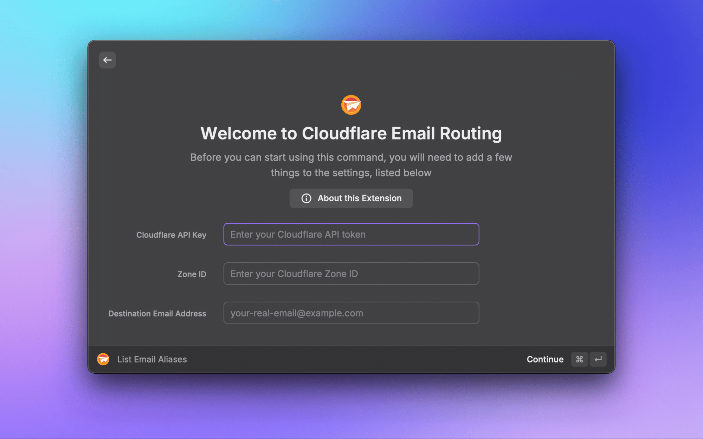
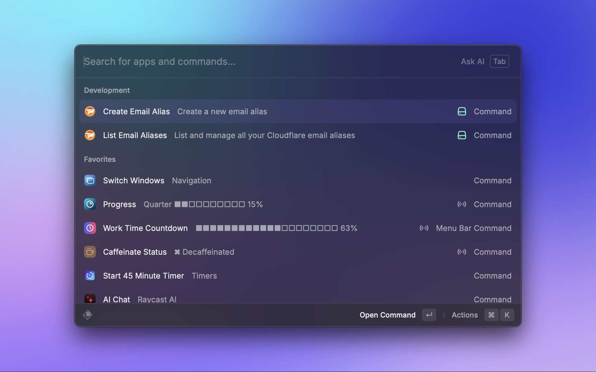
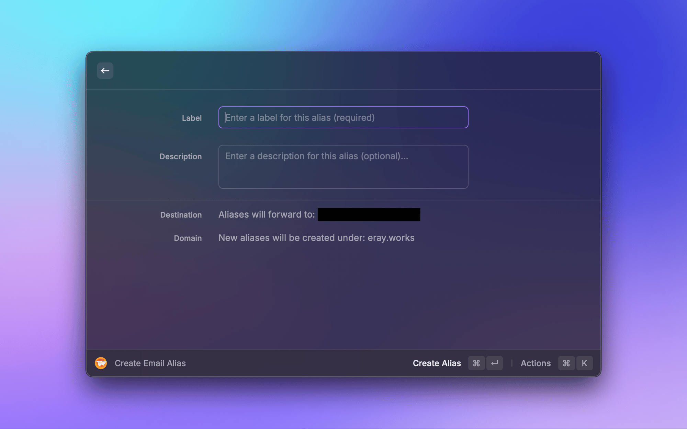
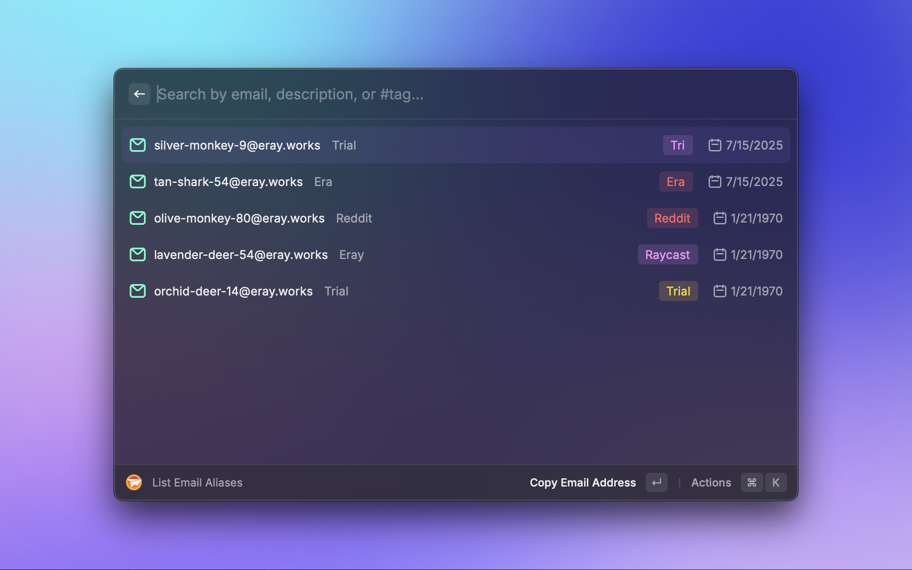
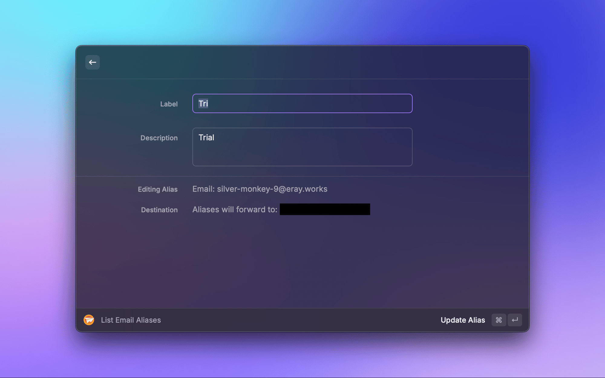

# Cloudflare Email Routing

A Raycast extension that allows you to create, list, edit, and delete Cloudflare email aliases directly from Raycast. 

## Features

- 📧 **Create Email Aliases**: Instantly generate random email aliases that forward to your real inbox.
- 📋 **List & Search**: View and search all your email aliases.
- ✏️ **Edit Alias Label**: Quickly update the label of any alias.
- 🗑️ **Delete Aliases**: Remove aliases you no longer need.
- 📋 **Quick Copy**: Copy email addresses to the clipboard.
- ⚡️ **Alias Pooling**: Pre-allocate a pool of aliases for even faster creation (optional).

## Screenshots

## Prerequisites

1.  **Cloudflare Account**: A Cloudflare account with a configured domain.
2.  **Email Routing**: Email Routing must be enabled for your domain in Cloudflare.
3.  **API Token**: A Cloudflare API token with the necessary "Email Routing" permissions.

For a detailed guide on setting up your Cloudflare account and obtaining the required credentials, please follow the [setup instructions](https://github.com/webmonch/hide-my-mail-cloudflare/blob/main/SETUP.md).

## Setup

After installing the extension, you will need to configure the following preferences in Raycast:

-   **Cloudflare API Key**: Your API token with `Email Routing:Edit` permissions.
-   **Zone ID**: The Zone ID for the domain where your email routing is configured.
-   **Destination Email Address**: The real email address where your aliases will forward emails to.
-   **Pre-allocate Alias Pool** (Optional): Enable to pre-create a pool of unused aliases for faster generation.

## Usage

### List Email Aliases Command

-   **View Aliases**: See a list of all your active email aliases.
-   **Search**: Search aliases by email address or label.
-   **Toggle Details**: Press `⌘D` to view detailed information for an alias.
-   **Copy Email**: Press `⌘C` to copy the alias's email address.
-   **Edit Alias**: Press `⌘E` to open the edit view for the selected alias.
-   **Delete Alias**: Press `⌘⇧D` to delete the selected alias (with confirmation).
-   **Copy Forwarding Address**: Press `⌘⇧C` to copy the destination email address.

### Create Email Alias Command

-   **Create New Alias**: Generate a new, random email alias.
-   **Add Label**: Assign a label to your new alias for organization.
-   **Use Random Unused Alias**: Press `⌘R` for quick creation using a pre-allocated alias with a default label.

## How It Works

This extension utilizes Cloudflare's Email Routing API to manage forwarding rules. It stores metadata within the rule's name using a specific format: `[hide_mail]|<timestamp>|<label>|<description>`. This allows the extension to manage aliases without needing a separate database.

## Security

-   Your API token and other credentials are stored securely using Raycast's preference system.
-   All API calls are made directly from your machine to the Cloudflare API.
-   No third-party servers are involved in any part of the process.

## Privacy

This extension communicates only with the Cloudflare API and Raycast. No user data is collected or sent to any other services.