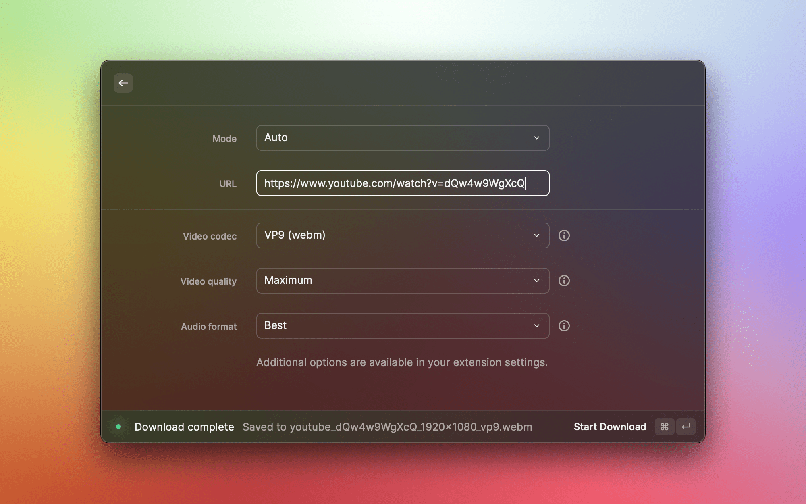

<div align="center">
    
    <h1 align="center">Cobalt for Raycast</h1>
    <p>
        A Raycast extension that allows you to easily download videos & audio from popular social media platforms, powered by <a href="https://github.com/imputnet/cobalt">cobalt</a>'s API. A list of supported services can be found <a href="https://github.com/imputnet/cobalt#supported-services">here</a>.
    </p>
</div>

> **Note**  
> This extension is neither created by nor affiliated with [cobalt](https://github.com/imputnet/cobalt).

## Features

- Video and audio file downloading
- Customizable video codec, video quality, and audio format
- Customizable download directory: choose where you want to save your downloads!
- Customizable API instance URL: Want to use a different Cobalt API instance? No problem!
- Receive a notification when your download completes
- Platform-specific customization settings

<div align="center">
    
</div>

## Run Locally (development mode)

Clone the project

```bash
git clone https://github.com/aelew/raycast-cobalt.git
```

Go to the project directory

```bash
cd raycast-cobalt
```

Install dependencies

```bash
npm install
```

Connect to Raycast

```bash
npm run dev
```

## License

[MIT](https://choosealicense.com/licenses/mit/)
