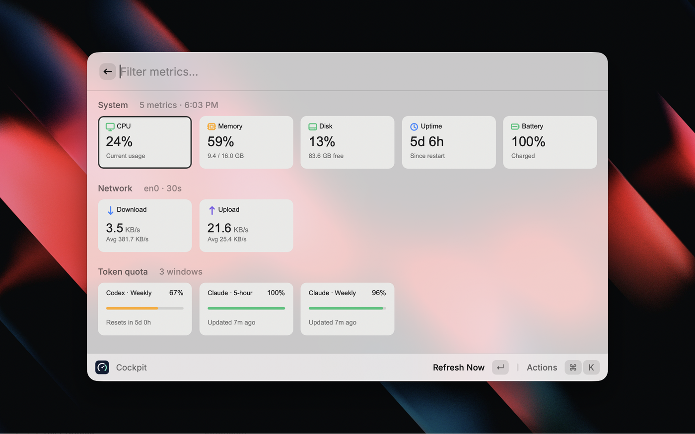

# Cockpit

An instrument panel for your Mac, in Raycast: system vitals next to how much Codex and Claude usage you have left.



## Included modules

- CPU usage
- Memory pressure and usage
- Root disk usage
- Time since the Mac was last started
- Current upload and download speed on the default network interface
- Battery percentage, state, and time remaining
- Codex / GPT rate-limit windows, remaining percentage, and reset time
- Claude five-hour and weekly remaining usage from Claude Desktop's local history

Every module can be enabled or disabled independently in Raycast's extension settings.

A single-screen native Raycast grid with separate system, network, and Codex quota cards. Each card has a stable grid identity, so live updates replace only the metric card that changed instead of redrawing one dashboard-sized image. Metrics update at the configured interval, and manual refresh updates them immediately.

## Install

Cockpit is not on the Raycast Store, so it is installed from this repository. Node is needed once to build it; nothing has to keep running afterwards.

Requirements:

- macOS
- Raycast
- Node.js 22 or newer, to build
- Codex CLI signed in, if the Codex module is enabled

```bash
git clone https://github.com/zellux/raycast-cockpit.git
cd raycast-cockpit
npm ci
npm run build
```

Then open Raycast, run the **Import Extension** command, and choose this folder. Cockpit now behaves like any other installed extension — no dev server, no terminal window left open. Because it did not come from the Store, Raycast will not update it for you: `git pull && npm run build` picks up a new version.

Assign a hotkey to **Open Cockpit** in Raycast Settings → Extensions if you want it a keystroke away.

## Develop

```bash
npm install
npm run dev
```

This imports the extension and then watches for changes, reloading on save and printing errors to the terminal. Stopping it leaves the extension installed.

## Configuration

Open Raycast Settings → Extensions → Cockpit. Available settings include:

- Per-module visibility toggles
- Dashboard sampling interval
- Network byte/bit units, and an optional fixed interface instead of the default route
- The volume reported by the disk module
- Codex CLI path, resolved from `PATH` by default, and optional Spark visibility (hidden by default)
- Claude Desktop usage-history path

## Project structure

```text
src/
  dashboard.tsx       Native Raycast grid dashboard
  lib/
    collectors.ts     Data collection adapters
    format.ts         Display formatting
    types.ts          Shared data model
    use-status.ts     Live dashboard refresh hook
```

To add a module, extend `ModuleKey` and `StatusSnapshot`, add its collector to `collectSnapshot`, add a preference in `package.json`, and render it in the dashboard.

## Notes

- All metrics are collected locally; see [Privacy](#privacy).
- Network speed needs two samples before it can calculate a rate, so the first reading displays “Sampling…”.
- Codex usage is cached for one minute to avoid repeatedly starting the Codex app server.
- Claude usage is read locally and shows source freshness because Claude's history file does not include reset timestamps.
- Individual collectors fail independently; one unavailable module does not prevent the rest of the dashboard from rendering.

## Privacy

This extension makes no network requests of its own and sends no telemetry. Everything it shows is read from your Mac and stays there.

What it reads, and how:

- System, network, and battery metrics come from standard read-only macOS commands: `top`, `memory_pressure`, `sysctl`, `df`, `route`, `netstat`, and `pmset`.
- Codex usage comes from the Codex CLI you already have signed in. The extension starts `codex app-server --stdio` locally and asks it for your rate-limit windows. Codex talks to OpenAI with its own credentials; this extension never reads, stores, or transmits those credentials.
- Claude usage is read from Claude Desktop's local usage-history file (`~/Library/Application Support/Claude/plan-usage-history.json` by default). The file is opened read-only; no Claude account data leaves your machine.
- The only thing written anywhere is Raycast's local storage, which holds the previous network counter sample and a one-minute cache of the last Codex response.

Nothing is uploaded, and no analytics or crash reporting is bundled. Any module you turn off in settings is not collected at all.

## License

MIT
