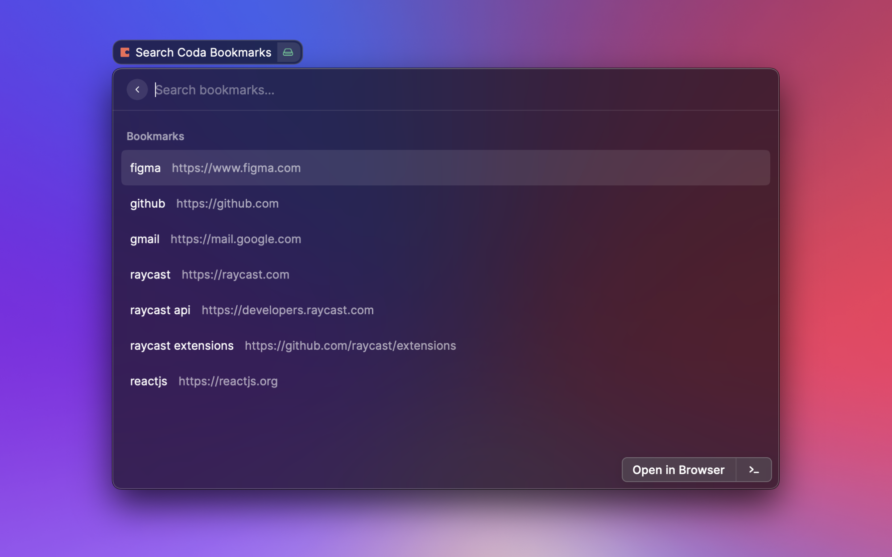

# Coda Bookmarks Search 🔖

Quickly find and open your bookmarked URLs stored in a [coda](https://coda.io) table.

## Configuration

1. Create a coda table with `name` and `url` columns. [Copy this sample doc](https://coda.io/d/Coda-Bookmarks-Search_deQgjTgGDJe/Bookmarks-URLs_suHbk#Bookmarks_tu76f) for the quickest setup.
2. Create an API token in your [coda account settings](https://coda.io/account) (be sure to save this for later).
3. Find your [coda document ID](https://coda.io/developers/apis/v1#section/Using-the-API/Resource-IDs-and-Links).
4. Make note of your table name (`Bookmarks` if using the sample doc).
5. Enjoy 🍻

## Resources

- [raycast](https://www.raycast.com/)
- [coda](https://coda.io)
- [coda browser extension](https://chrome.google.com/webstore/detail/coda-browser-extension/cdgkmagmdldlpiglliebaajdpdkigcbi)
