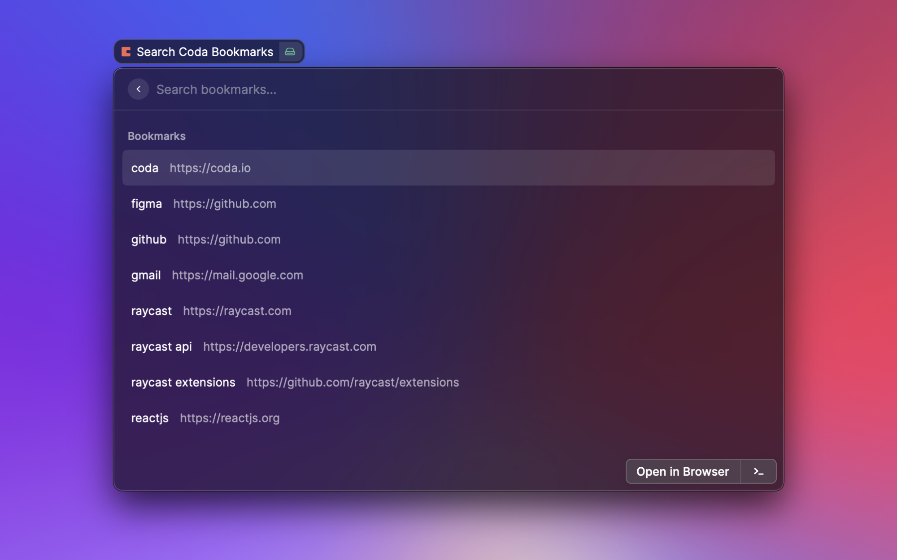
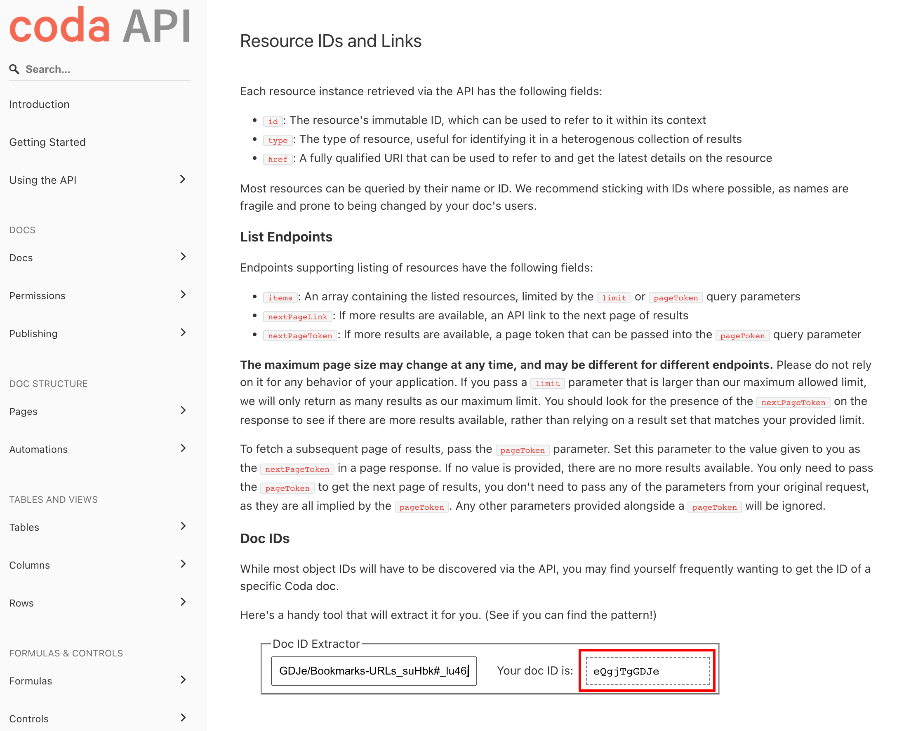
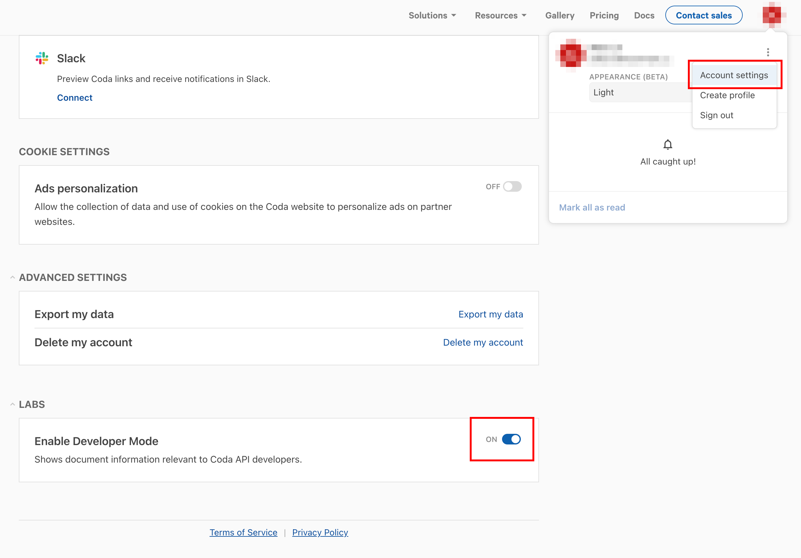
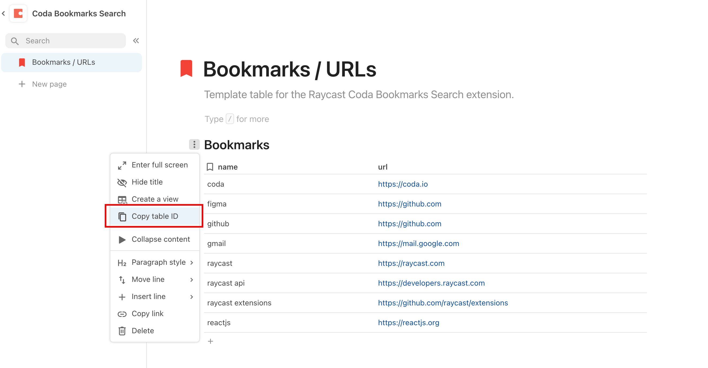

# Coda Bookmarks Search 🔖

Quickly find and open your bookmarked URLs stored in a [coda](https://coda.io) table.

## Configuration

1. Create a coda table with `name` and `url` columns. [Copy this sample doc](https://coda.io/d/Coda-Bookmarks-Search_deQgjTgGDJe/Bookmarks-URLs_suHbk#Bookmarks_tu76f) for the quickest setup.
   1. The columns name _must_ be `name` and `url` (case-sensitive).
2. Create an API token in your [coda account settings](https://coda.io/account) (be sure to save this for later).
3. Find and copy your [coda document ID](#copy-document-id).
4. Find and copy your [coda table ID](#copy-table-id).
5. Enjoy 🍻

### Copy Document ID

Follow this [link](https://coda.io/developers/apis/v1#section/Using-the-API/Resource-IDs-and-Links) and use the "Doc ID Extractor" by pasting your doc URL.

  
View

    

### Copy Table ID

Go to your [coda account settings](https://coda.io/account) and enable developer mode to easily copy the table ID.

  
View

  

  

## Resources

- [raycast](https://www.raycast.com/)
- [coda](https://coda.io)
- [coda browser extension](https://chrome.google.com/webstore/detail/coda-browser-extension/cdgkmagmdldlpiglliebaajdpdkigcbi)
