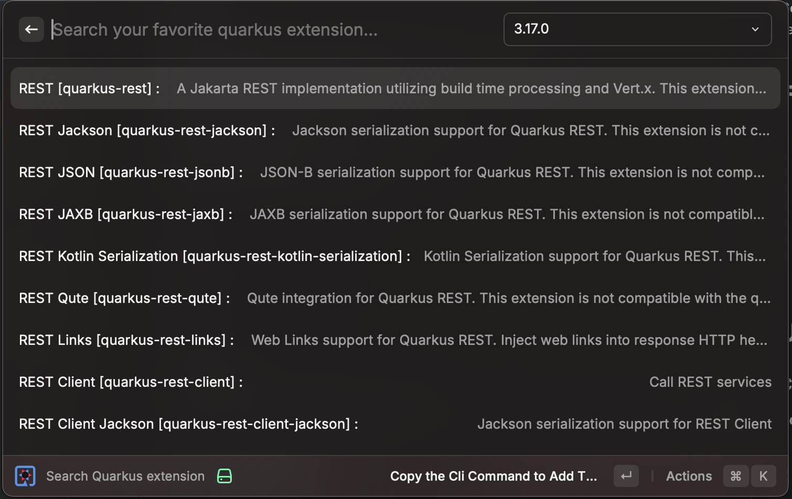

# Code Quarkus

Generate Quarkus project directly from Raycast, powered by the official https://code.quarkus.io service. 
You can also easily find the right extension for you project, get the command to add it and easily access its documentation

## Features
- Generate Quarkus projects without leaving Raycast
- Multiple build tools (Maven, Gradle)
- Full dependency management
- Downloads directly to your Downloads folder
- Find an extension
- Copy the command to add an extension
- Open the guide of extension

## Usage

### Create Quarkus project

#### How to

- Open Raycast
- Search for "Create Quarkus Project"
- Fill in your project configuration (Quarkus version, build tool, groupId, artifact name, java version)

  
- Select dependencies

  
- Generate and download your project
- Projects are automatically saved to your Downloads folder.

#### Preferences

After selecting "Create Quarkus Project", you can open the preferences option via the action menu.

In the preferences you are able to select the directory where the generated project will be downloaded.

### Find a Quarkus Extension
- Open Raycast
- Search for "Find Quarkus Extension"
- Type in the name the extension you're looking for.
- When you've fond the extension you can press enter. It will automatically copy the quarkus cli command to execute to add this extension to your project.
- 
- You can also open the action menu and choose one of this option:
  - See the extension guide: It will open your browser on the guide for this particular extension.
  - Copy the Maven Command to Add This Extension: It will copy in your clipboard the maven command to add this extension.
  - Copy the Gradle Command to Add This Extension: It will copy in your clipboard the gradle command to add this extension.
  - Copy the Build.gradle.kts Dependency Snippet: It will copy in your clipboard the snippet to add to your build.gradle.kts to add this extension.
  - Copy the Maven Dependency Snippet: It will copy in your clipboard the snippet to add to your pom.xml to add this extension.
  - Copy the Gradle Dependency Snippet: It will copy in your clipboard the snippet to add to your build.gradle to add this extension.
  - Copy Groupid:artifactid:version: It will copy in your clipboard the groupid:artifactid:version.

## Requirements
macOS
Node.js 20.x or later
Raycast

## Author
[Loïc Magnette](https://bsky.app/profile/lomagnette.bsky.social) 

## License
MIT