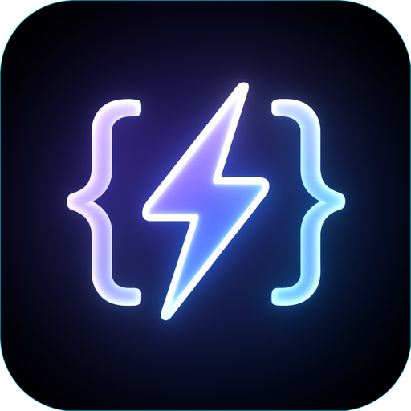

 

# Code Runner for Raycast

A powerful Raycast extension that allows you to write and execute code snippets directly on your local machine. Get instant feedback on your code without leaving Raycast\!

---

## 🎯 For Users: Boost Your Productivity

This section is for anyone who wants to use the Local Code Runner to quickly test code, learn new syntax, or automate small tasks right from their Raycast launcher.

**Looking to dive into the code or contribute? Jump to the [For Developers section](#for-developers)!**

### ✨ What It Does

The Local Code Runner brings a mini-IDE experience directly into Raycast. You can:

- **Write Code**: Type or paste your code snippets.
- **Run Instantly**: Execute your code and see the output without opening a separate editor or terminal.
- **Save Your Work**: Your code for each language is automatically remembered, even if you close the command.
- **Get Instant Feedback**: See standard output, errors, and warnings immediately.
- **Copy Results**: Quickly copy any output to your clipboard.

### 🌐 What Languages Does It Support?

This tool intelligently **detects and works with** the programming languages you already have installed and configured on your system. Currently, it's designed to detect:

- **JavaScript** (if Node.js is installed)
- **Python** (if Python 3 is installed)
- **Go** (if Go is installed)

As long as these languages are properly set up on your machine (e.g., you can run `node -v`, `python3 --version`, or `go version` in your terminal), this extension will find and use them. More languages may be added in the future\!

### 🚀 Getting Started

To use this powerful tool:

1.  **Ensure Raycast is Installed**: Download and install Raycast from [raycast.com](https://www.raycast.com/) if you haven't already.
2.  **Install the Extension**:
    - Open your terminal.
    - Navigate to the directory where you've downloaded/cloned this extension's source code.
    - Run the Raycast development command to link it:
      ```bash
      npm run dev
      ```
    - Raycast will prompt you to "Link" the extension. Confirm this action.
3.  **Check Your Languages**: If you plan to run code in a specific language (e.g., Python), make sure that language's runtime/interpreter is installed on your computer and accessible from your system's `PATH`.

### 💡 How to Use

1.  **Open Raycast**: Press `⌥ Space` (or your custom hotkey).
2.  **Find the Command**: Type `Run Code` and select the "Code Runner" command.
3.  **Automatic Detection**: On first launch (or after a fresh install), the extension will automatically scan your system for supported languages. This might take a few moments.
4.  **Choose Your Language**: Use the "Language" dropdown to select the language you want to code in.
5.  **Write Your Code**: Type or paste your code into the "Code" text area.
6.  **Run It\!**: Press `⌘ Enter` (or click "Run Code" in the Action Panel) to execute your code.
7.  **See the Output**: The results (Standard Output, Standard Error, or Execution Error) will appear directly within the Raycast form.
8.  **Refresh Languages**: If you install a new language after using the extension, simply select `✨ Detect New Languages` from the "Language" dropdown to update the list.

### ⚠️ Troubleshooting (User-Friendly)

- **"No supported languages found\!"**:
  - This means the tool couldn't find any common language runtimes (like Node.js, Python 3, or Go) on your computer.
  - **Solution**: Please ensure these languages are installed correctly on your system and that their executables are accessible in your system's `PATH` environment variable. You can verify this by running `node -v`, `python3 --version`, or `go version` in your terminal. If they don't show versions, they're not correctly set up.
- **"Code execution failed\! Error: 'command' command not found."**:
  - Similar to the above, even if a language is listed, its specific executable might not be fully accessible to the tool's environment.
  - **Solution**: Double-check your language installation and your system's `PATH` configuration. Sometimes restarting Raycast (or your computer) helps apply new PATH changes.
- **"Code execution timed out after 5 seconds."**:
  - Your code ran for longer than the allowed 5-second limit, or it might be stuck in an infinite loop.
  - **Solution**: Review your code for logic errors, infinite loops, or very heavy computations.

---

## 💻 For Developers: Extend & Contribute

This section is for developers interested in understanding the codebase, contributing, or extending the extension's capabilities.

### ⚙️ Developer Setup

To work on this extension, you'll need:

1.  **Node.js & npm**: Install Node.js (which includes npm) from [nodejs.org](https://nodejs.org/).
2.  **Git**: For cloning the repository.
3.  **Raycast**: As the development environment.
4.  **Language Runtimes**: To test code execution for different languages, ensure you have Node.js (for JS), Python 3 (for Python), and Go (for Go) installed and properly configured in your system's `PATH`.

### 🛠️ Getting Started with Development

1.  **Clone the repository**:

    ```bash
    git clone https://github.com/abdullahnettoor/code-runner-raycast.git
    cd code-runner-raycast

2.  **Install dependencies**:

    ```bash
    npm install
    ```

3.  **Run in development mode**:

    ```bash
    npm run dev
    ```

    This will open Raycast and link the extension for live development (changes to code will hot-reload).

### 📂 Codebase Structure

The project follows a modular structure to separate concerns:

- **`src/commands/`**: Contains the main Raycast command entry points (e.g., `run-code.tsx`). These are thin wrappers.
- **`src/components/`**: Houses reusable, presentational UI components (e.g., `CodeRunnerForm.tsx`). They receive props and render.
- **`src/hooks/`**: Custom React Hooks for encapsulating all stateful logic and business rules (e.g., `useCodeRunner.ts`). This is where the core logic resides.
- **`src/utils/`**: Provides general-purpose utility functions and helpers.
  - `codeRunner.ts`: Handles the low-level execution of code (spawning processes).
  - `imageMap.ts`: Maps language identifiers to their respective icons.
- **`src/constants/`**: For global, static application constants (e.g., LocalStorage keys).
- **`src/types/`**: Contains shared TypeScript interface and type definitions.

### ➕ Adding More Languages

To extend support for a new programming language:

1.  **Detection Logic**: Modify `src/utils/codeRunner.ts` to add detection for the new language's executable.
2.  **Execution Command**: Update the `runCode` function in `src/utils/codeRunner.ts` to handle the execution command for the new language (e.g., how to compile/run its temporary file).
3.  **Icon Mapping**: Add an entry for the new language's icon in `src/utils/imageMap.ts`.
4.  **Initial Code (Optional)**: If you want to provide a default code snippet, update the `getInitialCodeForLanguage` function in `src/hooks/useCodeRunner.ts`.

### 🤝 Contributing

We welcome contributions\! If you have ideas for new features, bug fixes, or improvements, please:

1.  Fork the repository.
2.  Create a new branch (`git checkout -b feature/your-feature-name`).
3.  Make your changes following the existing code style.
4.  Commit your changes (`git commit -m 'feat: Describe your feature'`).
5.  Push to the branch (`git push origin feature/your-feature-name`).
6.  Open a Pull Request, explaining your changes.

### 📄 License

This project is licensed under the MIT License - see the [LICENSE](LICENSE) file for details.
