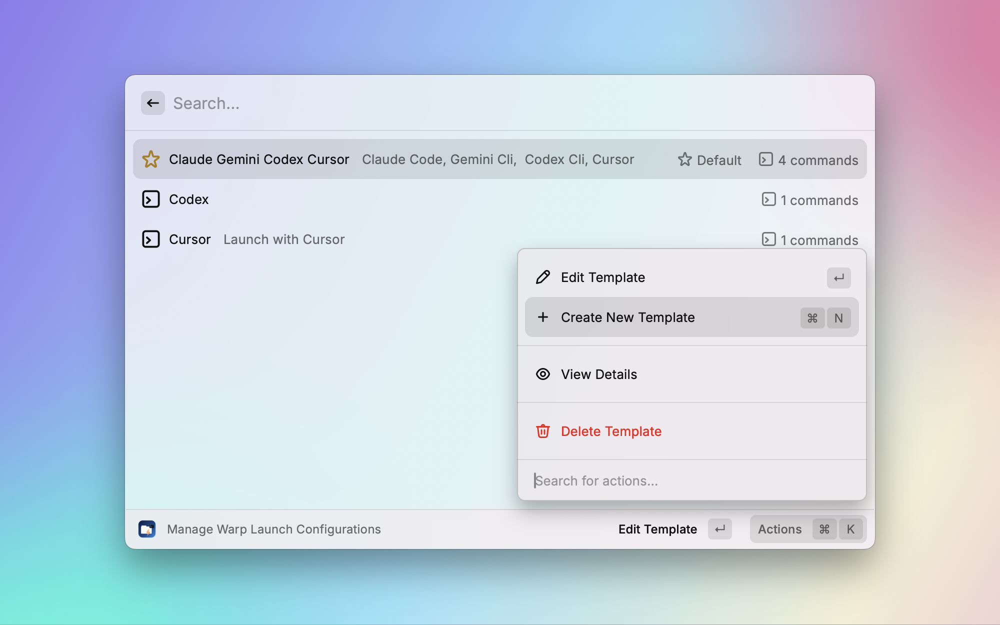
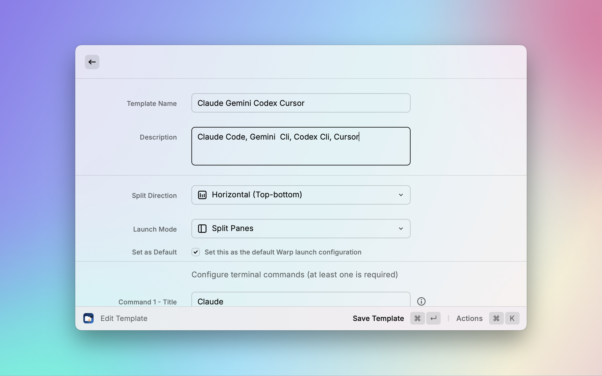

# Code Runway

A powerful Raycast extension for quickly searching and launching development projects with multiple coding CLI tools in Warp (Vibe Coding).

[中文文档](./README_CN.md) | [English](./README.md)

## ✨ Features

- 🔍 **Smart Project Discovery**: Automatically scans and indexes projects in configured directories
- 🚀 **Quick Launch**: One-click project startup with customizable Warp terminal configurations
- 🎯 **Project Templates**: Pre-defined launch templates for different development scenarios
- ⭐ **Default Template**: Set your preferred template as default for ultra-fast startup
- 🛠️ **Custom Commands**: Configure multiple terminal commands with custom working directories
- 📁 **Directory Management**: Easy project directory management with enable/disable controls
- 🎨 **Smart Icons**: Automatically assigns appropriate icons based on project type

## 📋 Requirements

- [Raycast](https://raycast.com/) - Required
- [Warp Terminal](https://www.warp.dev/) - Required for terminal launch functionality

## 🚀 Quick Start

### 1. Configure Project Directories

First, add your project root directories:

1. Open Raycast and search for **"Project Directory Settings"**
2. Click **"Add New Directory"** or press `Cmd + N`
3. Select your project root directories (multiple selection supported)
4. Optional: Add a display name prefix to organize directories

The extension will automatically scan these directories for projects.

### 2. Search and Launch Projects

1. Open Raycast and search for **"Search Projects"**
2. Type to search for your projects
3. Select a project and choose launch method:
   - **Default Template**: Quick launch with your preferred template (if set)
   - **Simple Launch**: Open in a single Warp window
   - **Template Launch**: Choose from available templates


### 3. Manage Templates

Create and customize launch templates:

1. Search for **"Warp Launch Templates"**
2. Create new templates or edit existing ones
3. Set a template as default using the **"Set as Default"** action (`Cmd + D`)



## 🔍 Project Detection

Projects are automatically detected by the presence of these files:

- `package.json` (Node.js/JavaScript)
- `Cargo.toml` (Rust)
- `go.mod` (Go)
- `pom.xml` / `build.gradle` (Java)
- `requirements.txt` / `pyproject.toml` (Python)
- `Gemfile` (Ruby)
- `composer.json` (PHP)
- `.git` (Git repository)
- `Makefile` / `CMakeLists.txt` (C/C++)
- `Dockerfile` (Docker)

## ⌨️ Keyboard Shortcuts

- `Cmd + R`: Refresh project list
- `Cmd + N`: Add new directory (in Project Directory Settings)
- `Cmd + D`: Set template as default (in Template Management)
- `Enter`: Launch with default template (or simple launch if no default)

## 🔧 Available Commands

| Command | Description |
|---------|-------------|
| **Search Projects** | Search and launch your development projects |
| **Project Directory Settings** | Manage project directories with full controls |
| **Warp Launch Templates** | Create and manage custom launch templates |


## 🎨 Template Customization

### Creating Custom Templates

1. Open **"Warp Launch Templates"**
2. Click **"New Template"**
3. Configure:
   - **Name**: Template identifier
   - **Description**: Brief description
   - **Split Direction**: Vertical (default) or horizontal
   - **Launch Mode**: Split panes, multi-tab, or multi-window
   - **Commands**: Add multiple commands with custom working directories

### Example: AI Tools Template

```yaml
Name: AI Development Tools
Description: Launch Claude Code, Gemini CLI, Codex and Cursor simultaneously
Split Direction: Horizontal
Commands:
  - Title: Claude Code
    Command: claude
    Working Directory: (project root)
  - Title: Gemini CLI
    Command: gemini
    Working Directory: (project root)
  - Title: Codex
    Command: codex
    Working Directory: (project root)
  - Title: Cursor
    Command: cursor .
    Working Directory: (project root)
```



## 🛠️ Warp Integration

The extension leverages Warp's Launch Configuration system:

- Creates YAML configuration files in `~/.warp/launch_configurations/`
- Supports multiple launch modes (split panes, tabs, windows)
- Automatically sets correct working directories
- Handles relative paths within projects
