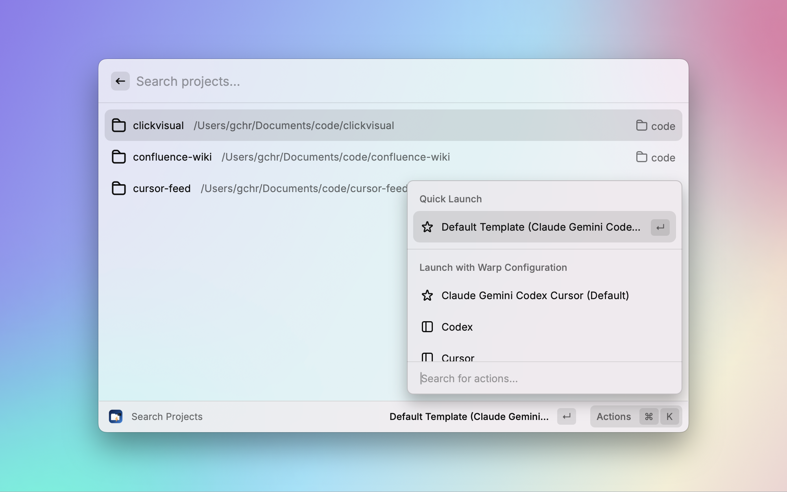
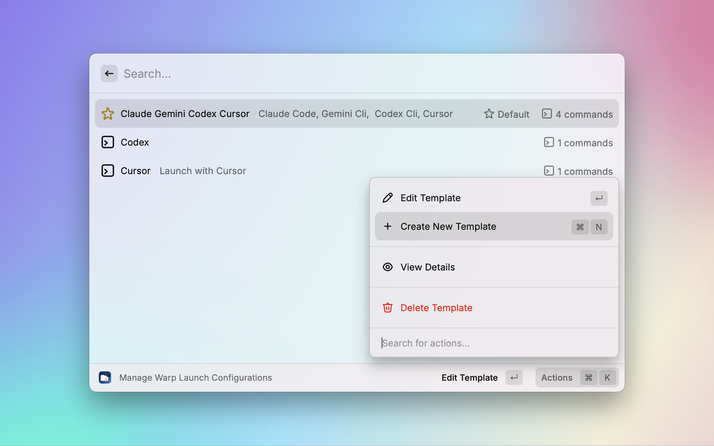
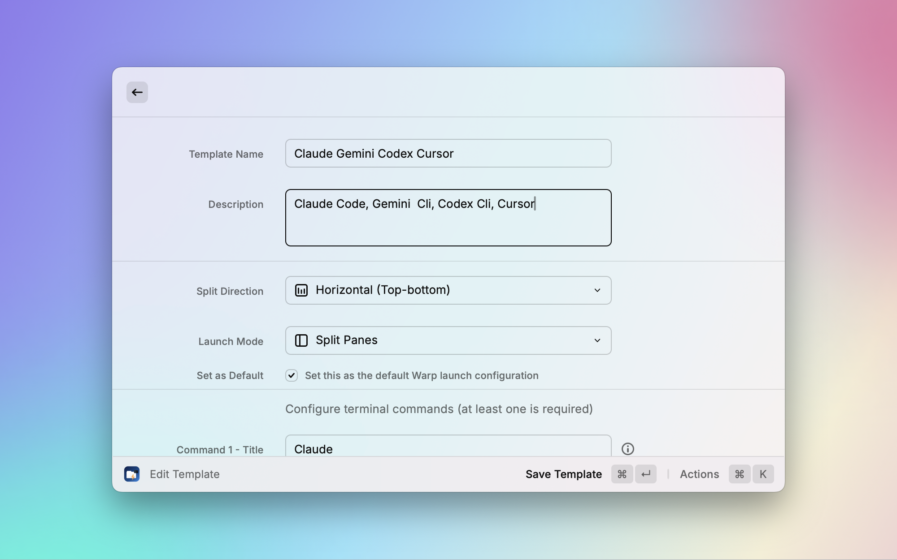

# Code Runway

一个强大的 Raycast 扩展，方便在 Warp 中搜索项目后，同时启动多个 Coding Cli， 方便快速开发（Vibe Coding）

[中文文档](./README_CN.md) | [English](./README.md)

## ✨ 功能特性

- 🔍 **智能项目发现**: 自动扫描和索引配置目录中的所有项目
- 🚀 **快速启动**: 一键启动项目，支持自定义 Warp 终端配置
- 🎯 **项目模板**: 为不同开发场景预定义启动模板
- ⭐ **默认模板**: 将常用模板设为默认，实现超快速启动
- 🛠️ **自定义命令**: 配置多个终端命令，支持自定义工作目录
- 📁 **目录管理**: 简单易用的项目目录管理，支持启用/禁用控制
- 🎨 **智能图标**: 根据项目类型自动分配合适的图标

## 📋 系统要求

- [Raycast](https://raycast.com/) - 必需
- [Warp Terminal](https://www.warp.dev/) - 终端启动功能必需

## 🚀 快速开始

### 1. 配置项目目录

首先，添加你的项目根目录：

1. 打开 Raycast 搜索 **"项目目录设置"**
2. 点击 **"添加新目录"** 或按 `Cmd + N`
3. 选择你的项目根目录（支持多选）
4. 可选：添加显示名称前缀来组织目录

扩展会自动扫描这些目录中的项目。

### 2. 搜索和启动项目

1. 打开 Raycast 搜索 **"搜索项目"**
2. 输入关键词搜索项目
3. 选择项目并选择启动方式：
   - **默认模板**: 使用你设置的默认模板快速启动
   - **简单启动**: 在单个 Warp 窗口中打开
   - **模板启动**: 从可用模板中选择



### 3. 管理模板

创建和自定义启动模板：

1. 搜索 **"Warp 启动模板"**
2. 创建新模板或编辑现有模板
3. 使用 **"设为默认"** 操作设置默认模板（`Cmd + D`）



## 🔍 项目识别

通过检测以下文件自动识别项目：

- `package.json` (Node.js/JavaScript)
- `Cargo.toml` (Rust)
- `go.mod` (Go)
- `pom.xml` / `build.gradle` (Java)
- `requirements.txt` / `pyproject.toml` (Python)
- `Gemfile` (Ruby)
- `composer.json` (PHP)
- `.git` (Git 仓库)
- `Makefile` / `CMakeLists.txt` (C/C++)
- `Dockerfile` (Docker)

## ⌨️ 快捷键

- `Cmd + R`: 刷新项目列表
- `Cmd + N`: 添加新目录（在项目目录设置中）
- `Cmd + D`: 设为默认模板（在模板管理中）
- `Enter`: 使用默认模板启动（如无默认则简单启动）

## 🔧 可用命令

| 命令              | 描述                       |
| ----------------- | -------------------------- |
| **搜索项目**      | 搜索并启动你的开发项目     |
| **项目目录设置**  | 管理项目目录，提供完整控制 |
| **Warp 启动模板** | 创建和管理自定义启动模板   |

## 🎨 模板自定义

### 创建自定义模板

1. 打开 **"Warp 启动模板"**
2. 点击 **"新建模板"**
3. 配置：
   - **名称**: 模板标识符
   - **描述**: 简要说明
   - **分屏方向**: 竖向（默认）或横向
   - **启动模式**: 分屏、多标签页或多窗口
   - **命令**: 添加多个命令，支持自定义工作目录

### 示例：全栈模板

```yaml
名称: 同时开启 Claude Code , Gemini Cli, Codex 和 Cursor
描述: 同时开启 Claude Code , Gemini Cli, Codex 和 Cursor
分屏方向: 横向
命令:
  - 标题: Claude Code
    命令: claude
    工作目录: (项目根目录)
  - 标题: Gemini Cli
    命令: gemini
    工作目录: (项目根目录)
  - 标题: Codex
    命令: codex
    工作目录: (项目根目录)
  - 标题: Cursor
    命令: cursor .
    工作目录: (项目根目录)
```



## 🛠️ Warp 集成

扩展利用 Warp 的启动配置系统：

- 在 `~/.warp/launch_configurations/` 创建 YAML 配置文件
- 支持多种启动模式（分屏、标签页、窗口）
- 自动设置正确的工作目录
- 处理项目内的相对路径
