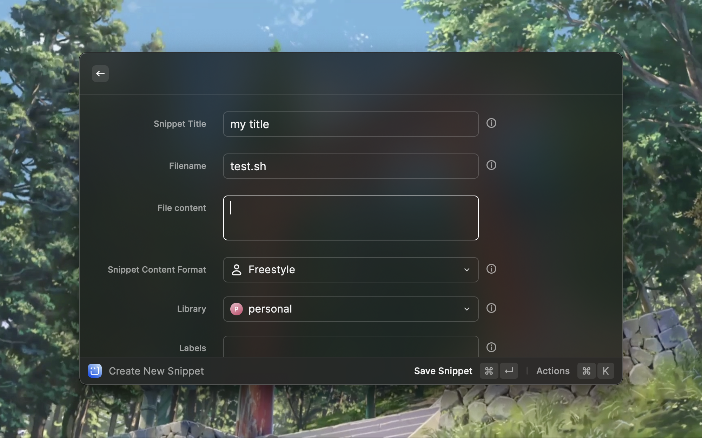
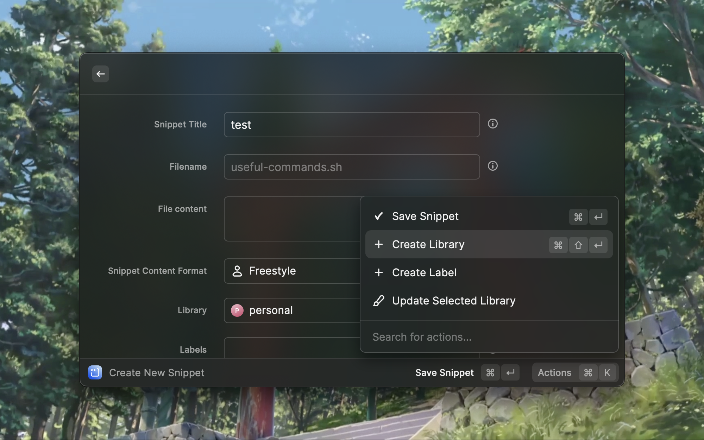
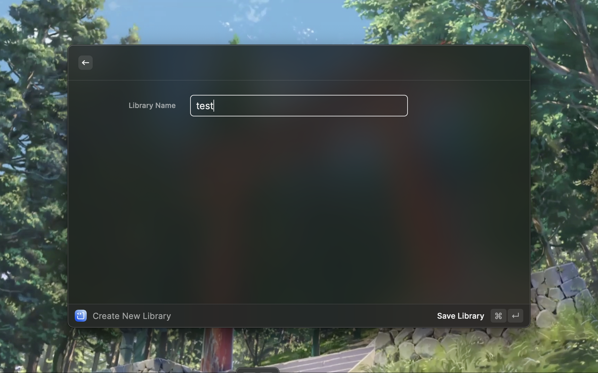
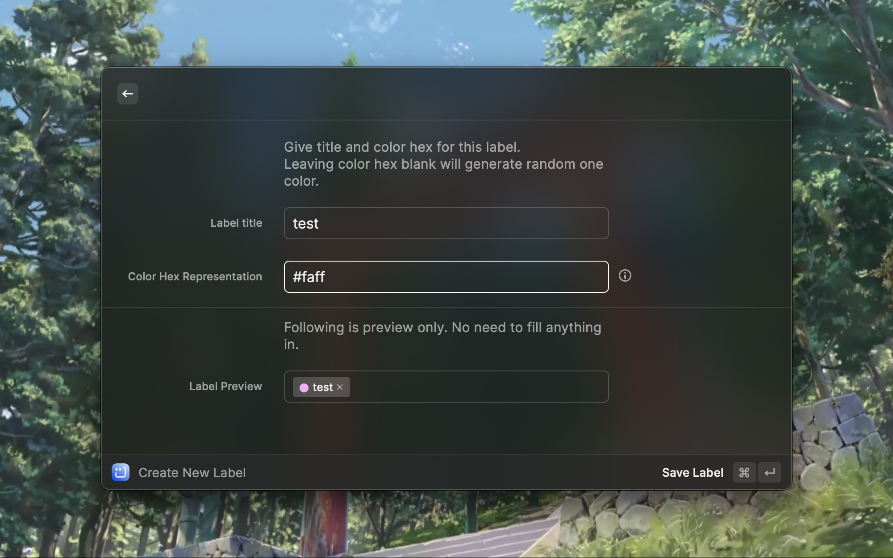
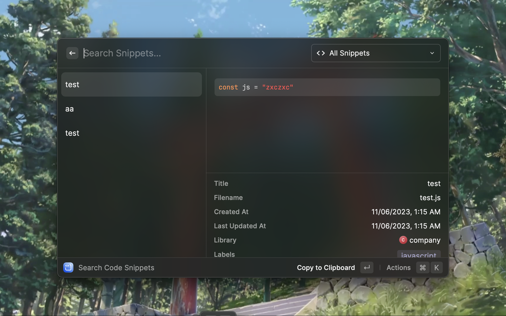
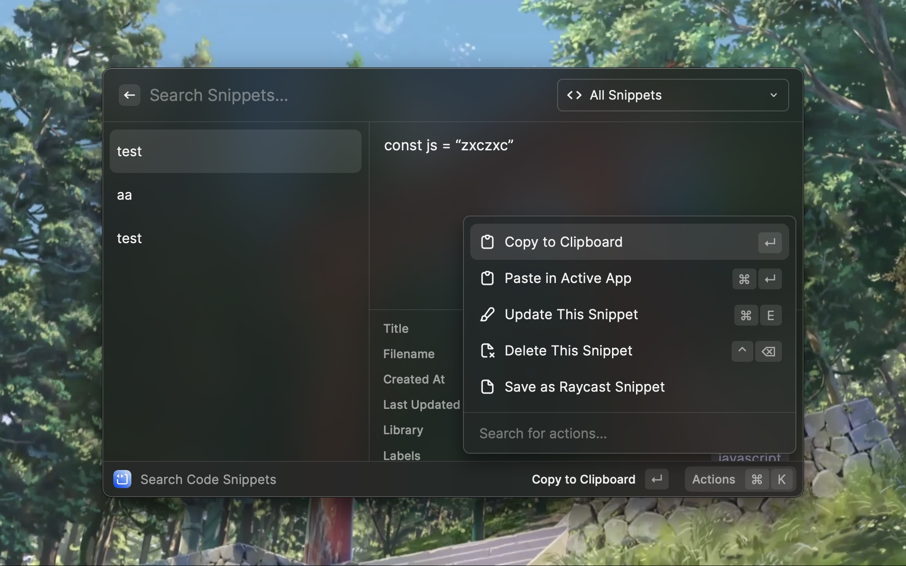
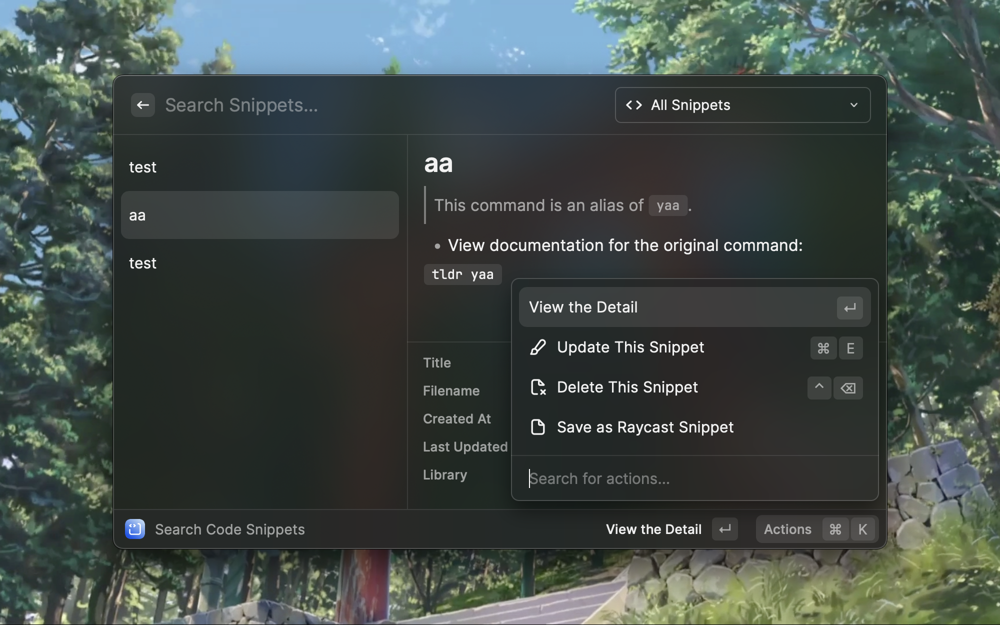
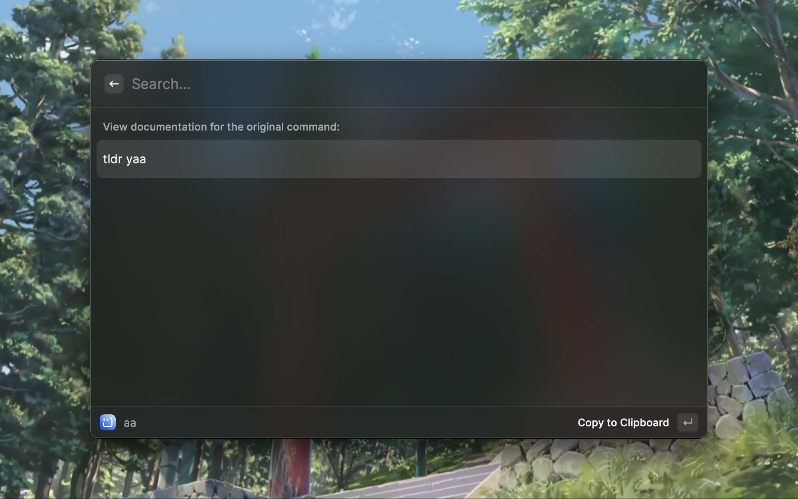
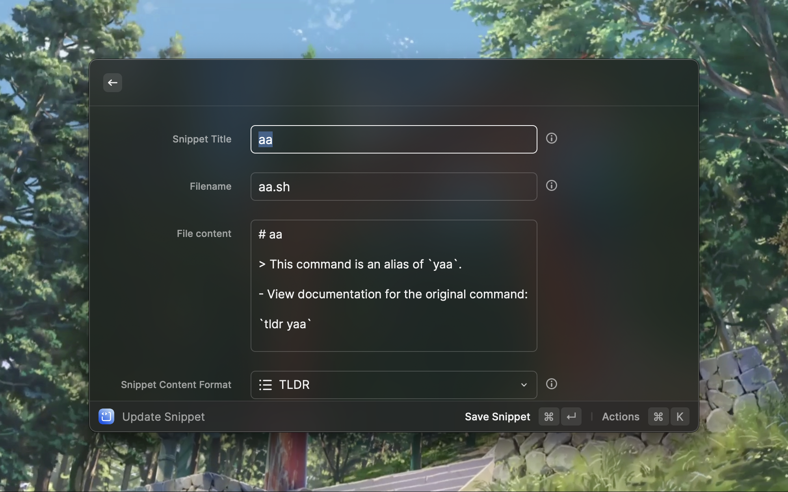
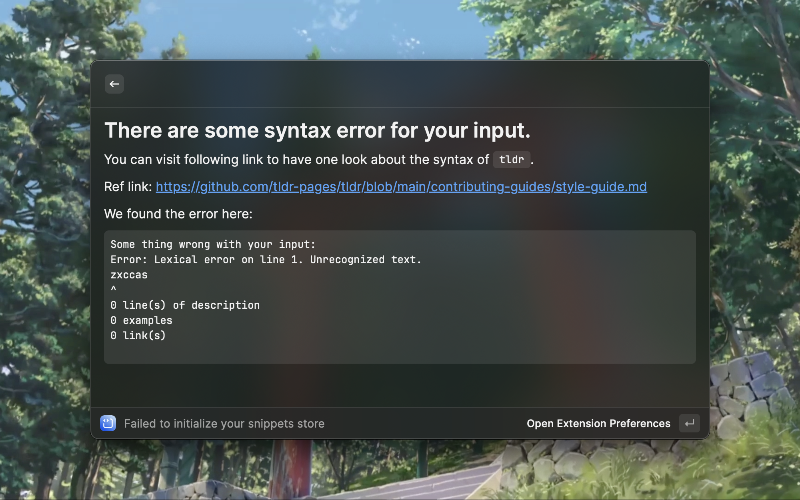

# Code Saver

One local-first snippet management extension for raycast. Store your code snippets and export them freely when you need it.

## Usage

### Create one new snippet

`Open raycast - Create Code Snippet`

### Create one library for your snippet

`Open raycast - Create Code Snippet - Cmd + k - Create Library`

### Create and preview one label for your snippet

`Open raycast - Create Code Snippet - Cmd + k - Create Label`

### Browser Snippets

`Open raycast - Search Code Snippet`

### Update existing snippet

### `TLDR` format checking

### Configuration

This is one pure **local managed** code snippets store. You should

1. Pick one local data store first. 
2. Create one Library then
3. Create snippet that you need.
4. Brower the snippts you created.

### Encryption

We use [multiple cipher](https://utelle.github.io/SQLite3MultipleCiphers/) to encrypt the sqlite data store.

The cipher we used is `AES 256 Bit` provided by `wxSQLite3`. You can see the details [here](https://utelle.github.io/SQLite3MultipleCiphers/docs/ciphers/cipher_aes256cbc/) and [here](https://github.com/utelle/wxsqlite3).
