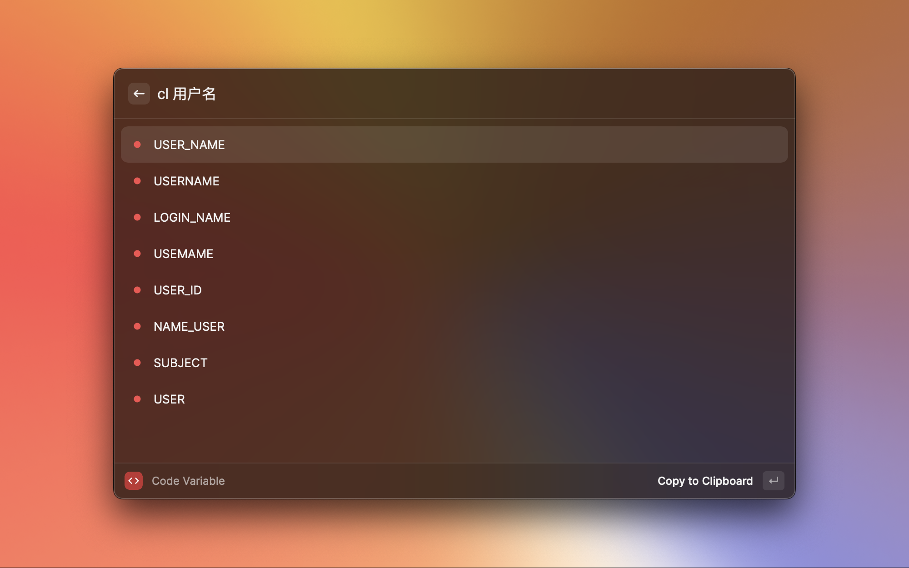

# Code Variable

Generate available code variables.

## Result

Currently supported commands: `xt`, `dt`, `xh`, `zh`,  `cl`.

### 小驼峰命名法：`xt`

### 大驼峰命名法：`dt`

### 下划线命名法：`xh`

### 中划线命名法：`zh`

### 常量命名法：`cl`

## Special Thanks

This project is based on and inspired by Alfred extension [CodeVar](https://github.com/xudaolong/CodeVar).

## License

[MIT](./LICENSE) License © 2023 [Hongbusi](https://github.com/Hongbusi) 
