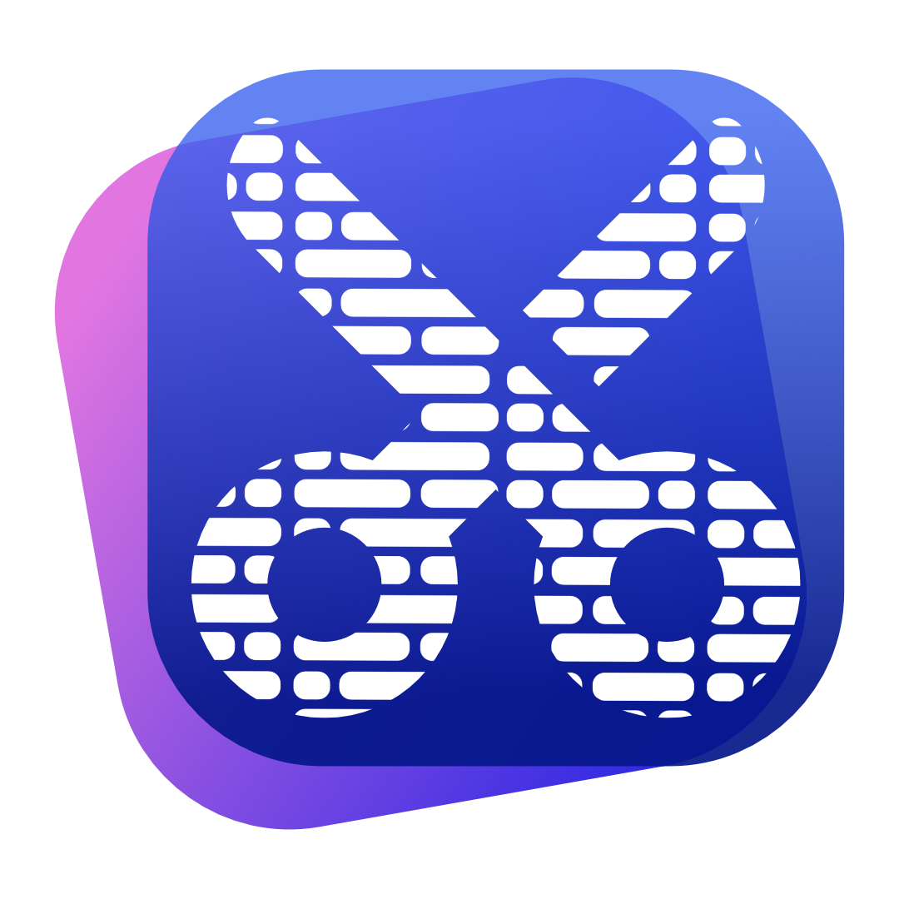
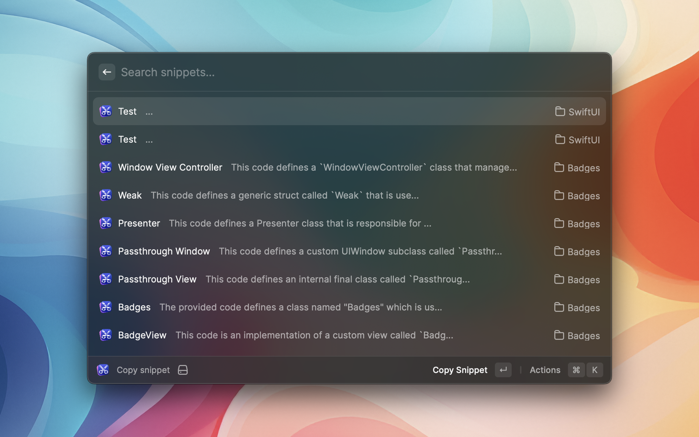
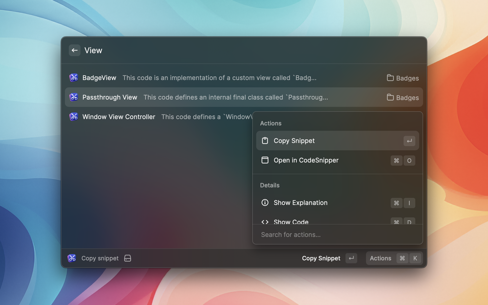
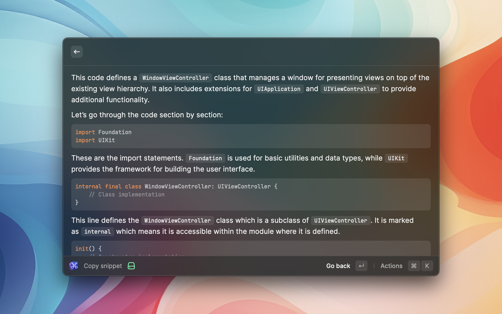
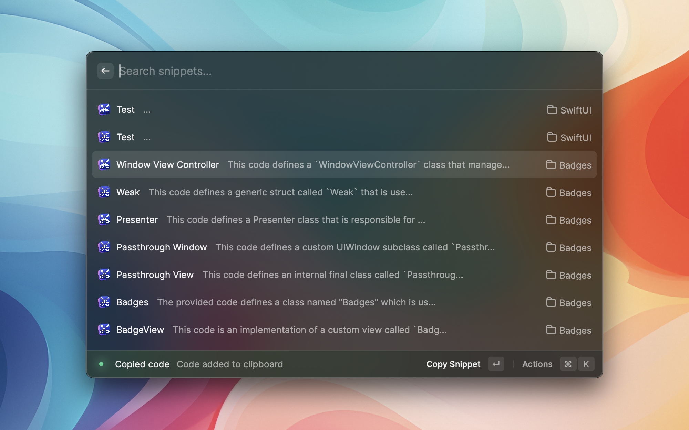
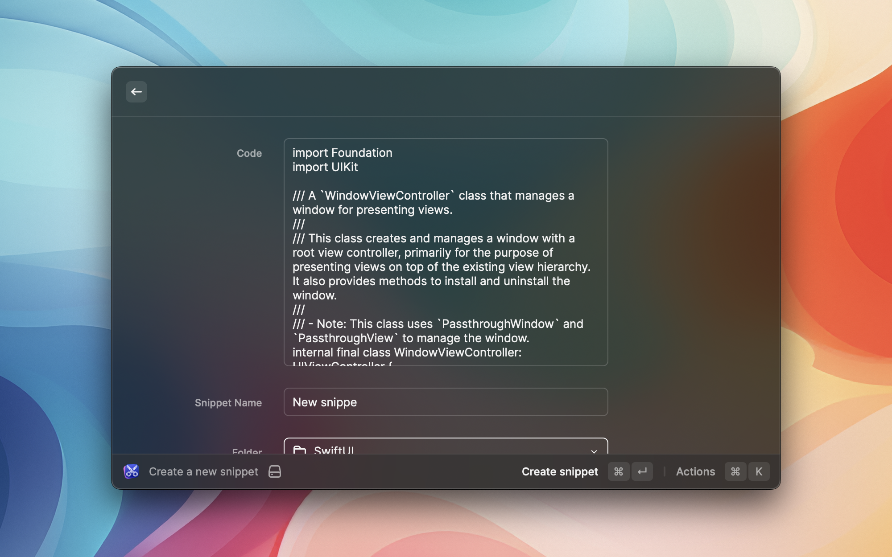

# CodeSnipper Raycast Extension 🚀

## Overview

The CodeSnipper Raycast Extension provides seamless integration between Raycast and CodeSnipper, allowing users to efficiently manage their code snippets right from their desktop or mobile device. This extension enables users to search, copy, open, and create code snippets in CodeSnipper with ease.

## Features

- 🔍 **Search Snippets**: Quickly find the code snippet you need by searching within your CodeSnipper collection.
- 📋 **Copy Snippets**: Copy code snippets to your clipboard for easy integration into your projects.
- 📂 **Open in CodeSnipper**: Instantly open a selected snippet in CodeSnipper for further editing and organization.
- ➕ **Create New Snippets**: Add new code snippets to your CodeSnipper collection without leaving Raycast.

## System Requirements

- iOS 16.0+, iPadOS 16.0+, macOS 13.0+
- [Raycast](https://www.raycast.com) installed on your device

## Installation

1. Ensure you have Raycast installed on your device.
2. Download and install the CodeSnipper Raycast Extension from the [Raycast Extension Store](https://www.raycast.com/timo-eichelmann/codesnipper).
3. Follow the setup instructions provided by the extension.

## Usage

1. Open Raycast and use the keyword `codesnipper` to launch the extension.
2. Use the provided commands to search, copy, open, and create code snippets.

## Screenshots

## License

This Raycast extension for CodeSnipper is licensed under the MIT License.

---

**Note**: CodeSnipper and Raycast are separate applications and are not affiliated with this extension.