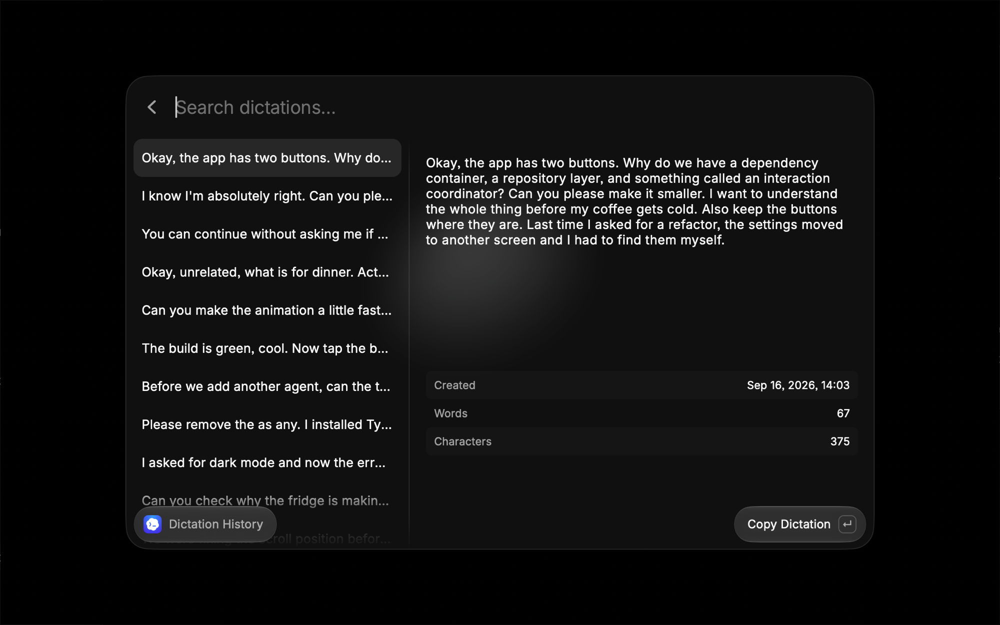

# Codex Dictation

Browse, preview, search, and copy recent Codex dictations from Raycast.

Search matches the full dictation text. History updates automatically while the command is open. For larger imported histories, the extension shows the 1,000 newest valid entries by creation date; it never modifies the history file.

## Requirements

Install [Codex](https://developers.openai.com/codex/app) before using this extension. Open Codex and sign in, then use dictation at least once so Codex creates its dictation history file.

The extension looks for Codex data in this order:

1. `$CODEX_HOME`
2. `~/.codex`

## Dictation Hotkeys

Use the `Open Codex Settings` command to open `codex://settings` and configure dictation hotkeys in Codex.
