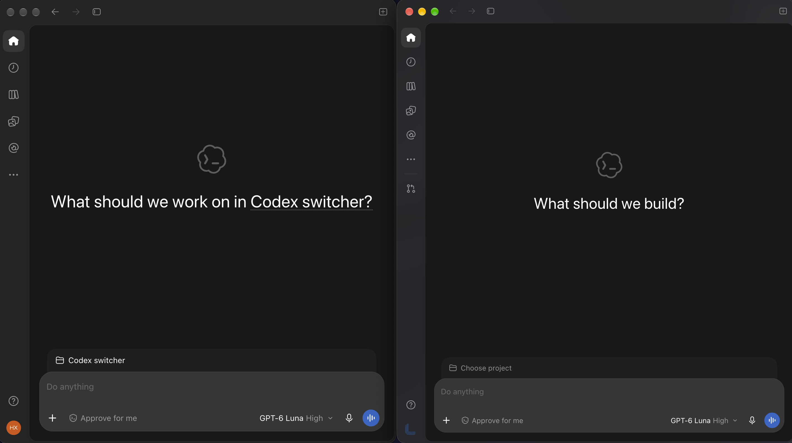

# Codex Profiles

I kept running into the same problem: the ChatGPT app doesn’t give me a simple way to keep work and personal accounts open side by side. I care about keeping projects, chats, plugins, and context separate. I looked for a quick solution, but nothing I found fit, so I made this for myself—and hopefully for others who want the same separation.

## How it works

Work uses your regular `~/.codex` folder. Other profiles get their own folders under `~/.codex-profiles/`. For another profile, the extension starts a second ChatGPT process (`open -n`) with a separate Codex home, database home, and Electron app-data directory. ChatGPT treats it as a separate local profile, so you can sign in to a different account and keep both windows open. Profile data isn’t shared or copied between them.

Each profile keeps its own plugins, dependencies, settings, and local app data. This can use more disk space because plugins, runtimes, and caches may be downloaded or stored again for each profile.

This is a local workaround, not an official OpenAI feature. It relies on how the ChatGPT app currently handles profile-specific launch settings, which could change in a future update. I hope OpenAI eventually adds native multi-account support.

Removing a profile from the list does not delete its folder or data. You can re-add an unlinked profile folder later.

If a secondary profile's window is closed but ChatGPT remains running without a window, opening that profile brings its window forward when possible. Otherwise, the extension closes and relaunches only that profile's ChatGPT instance. macOS may ask permission for the extension to control System Events for this recovery. Other profile instances are left alone.

## Compatibility

Tested with ChatGPT for macOS **26.924.22138 (build 11645)**, the version installed when this README was updated. OpenAI's public macOS release notes do not list numeric app versions; see [the release notes](https://help.openai.com/en/articles/9703738-chatgpt-macos-app-release-notes) for product updates.

## Commands

- **Switch Profile** — choose a profile to open.
- **Switch to Profile 1** — open the first profile directly.
- **Switch to Profile 2** — open the second profile directly.
- **Manage Profiles** — create, rename, remove, or re-add profiles.

You can assign hotkeys to the first- and second-profile commands in Raycast’s command settings.

## Development

Run `npm install`, then `npm run dev` to try the extension locally. Use `npm run build` and `npm run lint` to check it.
