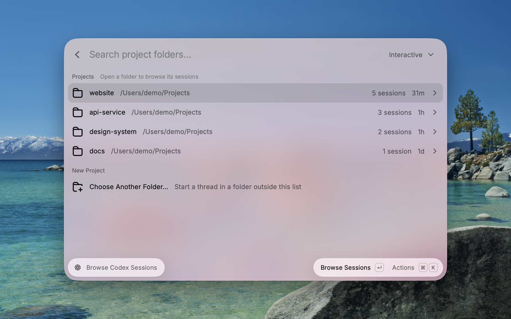

# Codex Sessions

A macOS Raycast extension for finding local Codex sessions and opening Codex projects in Codex Desktop.

## Commands

- **Browse Codex Sessions** shows project folders with session counts. Press Enter to browse a folder's sessions and Esc to return. Search within a project, switch between interactive/all/archived sessions, and resume a thread using the same actions as session search. Folders are grouped by the exact working directory recorded in session history, including worktrees and folders that no longer exist.
- **Search Codex Sessions** searches local Codex threads. Interactive sessions are shown by default; the list also supports all sessions and archived sessions.

In Browse Codex Sessions, press **⌘N** on a folder or inside its session list to open a new thread in that project. The **New Thread in Project** action opens Codex's composer with the selected folder; enter your prompt there to start. This action is also available when a project's session search has no matches.

To start in a folder that has no session history, use **Choose Another Folder…** in Browse Codex Sessions. The folder picker remains available when the state database cannot be loaded.

**Upgrading from Open Codex Project:** the command is now called **Browse Codex Sessions**, and existing hotkeys and aliases are preserved. Press Enter to browse a project's threads, or **⌘N** to start a new thread there. Project folders are now sorted by recent session activity; the old frecency ranking and reopen-by-git-remote action are no longer available. Session history remains browsable for folders that have been moved or deleted.

Session lists enrich SQLite session metadata with lightweight `Working` and `Done · Unread` state written by Codex hooks. The hook has no notification UI of its own.

## Screenshots

Browse project folders, then open a folder to see its sessions. These screenshots use sample data.




## Setup

1. Install Codex Desktop or the Codex CLI and create at least one local session.
2. Install [Codex Sessions from the Raycast Store](https://www.raycast.com/jomatsu/codex-sessions).
3. Optional: enable live `Working` and `Done · Unread` status tags:

   ```sh
   npx codex-raycast setup
   ```

4. Open Codex, run `/hooks`, and review and trust both installed hooks.

Session search and the project list work without the optional hook. The hook only adds live status tags.

## Preferences

- **Codex CLI Path** optionally sets the absolute path to the `codex` binary. When empty, the extension checks common installation paths and then `PATH`.
- **Terminal for Resume** chooses Terminal.app or iTerm for the Resume in Terminal action.

## Data and privacy

The extension reads Codex's internal state database **read-only** and never modifies or uploads your Codex data. If the database is unavailable, it scans only the heads of the newest local rollout files and labels the result as degraded mode. Session titles and prompts remain on your Mac.

Only **local** threads are cataloged in the state database. Codex Cloud tasks do not appear, by design.

## Session status

Codex's SQLite catalog does not persist live `working` or `done` state. Two lightweight, trusted Codex hooks supplement the database by maintaining `~/.local/state/raycast-codex-sessions/states.json`:

- `UserPromptSubmit` marks an interactive session as `Working`.
- `Stop` waits for a short settle window, then marks it `Done · Unread`; a newer prompt cancels the pending completion.

The hook stores no assistant message content, shows no macOS notification, and has no separate menu-bar UI. `codex exec`, subagent, and JSON automation sources are excluded. Opening a completed session from **Browse Codex Sessions** or **Search Codex Sessions** marks it as seen.

The hook and its setup CLI ship as the [`codex-raycast`](https://www.npmjs.com/package/codex-raycast) npm package in this monorepo. Install or repair it with `npx codex-raycast setup`, verify with `npx codex-raycast doctor` (especially after Codex version upgrades), and review trust with `/hooks` inside Codex. This extension only reads `states.json`; without the hook installed, the status tags simply stay absent.

## How it differs from the Codex extension

The Store's [Codex](https://www.raycast.com/asifk/codex) extension is a thread management console built on a live `codex app-server` process: it drives the app-server over JSON-RPC to rename, summarize, archive, fork, and export threads, listing them within its lookback window.

Codex Sessions answers a different question — *which of my sessions is working or finished right now, and take me back into it*:

- Reads Codex's on-disk state **read-only** (the SQLite catalog, full history) and never spawns a Codex process; when the database is unavailable it degrades to a bounded rollout-file scan instead of failing.
- Adds live `Working` / `Done · Unread` status tags through the optional [`codex-raycast`](https://www.npmjs.com/package/codex-raycast) hook, with triage scopes for unread completions.
- Resumes sessions in Terminal or iTerm for CLI-only setups, browses projects by recent use, and starts new threads in a chosen folder.

The two work well together: this extension for ambient status and fast resume, the Codex extension for deep thread management.

## Troubleshooting

If no sessions appear, verify that Codex has created `~/.codex` and that the optional CLI path points to an executable `codex` binary. A degraded-mode banner means the state database could not be queried; the extension will show a bounded recent file scan instead.

The extension uses Codex Desktop deep links, with `codex app <path>` and terminal resume as fallbacks.
