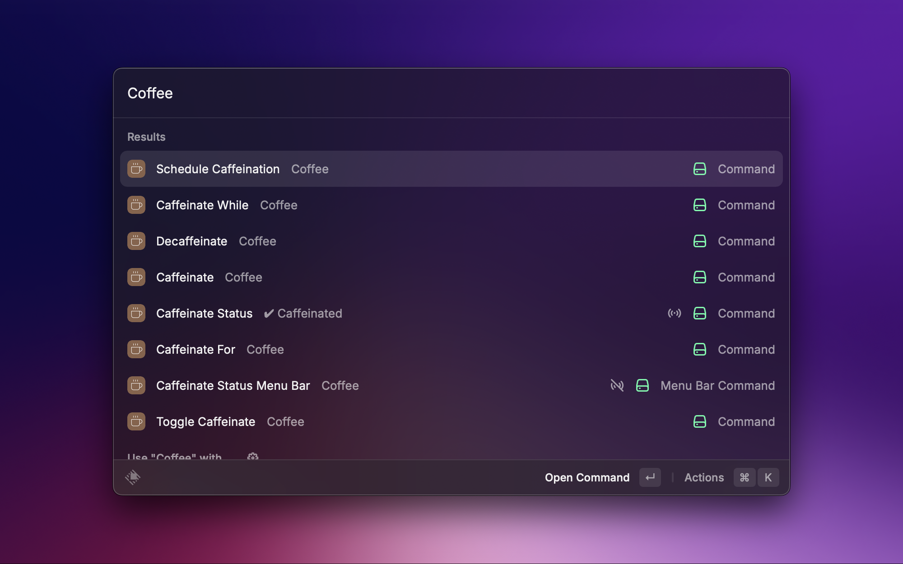

  
  <h1 align="center">Coffee Extension</h1>

**Coffee** is a Raycast extension designed to manage the caffeination of your Mac. Whether you want to keep your Mac awake for a specific period, while a particular app is running, or on a schedule, Coffee has you covered.

## Installation 🛠️

To install the Coffee extension, follow these steps:

1. Open Raycast.
2. Search for "Store" and navigate to the Raycast Store.
3. Search for "Coffee" and click "Install."

## Usage 🚀

Once installed, simply trigger the Raycast command palette and search for the desired caffeination command.

  

## Features ✨

### 1. **Caffeinate/Decaffeinate**

Keep your Mac awake indefinitely or cancel the caffeination.

### 2. **Toggle Caffeination**

Toggle between keeping your Mac caffeinated and in a decaffeinated state

### 3. **Caffeinate For**

Caffeinate your Mac for a specified amount of time.

  

### 4. **Caffeinate While**

Keep your Mac awake as long as a specific app is running.

  

### 5. **Schedule Caffeination**

Set up a custom caffeination schedule using natural language.  
Examples:

> ⏳ Schedule for everyday except Tuesday from 13:00 to 20:00  
> ⏳ Schedule for Monday and Thursday from 09:00 to 14:00  
> ⏳ Schedule from 10:00 to 16:30 (adds schedule for all days)  
> ⏳ Saturday and Sunday from 20:00 to 23:30

Supported Actions:

- Add a Schedule
- Pause/Resume Schedule
- Delete a Schedule

> 📋 **Note:** If you pause a schedule, you must manually resume it for it to work the next week or any future instances.

  

### 6. **Caffeination Status**

Get the current state of caffeination.

### 7. **Caffeinate Status Menu Bar**

Get the status of current caffeination in your menu bar.
