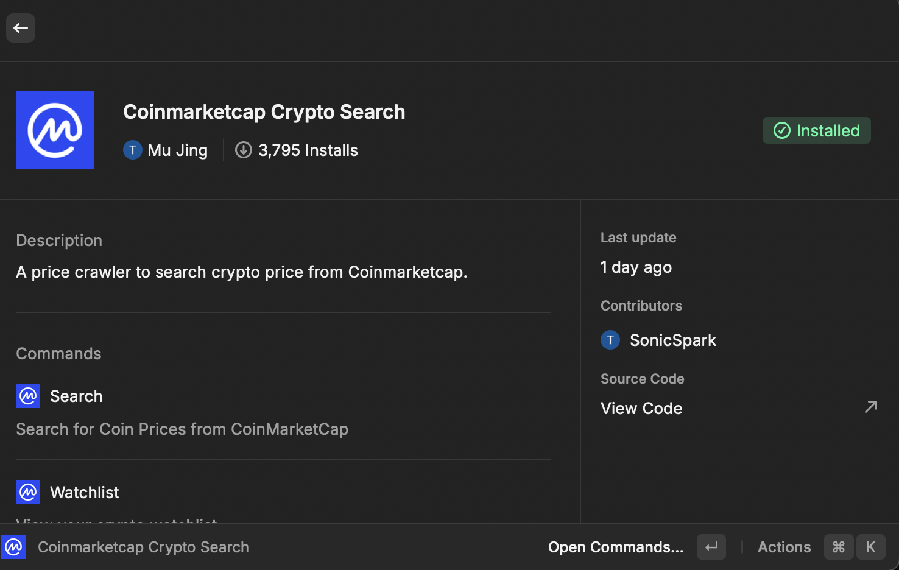
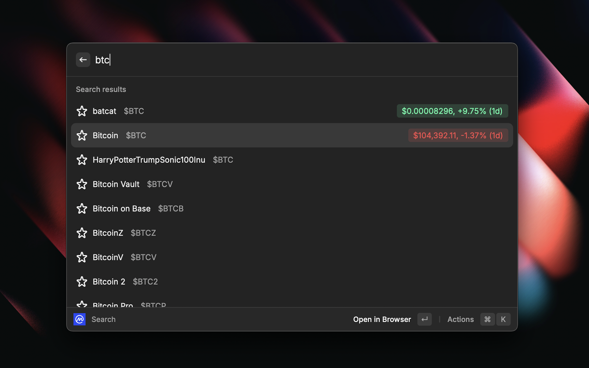
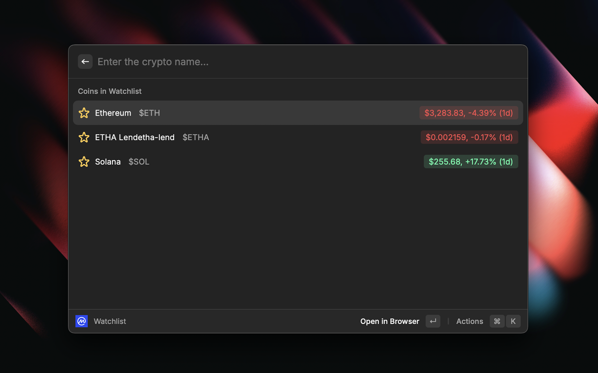
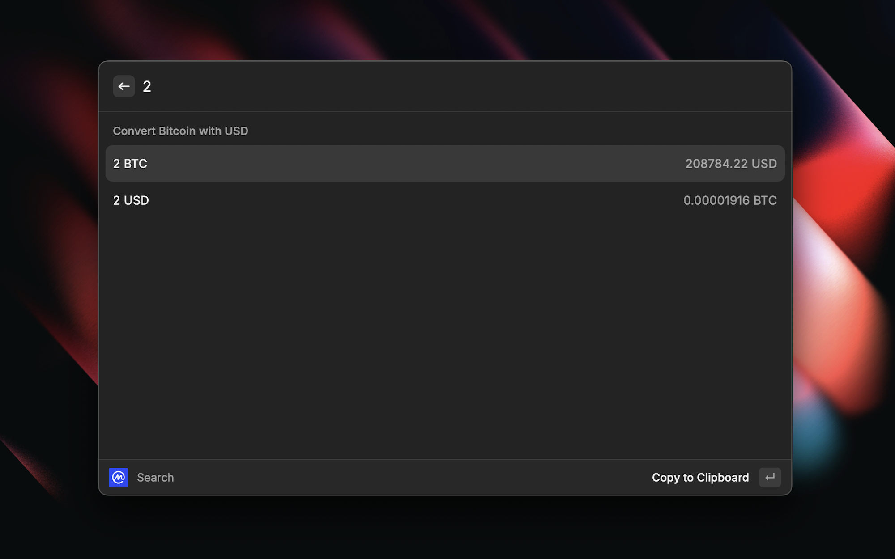

# Raycast CoinMarketCap Crypto Crawler

A Raycast plugin for getting the latest price of your favorite coins from [CoinMarketCap](https://coinmarketcap.com/).

## Basic Usage

Just type the name of the coin you want to search for. There's no need to use api key as this extension is using crawler to get the latest price in real-time.

## Watchlist

You can also add your favorite coins to the watchlist by pressing `ctrl + shift + w` to track the price of your favorite coins. You can use the `watchlist` command to view the watchlist.

## Calculate Token Value

You can also calculate the value of the coin you're searching for by the amount of coins you entered.
Just open the action panel and select `Calculate Value`, or press `command + enter` to enter the calculation panel.

