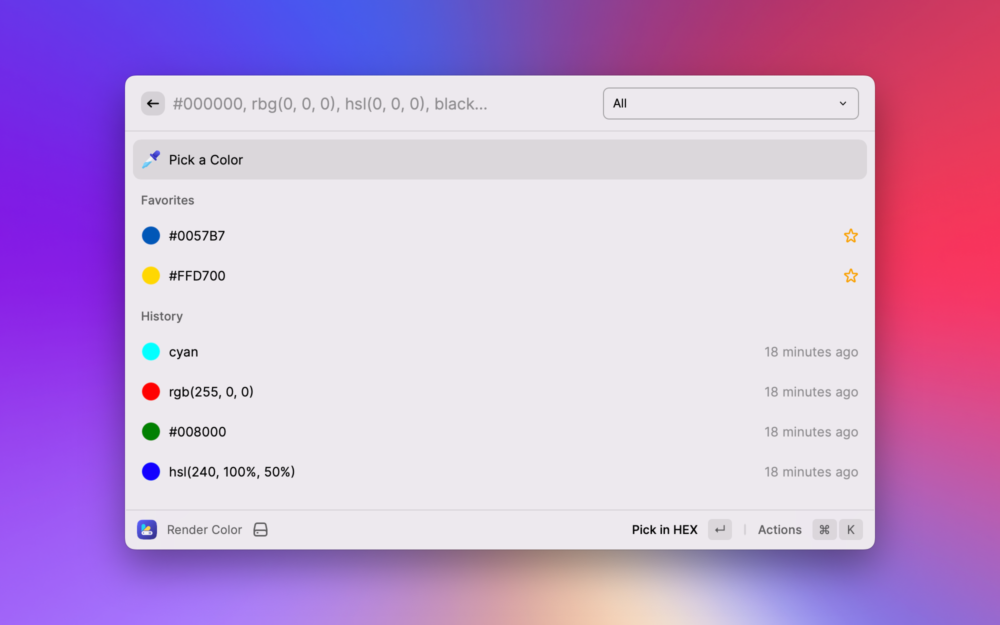

  

# Color Casket

Handy color utilities in your pocket.

Now with **Color Picker**!

---

**Color Casket** provide you ability to pick and render color strings in next formats:

- HEX
- RGB
- HSL
- Keyword

Keyword - its basic color names as: red, blue, cyan, purple, etc. When you searching in another format **Color Casket** will find closest color name;

## Usage

### Render Color

Type `Render Color` command to open your color casket.

### Pick Color

Type `Pick Color` command to open a color picker.

---

Available keywords to find commands: `color`, `pick`, `eyedropper`, `pipette`, `render`, `render color`, `color utilities`, `color casket`

## Features

- [x] pick color from everywhere
- [x] render color by string value
- [x] render and pick history
- [x] favorite color list
- [x] configure preferred color format

## Future updates

Let's make **Color Casket** as your favorite pocket color tools. Create a Pull Request or open a Feature Request with your new great idea.

### TODO schedule

- [ ] filter by formats
- [ ] generate shades (based on color)
- [ ] generate color palette (based on color)
- [ ] search in opinion recommended color palettes

## Changelog

Please see [CHANGELOG](CHANGELOG.md) for more information what has changed recently.

## Credits

- [Slava Razum](https://github.com/slavarazum)
- [Perfect Raycast Documentation and API](https://developers.raycast.com)

