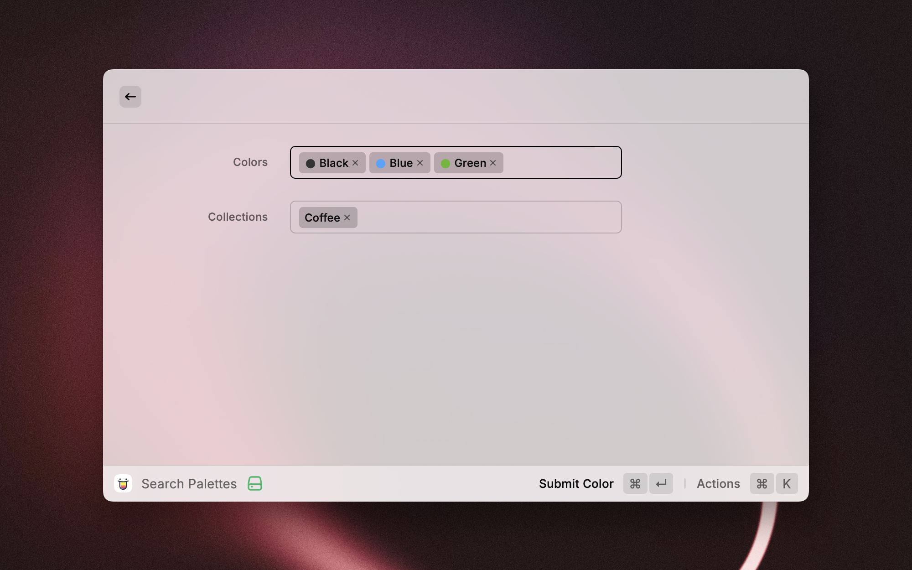
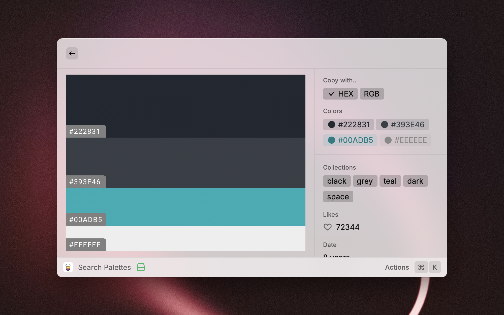

 
 

<h1 align="center">Color Hunt</h1>

Color Palettes for Designers and Artists

## Introduction

This extension features all the functionalities of the [Color Hunt](https://colorhunt.co/) website. Users can browse,
search, filter, and copy color palettes to their clipboard.

## Bugs

The extension utilizes [satori](https://github.com/vercel/satori) to generate SVGs, which consumes a significant amount
of memory. Given that Raycast currently has a memory limit of `100MB`[^1], this may cause the heap out of memory.

so it currently only support fetch the first **11 pages**.

## Installation

Currently, you need to clone this repo and install it locally in developer mode.

You will need to have [Node.js](https://nodejs.org) and [pnpm](https://pnpm.io/) installed.

1. Clone this repo `git clone https://github.com/bxb100/color-hunt.git`
2. Go to the folder `cd color-hunt`
3. Install dependencies `pnpm install`
4. Go to Raycast, run `Import Extension` and select the folder

[^1]: https://raycastcommunity.slack.com/archives/C02HEMAF2SJ/p1715350721316929?thread_ts=1715342564.936389&cid=C02HEMAF2SJ
