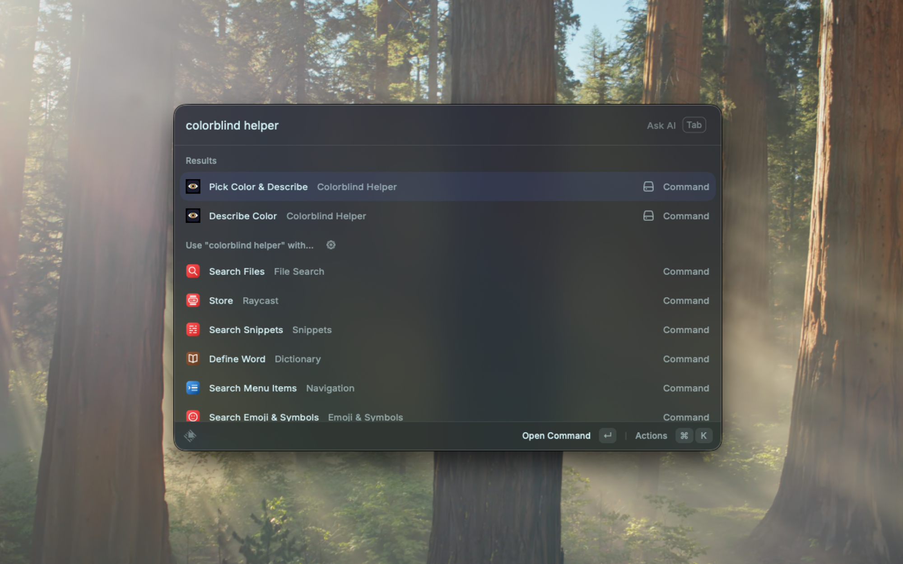

# Colorblind Helper

Pick any color from your screen and get a human-readable description with colorblind simulation.

## Features

- **Pick Color from Screen** — Use the native macOS eyedropper to select any pixel. The hex code is automatically copied to your clipboard.
- **Simple & Detailed Names** — Every color gets a basic name (e.g. "blue", "brown") and a natural-language description (e.g. "a muted steel blue", "a bold tomato").
- **Colorblind Simulation** — See how a color appears to people with protanopia, deuteranopia, and tritanopia.
- **Confusion Warnings** — Get alerts when a color may be misidentified by someone with color vision deficiency.
- **Hex Input** — Type a hex code directly to describe any color without the eyedropper.
- **History** — Access your recently picked colors from within Raycast.

## Commands

| Command | Description |
|---|---|
| **Pick Color & Describe** | Opens the eyedropper, describes the color in a HUD notification, and copies the hex to clipboard. |
| **Describe Color** | Opens a list view where you can pick a color, enter a hex code, or browse your history. Push into a detail view for full colorblind simulation data. |

## How It Works

1. **Basic name** is determined from the color's HSL values (hue, saturation, lightness) and maps to intuitive categories: red, orange, yellow, green, teal, blue, purple, pink, brown, gray, black, or white.
2. **Detailed description** uses the closest match from the standard HTML color palette (~140 well-known names like "tomato", "steel blue", "lavender") combined with a single qualifier (dark, pale, muted, soft, vivid, or bold) based on the color's lightness and saturation.
3. **Colorblind simulation** applies Vienot et al. (1999) simulation matrices to show how the color shifts under each type of color vision deficiency.
4. **Confusion warnings** fire when the simulated color differs significantly from the original (using redmean color distance) and lands in a different basic color category.

## Requirements

- macOS (uses native `NSColorSampler` for the eyedropper)
- [Raycast](https://raycast.com)
