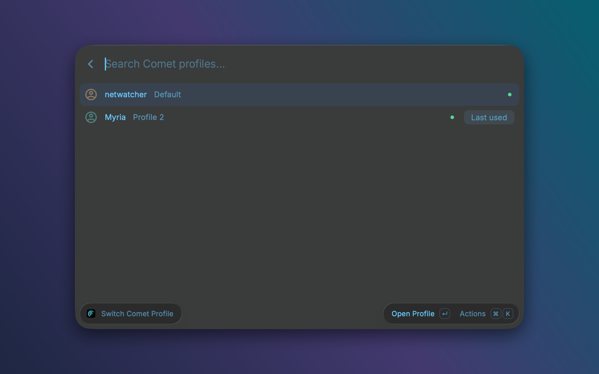

# Comet Profile Switcher

Open a specific [Comet](https://www.perplexity.ai/comet) browser profile straight from Raycast. Type `work` and hit Enter, or press a global hotkey, and Comet brings that profile's window to the front (or opens one).



## Commands

| Command | What it does |
| --- | --- |
| **Switch Comet Profile** | Lists your Comet profiles with their colors, a dot for profiles that have a window open, and a "Last used" tag. Enter focuses or opens the profile. ⌘Enter opens a new window. |
| **Profile 1** … **Profile 5** | Each opens the profile you assign to it. The first time you run one, Raycast asks which Comet profile it should open. Profiles 3 to 5 are off by default; enable them in Raycast Settings if you have more profiles. All accept an optional URL argument, e.g. `Profile 1 github.com`. |

## Give a profile an alias or hotkey

1. Run **Profile 1**. Raycast asks for the Comet profile: type its name exactly as Comet shows it (for example `Work`). The folder name such as `Profile 2` works too.
2. Open Raycast Settings → **Extensions** → **Comet Profile Switcher**.
3. Next to **Profile 1**, set an **Alias** (e.g. `work`) and/or a **Hotkey** (e.g. Hyper + W).

Repeat with Profile 2 for your next profile, and so on. To change which profile a command opens, select it in Raycast, press ⌘K → *Configure Command*, or use ⌘E from the picker to jump to the settings.

## Preferences

- **Comet Application**: only needed if Comet isn't in `/Applications`.
- **Comet Data Directory**: defaults to `~/Library/Application Support/Comet`.
- **Always open a new window**: by default an existing window for the profile is brought to the front; enable this to get a fresh window every time.

Focusing an existing window uses macOS accessibility to find the Comet window titled with that profile, so Raycast needs **Accessibility** access (System Settings → Privacy & Security → Accessibility). Without it the extension still works but always opens a new window, and tells you why.

## Performance

- No network, no background processes, no menu bar item.
- Comet's profile registry (`Local State`, about 1 MB) is parsed once and cached; it's re-read only when the file changes.
- Comet is launched through macOS `open`, so nothing stays attached to Raycast.

## How it works

Comet is Chromium-based. Its profiles live in `~/Library/Application Support/Comet/<directory>` and are listed in `Local State` under `profile.info_cache`, with the display name and theme colors.

Opening a profile first looks for a Comet window whose title ends in ` - Comet - <profile>` and raises it. If there is none (or you asked for a new window / passed a URL), it runs:

```
open -na /Applications/Comet.app --args --profile-directory="Profile 2" [--new-window] [url]
```

A running Chromium always opens a new window for a bare `--profile-directory`, which is why the focus step comes first.

## Local mode: one command per profile

If you install from source, you can skip the slots entirely and get a command named after each of your profiles, with an icon in that profile's colors, so they appear by name in Raycast Settings:

```sh
git clone https://github.com/alexnicolai/comet-profile-switcher
cd comet-profile-switcher
npm install
npm run local
```

This generates a private copy of the extension in `.local/` from your Comet profiles and installs it into Raycast as *Comet Profile Switcher (Local)*. Run `npm run local` again after adding or renaming profiles in Comet. The Store version can't do this because Store extensions have a fixed command list.

## Development

```sh
npm install
npm run dev      # install the Store version into Raycast with hot reload
npm run lint
npm run build
```

## License

MIT
