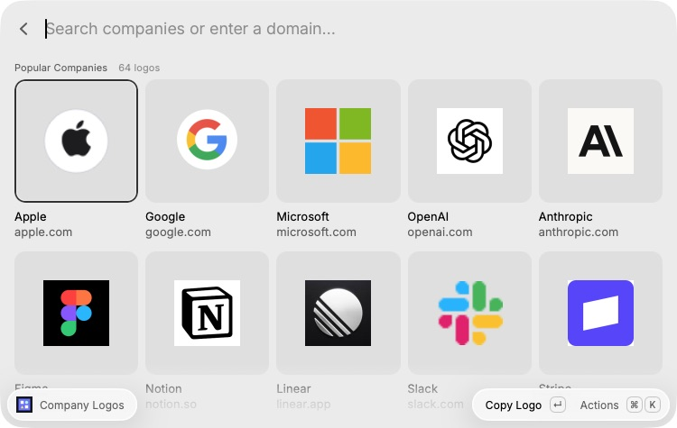

# Company Logos

Find a company logo in Raycast. Copy the image, then paste it into a document, slide, canvas, or chat.



## Install

**Install from source for now.** The [Raycast Store submission](https://github.com/raycast/extensions/pull/32079) is pending review. One-click installation becomes available after approval and publication.

1. Install [Raycast](https://www.raycast.com/) on macOS.
2. Install [Node.js](https://nodejs.org/en/download) 22 or newer. npm is included.
3. Open Terminal and run:

```sh
git clone https://github.com/mrzmyr/raycast-company-logos.git
cd raycast-company-logos
npm ci
npm run dev
```

4. Wait for `ready - built extension successfully`.
5. Open Raycast, search **Search Company Logos**, and press Enter.
6. Stop the Terminal process with **Ctrl+C** when you are done. The extension stays installed.

No API key or additional account is needed. Keep the cloned folder to update the extension later.

### Install without Git

Download the [source ZIP](https://github.com/mrzmyr/raycast-company-logos/archive/refs/heads/main.zip) and unzip it. In Terminal, type `cd `, drag the extracted folder into the window, and press Enter. Then run:

```sh
npm ci
npm run dev
```

### Update or uninstall

To update a Git clone, open Terminal in the project folder and run:

```sh
git pull --ff-only
npm ci
npm run dev
```

For a ZIP install, download a fresh ZIP and repeat the install steps. To uninstall, open **Raycast Settings → Extensions**, select **Company Logos**, and choose **Remove Extension** from its actions menu.

## Use

- Search 64 popular companies by name, domain, or product alias.
- Enter another domain or full website URL to fetch its favicon.
- **Enter:** copy the PNG image.
- **⌘Enter:** paste into the previously active app.
- **⌘⇧C:** copy the image URL.
- **⌘O:** open the company website.

Images come from Google's favicon endpoint: `https://www.google.com/s2/favicons?domain=stripe.com&sz=256`. No API key needed. Requests ask for 256 px, but actual resolution depends on the website. These are website icons, not full wordmarks or vector brand assets. Unknown sites may return a generic icon or an error.

Downloaded images are converted to PNG with macOS `sips`, then cached for seven days. Copy and paste use Raycast's file clipboard API; the target app must accept image/file pastes. Preview and download requests send company domains to Google. URL paths and query strings are discarded.

## Source and images

Source code is available under the [MIT license](LICENSE). **Individual company logo files are fetched at runtime and are not included in this repository or its releases.** The catalog contains company names, domains, and search keywords. Company logos appear in the README and Store screenshots only. The bundled extension icon is original geometric artwork.

Keep downloaded logos and caches out of contributions. Image files are ignored by Git except for the extension's own icon and the README and Store screenshots.

## Check

```sh
npm test
npm run typecheck
npm run lint
npm run build
```

Requires macOS and Raycast. Built with the [Raycast Grid API](https://developers.raycast.com/api-reference/user-interface/grid) and [Clipboard API](https://developers.raycast.com/api-reference/clipboard).
