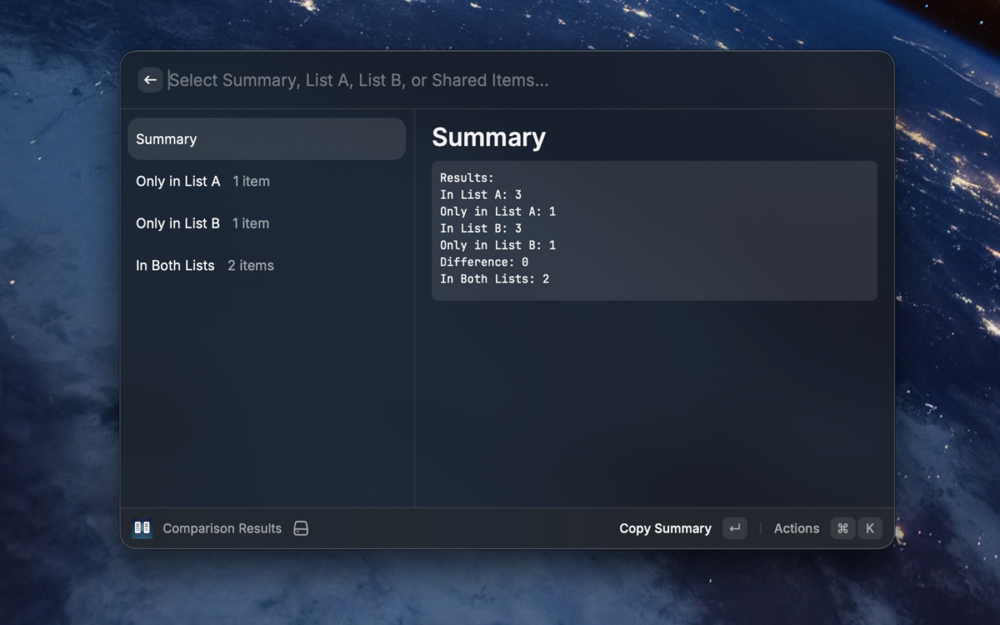
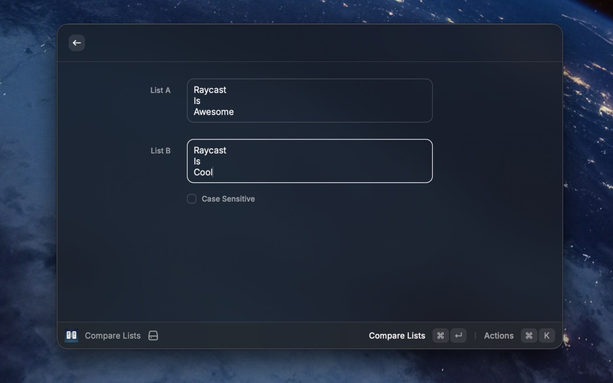
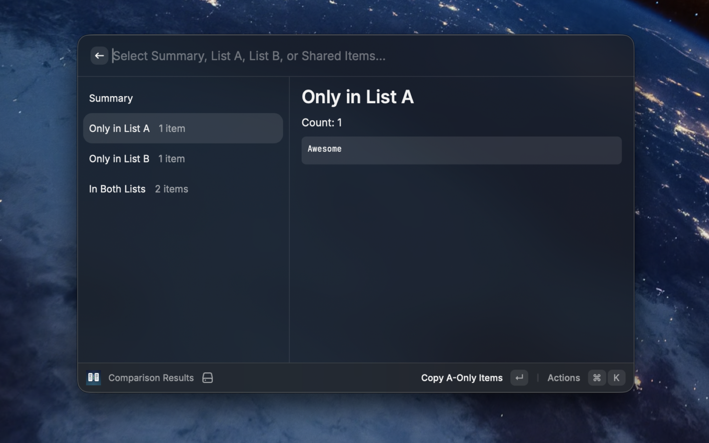
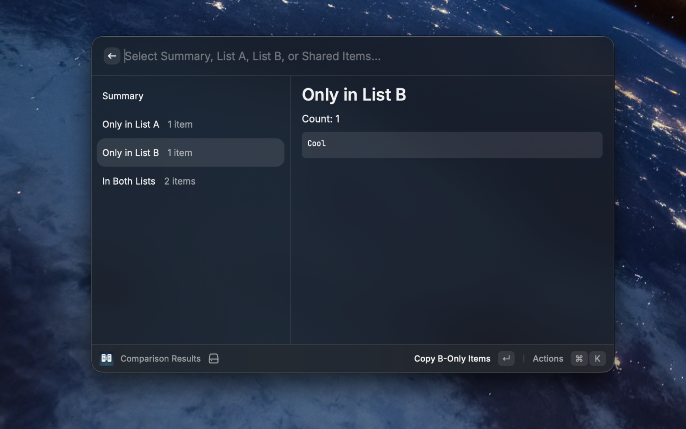
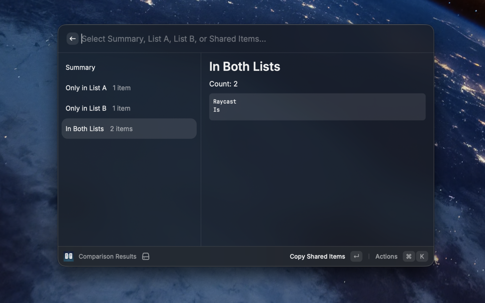
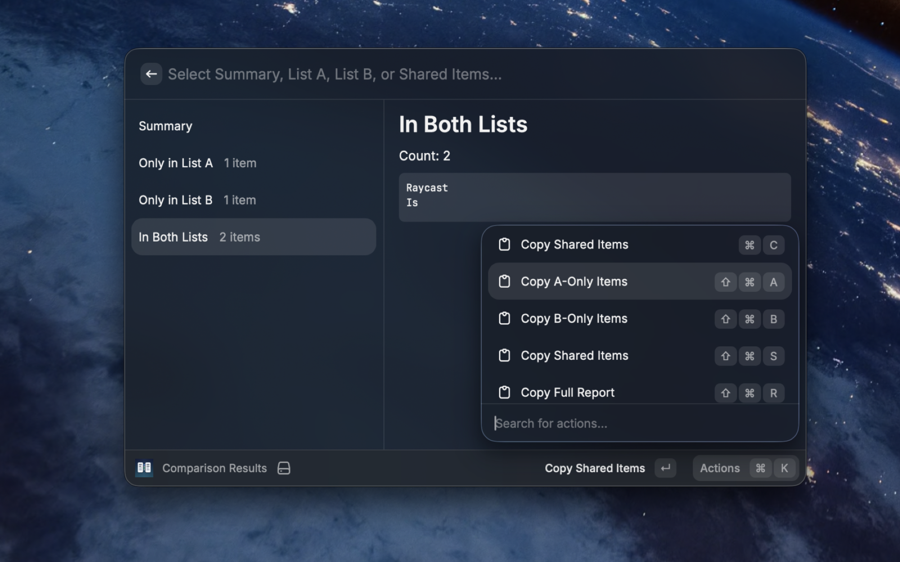

# List Comparison

Fast list diff for Raycast. Paste two lists, compare them instantly, and copy exactly what you need.



## Highlights

- Compare two newline-separated lists in seconds
- Toggle case-sensitive or case-insensitive matching
- See a clean breakdown: `Only in List A`, `Only in List B`, and `In Both Lists`
- Copy any section or the full report directly from Raycast
- Preserves first-seen order so results stay readable

## How It Works

The comparison engine is designed for everyday text cleanup tasks:

- trims surrounding whitespace
- ignores blank lines
- deduplicates repeated items in each list
- keeps shared item order based on List A

This makes it useful for IDs, emails, SKUs, tags, keywords, exports, and quick sanity checks.

## Screenshot Tour

### Input Form


### Summary


### Only in List A


### Only in List B


### Shared Items


### Shared Items Actions


## Keyboard Shortcuts

| Action | Shortcut |
| --- | --- |
| Copy selected view | `cmd + c` |
| Copy A-only items | `cmd + shift + a` |
| Copy B-only items | `cmd + shift + b` |
| Copy shared items | `cmd + shift + s` |
| Copy full report | `cmd + shift + r` |

## Usage

1. Open `Compare Lists` in Raycast.
2. Paste `List A` and `List B` (one item per line).
3. Toggle `Case Sensitive` if needed.
4. Submit and inspect summary, differences, and overlap.

## Development

```bash
npm install
npm run dev
```

## Validation

```bash
npm run lint
npm run test
npm run build
```

## License

MIT
