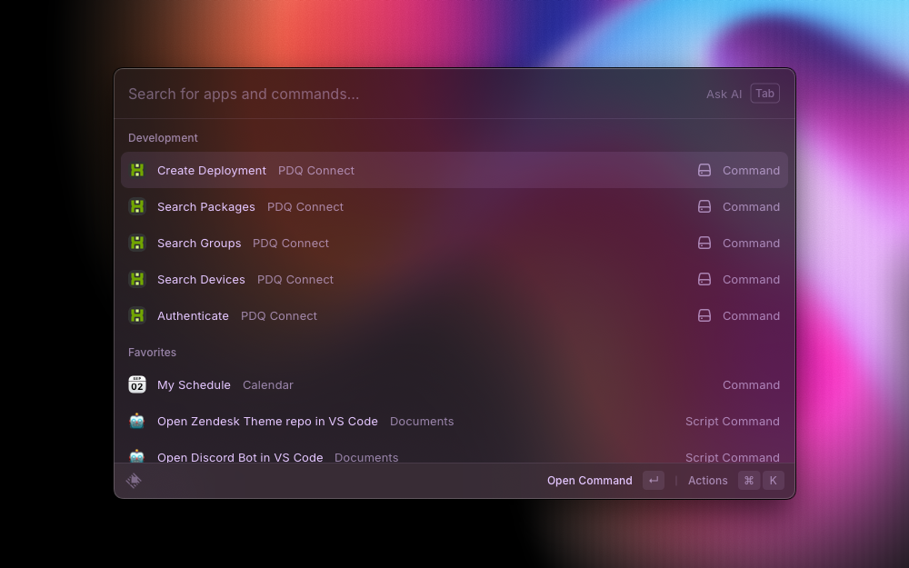
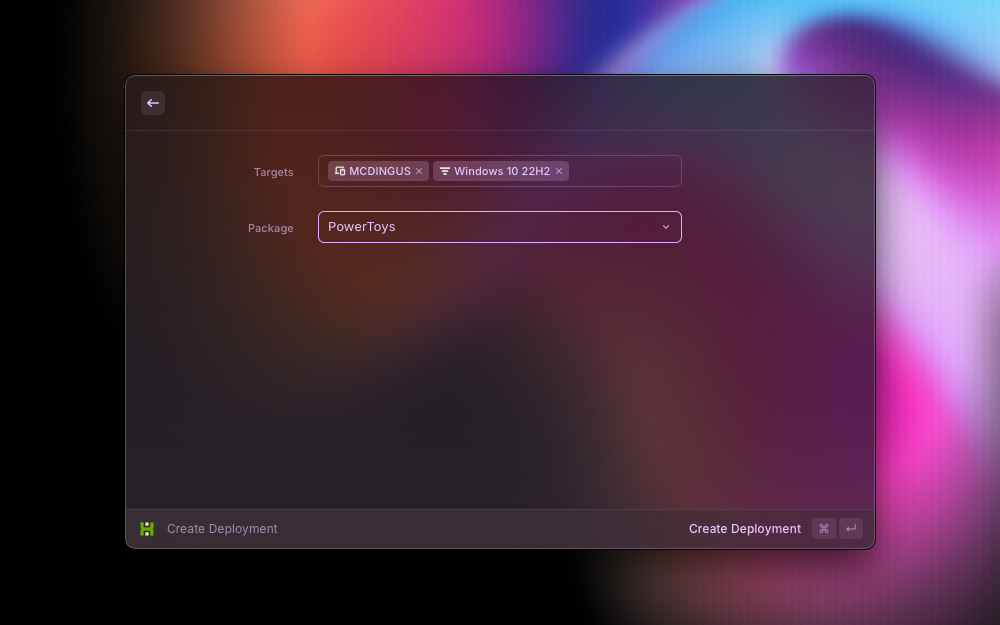
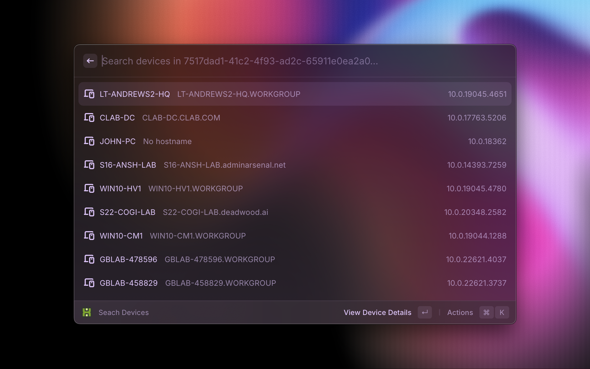
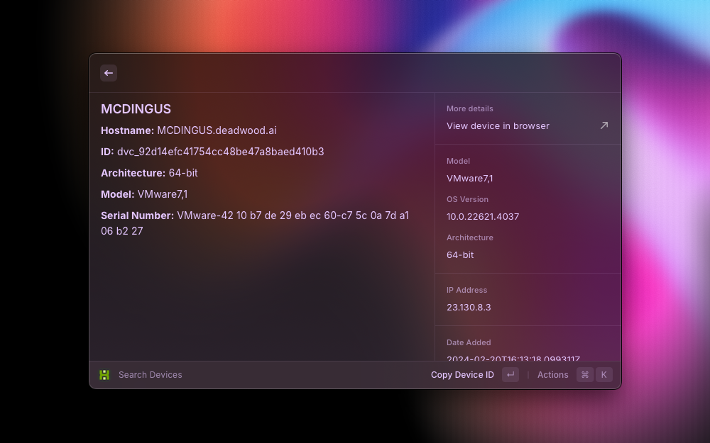
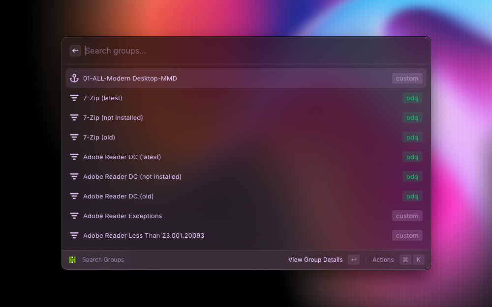
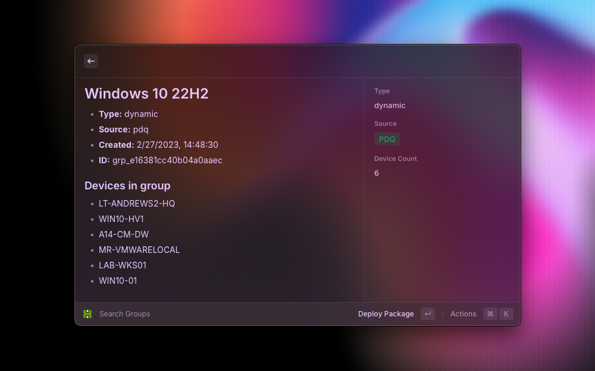
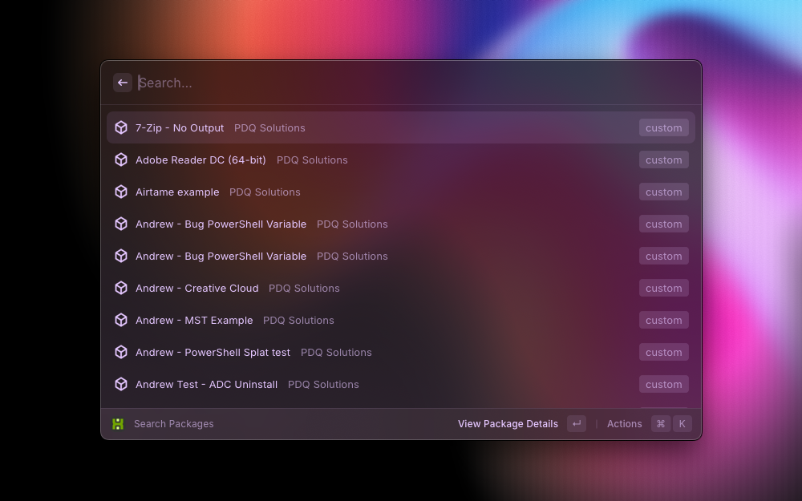
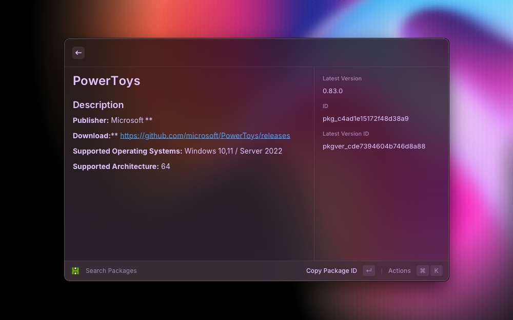
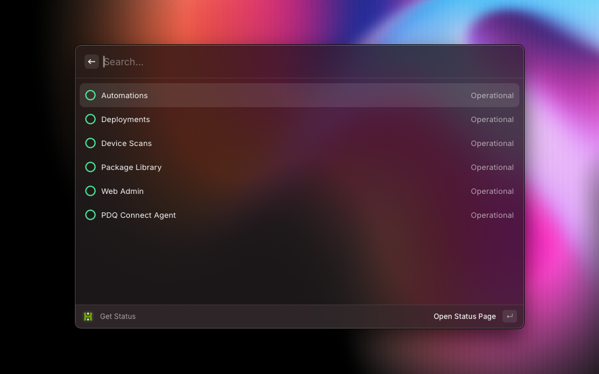

# PDQ Connect + Raycast

## Overview

This Raycast extension serves as a handy "remote control" for PDQ Connect, providing quick access to key features without trying to replace the full web application. Think of it as a streamlined companion to enhance your workflow:

Fast Access: Quickly perform common actions without opening the full web app

Productivity Boost: Access essential features right from Raycast

Complementary Tool: Works alongside the main PDQ Connect application

Focused Functionality: Optimized for speed and efficiency in daily tasks

While this extension offers convenient shortcuts, it's designed to complement—not replace—the comprehensive features available in the full PDQ Connect web application.

Use this "remote" for rapid interactions or quick glances, then seamlessly switch to the web app for more complex operations and in-depth work.

## Commands

- `Authenticate`

  - This is a required command where the API token and Org Name are configured

  - We require the Org Name because of direct links to devices requiring the org in the URL

- `Create Deployment`

  - Easily deploy a package to targets (devices and/or groups)

- `Search Devices`

  - Allow users to search for Devices, view details and initiate a deployment

- `Search Groups`

  - Allow users to search for Groups, view details and initiate a deployment

- `Search Packages`

  - Allow users to search for Packages, view details and initiate a deployment

- `Get Status`

  - Quickly view the status of PDQ Connect's individual services

Note: Each Search [Noun]command allows users to create deployments within that command. The functionality is intentionally "circular" to provide multiple ways to create a deployment.

## Current Status

The extension is fully functional and ready for testing by others. The repository is available for review below. I haven't examined the process for publishing it in Raycast's store in detail, but it seems straightforward at first glance.

## Limitations

Raycast is currently limited to macOS. As far as I can tell there are no plans to bring this to Windows and there aren't any Windows' equivalents. A PowerShell module (coming soon ™️) will most likely be the closest.

As of 9/2024, the API endpoints are limited to /deployments, /devices, /groups, /packages.

Raycast handles most of the formatting, which limits our control. We can adjust the content and some aspects of its appearance, but much of it is abstracted away from us as developers.

## Future Improvements

- Providing more links to view on the browser could be a nice QOL
- Add Status command to quickly see statuses
- Standardize list formatting
- Provide option to set nickname for org
  - GUIDs are necessary for URLs but not contextually helpful
- Provide option to create profiles
  - Allow customers with multiple orgs to quickly switch between them
- Add ability to filter within the list commands
  - Ex: Filter results by source - PDQ vs Custom
- Improve caching
- Maybe provide the option to force a sync or set a custom expiration period
- INTERNAL/DEV: Provide ability to change URL to staging
- API improvements that would be helpful:
  - More device information is accessible
  - Is device online, new, etc?
  - Custom fields
  - Etc
- Ability to interact with:
  - Packages and Groups (CRUD)
  - Vulnerability and Remote Desktop
  - Automations (CRUD)
  - Reports (CRUD)
  - Custom Scanners (CRUD)
  - Variables (CRUD)
  - Ability to determine Org Name

## Security

### Local Storage

The API token and organization name are stored securely using Raycast's LocalStorage API. This ensures that your credentials are encrypted and stored locally on your device, not on any remote servers.

### No Hardcoding

API tokens are never hardcoded in the extension's source code.

### Minimal Access

The extension only stores the necessary credentials (API token and organization name) required for its functionality.

### Password Field

The API token input uses a Form.PasswordField, which masks the input to prevent shoulder-surfing and accidental exposure.

### Input Sanitization

Both the API token and organization name are trimmed of leading and trailing whitespace before storage, reducing the risk of input-based vulnerabilities.

## Screenshots

All commands

---

Create Deployment

---

Search Devices

---

Device Details

---

Search Groups

---

Group Details

---

Search Packages

---

Package Details

---

Get Status

---
