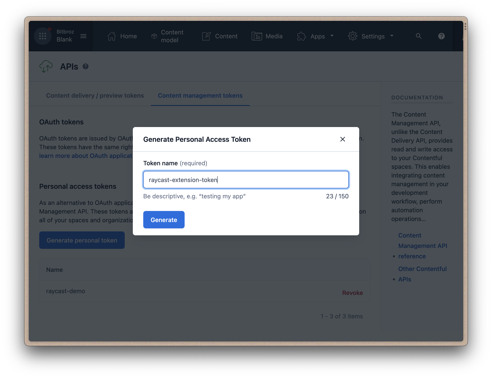

    

# Contentful

Browse and search Contentful content and assets library.

## Setup

1. Go to your Contentful account
2. Create [new personal access token](https://www.contentful.com/help/personal-access-tokens/) in `Settings -> API Keys -> Content management tokens -> Generate personal token`

3. Find your Contentful space id - https://www.contentful.com/help/find-space-id/
4. Put token and space id in extension preferences

## 🗒️ NOTE

The extension uses the default locale as `en-US` so if you are using a different locale, the extension might not work properly. This might change in the future.