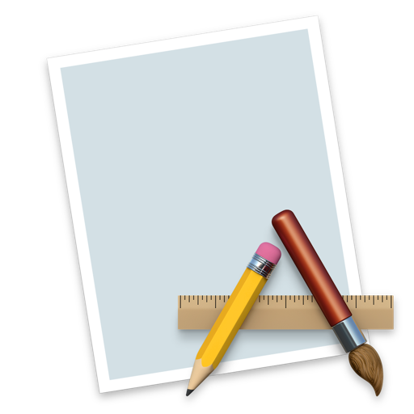

# Context Stack

Manage your mental context stack directly from Raycast. Capture what you are working on before you switch tasks, and pop it off the stack when you return.

## Features

- **Stack Push**: Capture your current context.
  - Automatically detects **Browser URLs** (Chrome, Safari, Arc, Zen, etc.) to save the specific tab.
  - Detects **iTerm2** session names.
  - Stores the window title and application for all other apps.
- **Stack Pop**: View your stack and restore context.
  - **Enter**: Copies the content to clipboard and activates the original application (or opens the URL).
  - **Cmd + Backspace**: Deletes the item from the stack.
  - **Cmd + Shift + C**: Copies the content without activating the app.

## Commands

### Stack Push
Adds a new item to the top of your stack. 

### Stack Pop
Displays your stack with the newest items at the top. 

