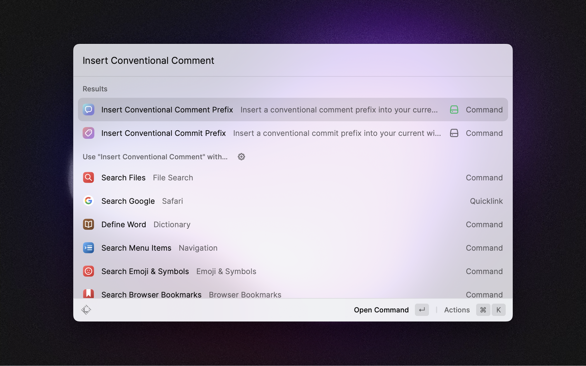
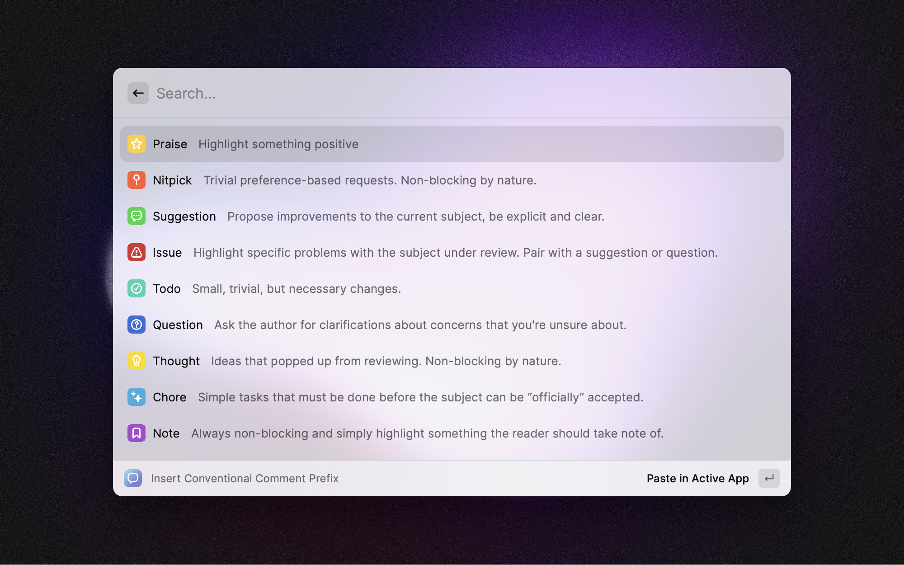

# Conventional Comments

Provides a list and description of [conventional comment](https://conventionalcomments.org) prefixes that can be inserted into the active window. Aimed at developers to provide an easy cheat-sheet of all the [conventional comment](https://conventionalcomments.org) prefixes and their meanings useful during code reviews.

