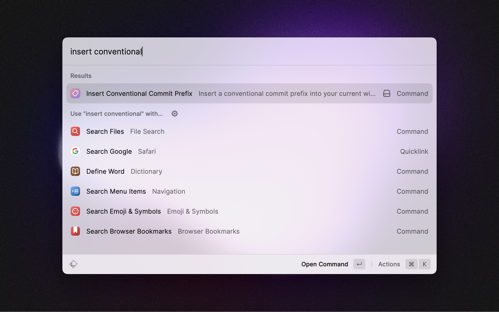
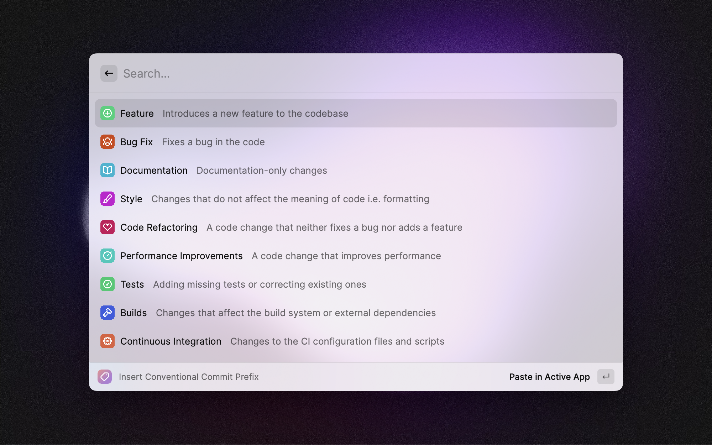

# Conventional Commits - Extension for Raycast

Provides a list and description of conventional commit prefixes that can be inserted into the active window. This is an extension written for [Raycast](https://www.raycast.com).

