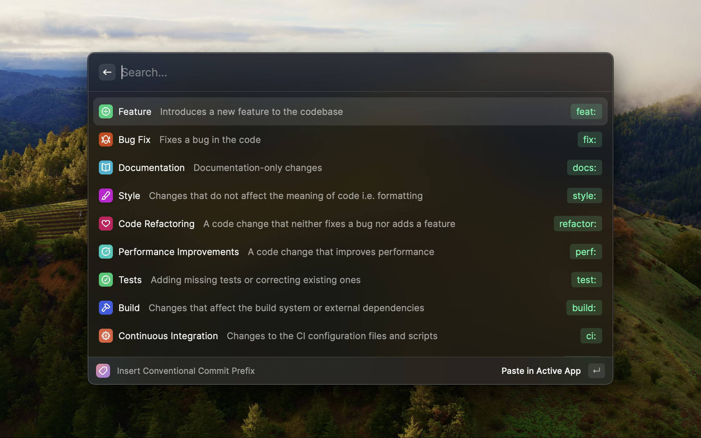
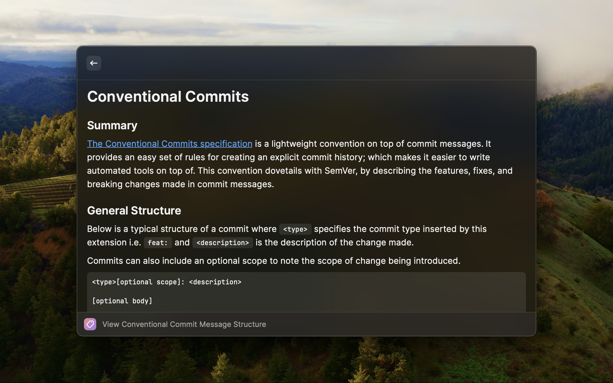

# Conventional Commits

A [Raycast](https://www.raycast.com) extension designed to provide a reference list of the possible [Conventional Commit](https://www.conventionalcommits.org/en/v1.0.0/) prefixes enriched by the [Angular Convention](https://github.com/angular/angular/blob/22b96b9/CONTRIBUTING.md#-commit-message-guidelines) which can be inserted into the active window.

Each prefix contains a brief description explaining a typical usecase, once selected Raycast inserts the prefix into your current text field.

You can also view the message structure to better understand how it can be applied in a given context.

## Usage

###  Inserting a prefix

1. Open Raycast
2. Start typing the full or partial command name (Insert Conventional Commit Prefix)
3. Select "Insert Conventional Commit Prefix" from the menu
4. Make a selection of the prefix you want to insert into the current window and press enter

###  Viewing message structure

1. Open Raycast
2. Start typing the full or partial command name (View Conventional Commit Message Structure)
3. Make a selection of the prefix you want to insert into the current window and press enter

## Available Prefixes

The following prefixes are available:

- Feature
- Bug Fix
- Documentation
- Style
- Code Refactoring
- Performance Improvements
- Tests
- Build
- Continuous Integration
- Chore
- Revert

Something missing? Raise an issue in the repo [here](https://github.com/niemtec/conventional-commits/issues)!
