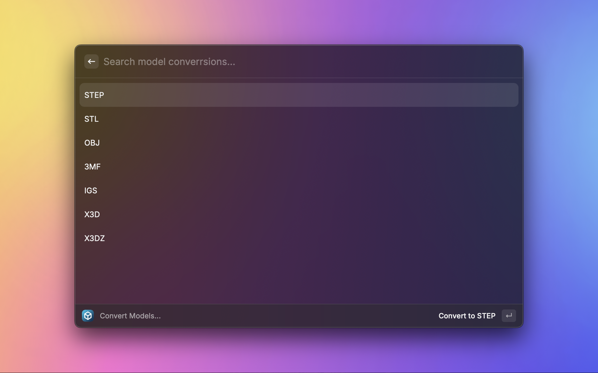
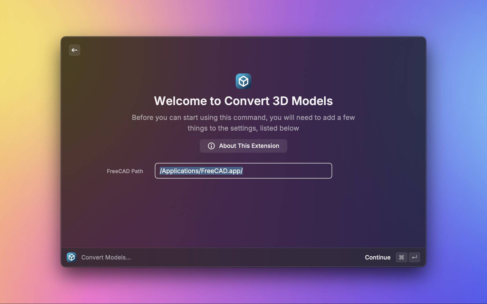

# Convert 3D Models

Effortlessly convert between various NURBS/Parametric and mesh 3D model formats, including STEP, STL, OBJ, and more.

## Features

* **Multiple Format Support**: Seamlessly convert across a range of 3D model formats such as STEP, STL, OBJ, IGS, and X3D.
* **Powered by FreeCAD**: Leverage the robust [OpenCASCADE](https://wiki.freecad.org/OpenCASCADE) engine of [FreeCAD](https://www.freecad.org/index.php) for all conversions.
* **NURBS and Mesh Conversion**: Easily transform NURBS models to Mesh formats and vice versa.
* **Quick conversions to popular formats**: Quickly convert your models to popular formats with direct conversion commands.



## Commands

* Convert Models...
  * Convert selected 3D model files from one format to another
* Quick Convert to STL
  * Quickly convert the selected 3D models to STL
* Quick Convert to OBJ
  * Quickly convert the selected 3D models to OBJ
* Quick Convert to STP
  * Quickly convert the selected 3D models to STP

## Installation

This extension relies on having [FreeCAD](https://www.freecad.org/) installed on the machine. You will be prompted to specify the path that FreeCAD is installed.



It's recommended to open FreeCAD at least once after installation so that MacOS can verify the installation.

### Downloading FreeCAD

Download the latest version of FreeCAD from the [official downloads page](https://www.freecad.org/downloads.php). Once the file is downloaded:

1. Mount the disk image file.
2. Drag the FreeCAD application to your preferred folder, such as the Applications folder.

To launch FreeCAD, double-click the app. If you encounter a message stating "FreeCAD can't be opened because it is from an unidentified developer," follow these steps:

1. Navigate to the Applications folder.
2. Right-click the FreeCAD app and select "Open."
3. Click "Open" in the dialog to confirm.

**Note:** This extension functions independently of the FreeCAD GUI and utilizes FreeCAD's command-line and Python interfaces. You do **not** need to have FreeCAD opened to use this extension.

### Homebrew Installation

Alternatively, you can install FreeCAD using [Homebrew](https://brew.sh/), a package manager that helps you manage software installations and updates on macOS. After installing Homebrew, install FreeCAD by running the following command in your terminal:

```shell
brew install freecad
```

---

## Thanks

Special thanks to Stephen Kaplan <skaplanofficial@gmail.com> for creating [SIPS](https://github.com/raycast/extensions/tree/b415b8a9013e8569f788e5b7fc01a171a4f038d9/extensions/sips) on which this extension was heavily based.

Further credit to [faeiretree on Github](https://github.com/faerietree/freecad_convert) for his work on `freecad_convert`, which laid the groundwork for this FreeCAD conversion functionality.
