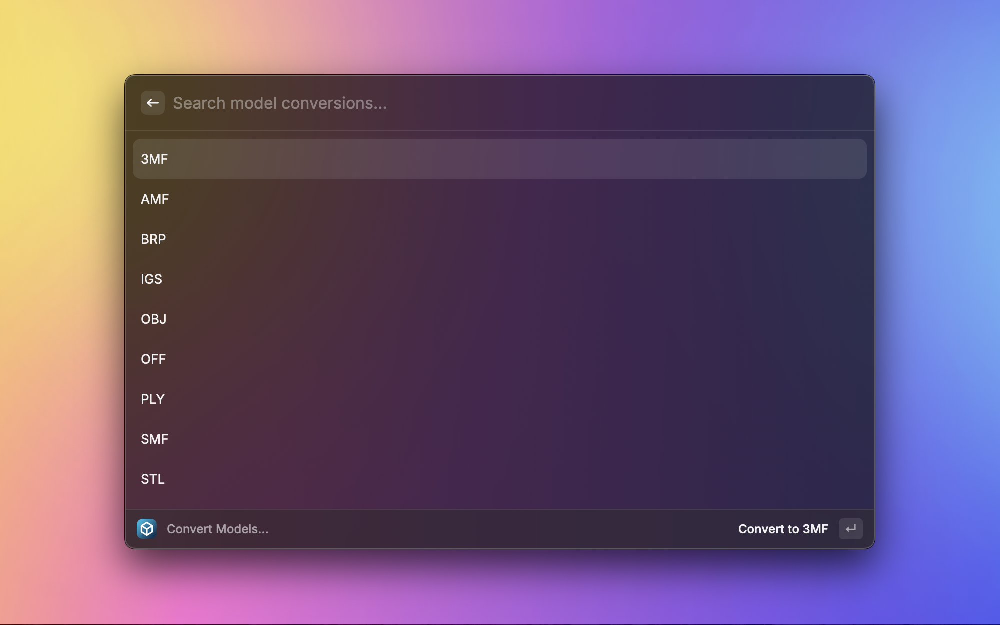

# Convert 3D Models

Convert between various NURBS and mesh 3D model formats, such as STEP, STL, OBJ, and others.

## Features

* Convert between various 3D model formats, including IGS and X3D
  * All conversions powered by [FreeCAD](https://www.freecad.org/index.php)'s powerful OpenCascade engine
* Convert from NURBS -> Mesh and Mesh -> NURBS



## Installation

This extension relies on having [FreeCAD](https://www.freecad.org/) installed on the machine. You will be prompted to specify the path that FreeCAD is installed.


### Installation through Web

You can download and follow the FreeCAD installation packages from [FreeCAD's Downloads page](https://www.freecad.org/downloads.php). 

This is the recommended way of installing FreeCAD for ease of installation. The FreeCAD installer is provided as a app package (.app) enclosed in a disk image file.

You can download the latest installer from [FreeCAD's Downloads page](https://www.freecad.org/downloads.php) page. After downloading the file, just mount the disk image, then drag it to the Application folder or a folder of your choice.

That's it. Just click on the app to launch FreeCAD. If you have this message "FreeCAD can't be open as it is from unidentified developer." Open the folder (Application) and right click on the app then click open and accept to open the application.

You do **not** need FreeCAD open to use this extension, as it relies on FreeCAD's command line interface and its Python interface.

### Installation through `brew`

You can also use a package manager such as HomeBrew to keep your software updated. Instructions to install HomeBrew can be seen [here](https://brew.sh/). When HomeBrew installed you can simply install FreeCAD through your bash terminal with:

```brew install freecad```

## Warnings

Warning: This extension is not compliant with the Terms of Service of FreeCAD. Use at your own risk.

## Thanks

Special thanks to Stephen Kaplan <skaplanofficial@gmail.com> for creating [SIPS](https://github.com/raycast/extensions/tree/b415b8a9013e8569f788e5b7fc01a171a4f038d9/extensions/sips) on which this extension was heavily based.

Further credit to [faeiretree on Github](https://github.com/faerietree/freecad_convert) for his work on `freecad_convert` which formed the basis of the FreeCAD conversion.