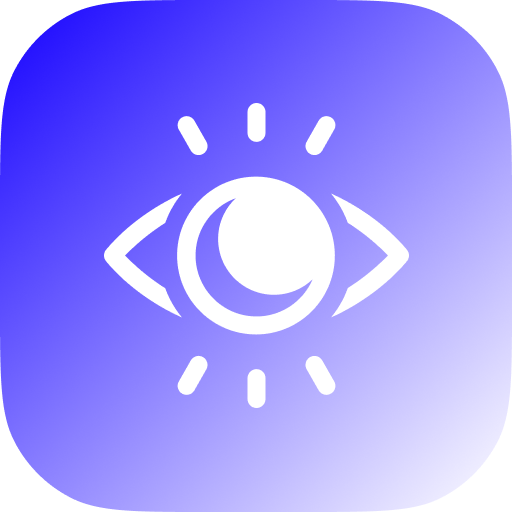
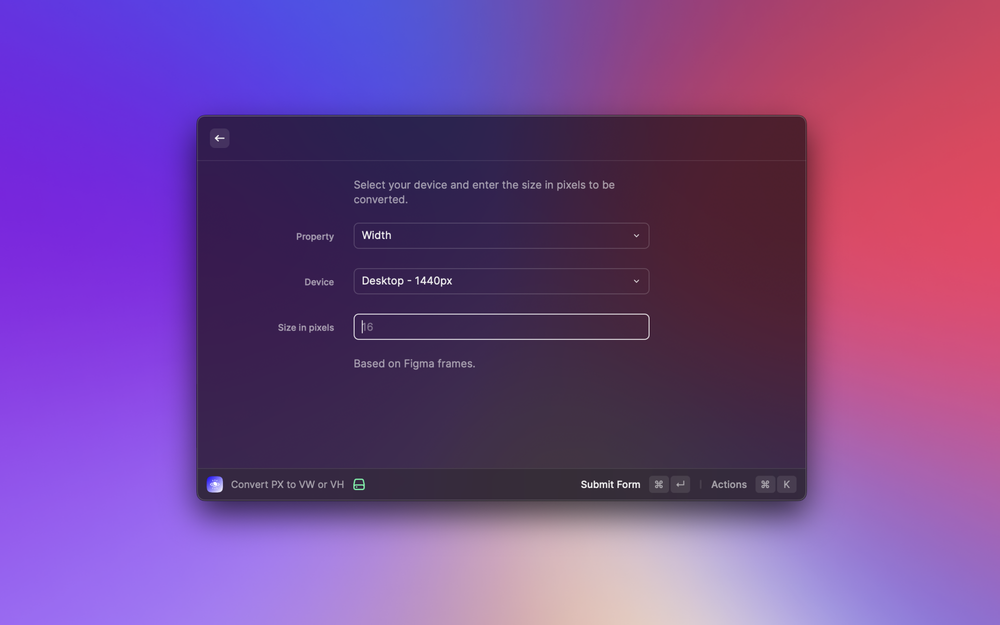
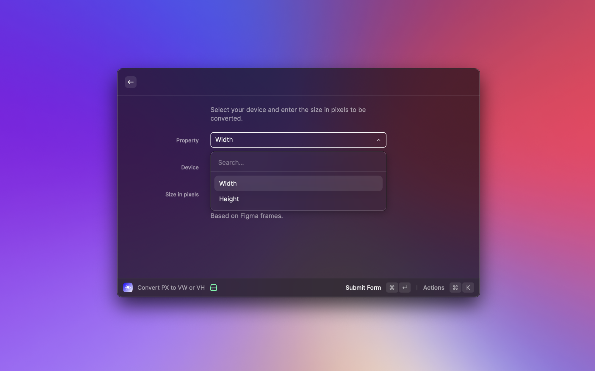
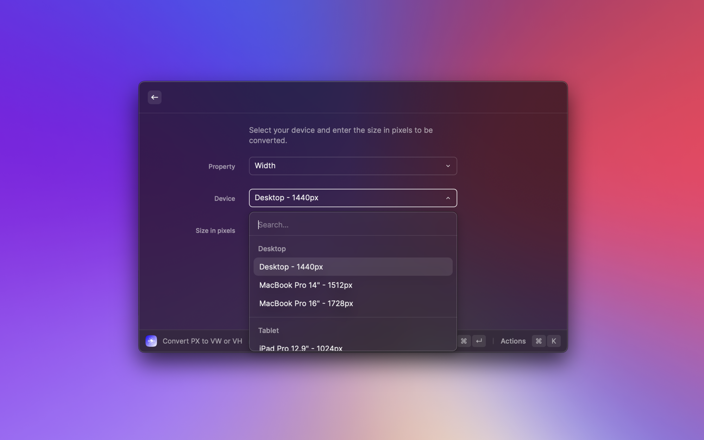
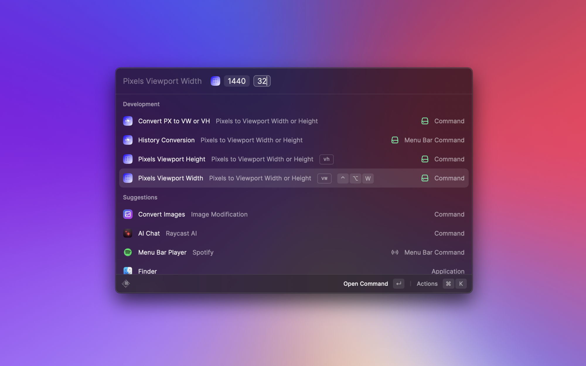
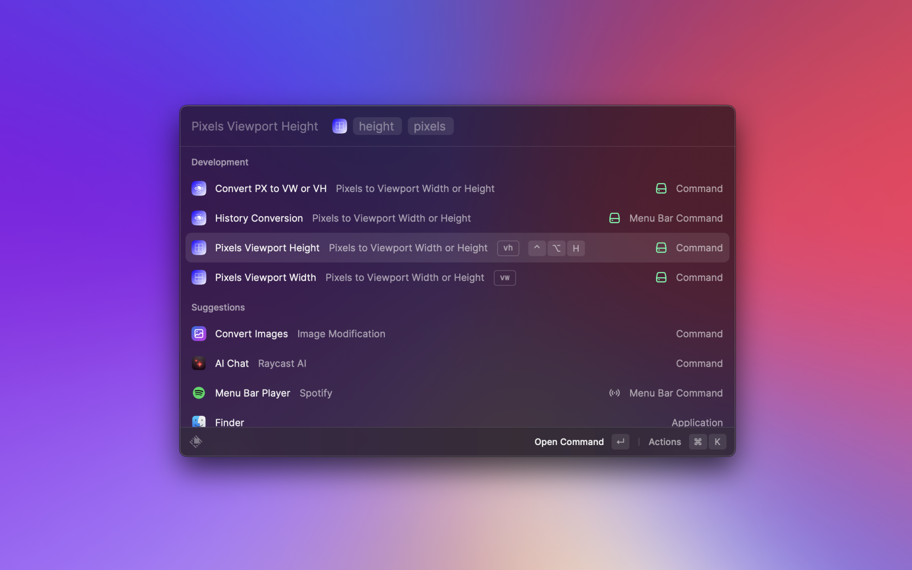

# Raycast Extension: Pixels to Viewport Width or Height

A Raycast extension that converts pixel values to viewport units (vw/vh) based on the chosen viewport size.

## Features

- Precise conversion of pixels to vw (viewport width) or vh (viewport height) based on the selected viewport size.
- Converted values are directly copied to the clipboard for quick and convenient use.

## Screenshots

_Screenshots of the extension in action_

## Installation

1. Make sure you have [Raycast](https://www.raycast.com) installed on your system.
2. Open Raycast and navigate to the "Extensions" tab.
3. Click on the "Add Extension" button.
4. Search for "Pixels to Viewport Width or Height" and install the extension.

## Usage

1. Launch Raycast.
2. Search and select "Convert PX to VW or VH".
3. Choose between viewport width or height.
4. Then choose your desired currency.
5. Enter the pixel value you want to convert.
6. The converted value in vw/vh will be automatically copied to the clipboard.

## Contribution

Contributions are welcome! If you want to improve this extension or add new features, feel free to open a pull request.

## License

This project is licensed under the MIT License. Please see the [LICENSE](LICENSE) file for more details.

---

**Note:** This extension was developed by Atiipik and ThoPel.
