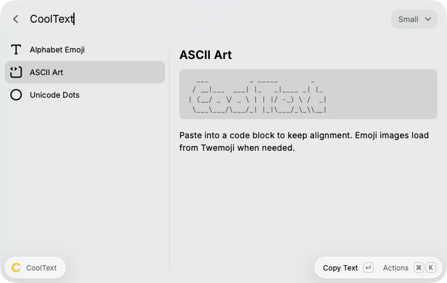
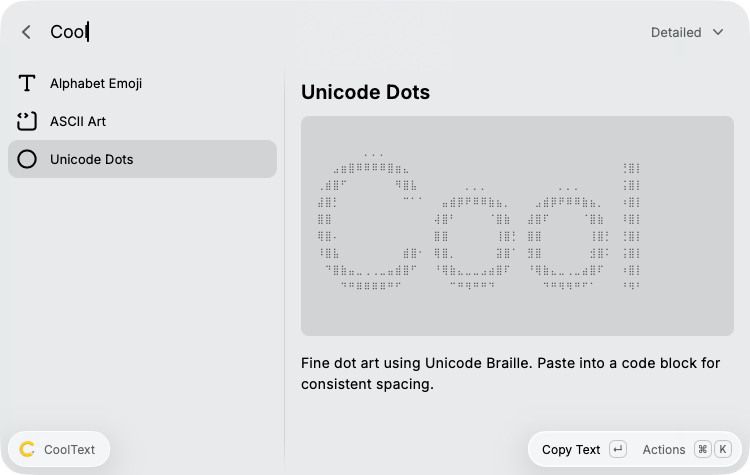
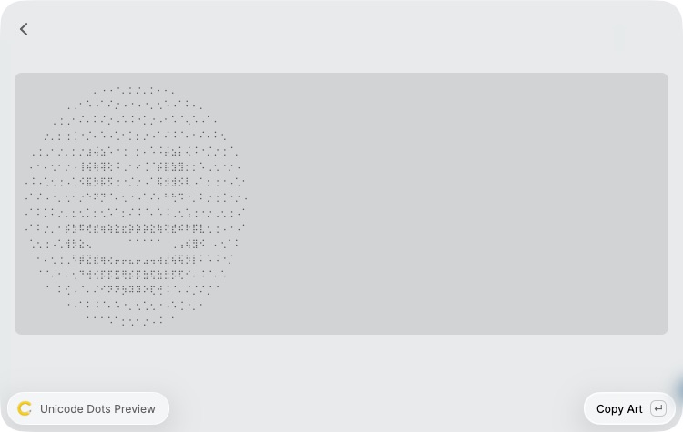

# CoolText

Turn text, emoji, or images into copyable art directly in Raycast.

## CoolText

Type in the search field and see the result immediately. Three styles are available:

- **Alphabet Emoji:** original alternating yellow and white custom emoji codes.
- **ASCII Art:** compact text banners and emoji pictures rendered with ASCII characters.
- **Unicode Dots:** text and emoji rendered with 2×4 Unicode Braille cells and Floyd-Steinberg dithering for finer detail.

Press **Tab** or **Shift-Tab** to switch styles. Up/Down also works. **Enter** copies the selected result and closes Raycast. Text stays focused while switching. Empty input shows a labeled example; it never copies the example. Loading and failed previews cannot overwrite your clipboard.

In ASCII mode, choose **Small**, **Standard**, **Slant**, or **Big** from the font dropdown. Small is the compact default. Text wraps at 60 columns and removes trailing whitespace and empty edge rows. Paste into a code block or monospace field to preserve alignment. Emoji pictures appear as separate blocks in input order, including joined emoji and skin tones.





### Quick input

The fast route uses the same **CoolText** command: press Tab in Raycast search to enter optional text, choose the style and ASCII font, then press Enter. The transformed result copies automatically. Root Search uses Raycast's normal Tab navigation between arguments; Tab cycles styles inside CoolText.

Set a short alias such as `ct` in Raycast Settings > Extensions for faster access.

### Image to Text Art

Inside CoolText, open **Image to Text Art** from Actions (Command-I on macOS). Choose an image file, choose Unicode Dots or ASCII, select Compact (32 columns) or Detailed (56 columns), and optionally invert contrast. Use the **Preview Art** action (Command-Enter on macOS), then Enter to copy the preview. Escape returns to the form to adjust it.

PNG and JPEG are supported. Images must be smaller than 20 MB, at most 16 megapixels, and no more than 8192 pixels on either side. Dimensions are checked before decoding. Character proportions are corrected and tall output is capped at 64 rows. Simple subjects and strong contrast give the clearest results. The action **Use Copied Image File** accepts copied files; raw clipboard screenshots must first be saved as PNG.



## Install locally

Requires Raycast and Node.js 22.22.2 or later.

```sh
npm ci
npm run dev
```

Raycast imports the extension automatically. The manifest author is the Raycast account `pho_huynh`. Maintainers can submit updates for Store review with `npm run publish`; submission does not make an extension immediately available in the Store.

## Original format and compatibility

For `hi`, Alphabet Emoji copies `:alphabet-yellow-h::alphabet-white-i:`. It preserves plain ASCII letter case and alternates colors by UTF-16 input position, including punctuation and spaces. Each ordinary space becomes three spaces. Vietnamese letters map to lowercase Telex emoji names: `ậ` becomes `aaj`, `ư` becomes `uw`, and `đ`/`Đ` become `dd`. Composed (NFC) and decomposed (NFD) input are supported; color positions still follow the original UTF-16 input. Unsupported letters such as `ñ`, `î`, and `ĉ` pass through unchanged.

The receiving workspace needs matching `alphabet-yellow-*` and `alphabet-white-*` custom emoji, including the corresponding Vietnamese Telex names. Use lowercase input if uppercase emoji codes are unavailable.

ASCII banners support printable English ASCII characters and line breaks, plus emoji through the picture conversion path. Other scripts and accented text currently show an error rather than being silently removed; Alphabet Emoji converts supported Vietnamese letters and preserves other scripts.

## Privacy and credits

Text banners and image-file conversion run locally with no API key. Your image files and typed text are not uploaded. Emoji conversion downloads the corresponding public Twemoji PNG from jsDelivr on demand. The URL contains only the emoji's code points. Up to 64 rendered emoji are cached in memory for the current command session; uncached emoji require a connection.

ASCII and Unicode dot input accepts up to 8 emoji per render. Emoji requests start together, each with a 15-second timeout, and results retain input order. Alphabet Emoji has no emoji-count limit.

Unicode dot text defaults to **Detailed**; choose **Compact** for smaller output. Letters retain their size as text grows, wrapping at word boundaries or splitting long words without dropping characters. Line breaks are preserved. Each text block accepts up to 500 characters.

The Unicode dot text renderer uses the bundled Open Sans bitmap font under its [Apache 2.0 license](assets/fonts/LICENSE.txt).

Emoji graphics: [Twemoji 17.0.3](https://github.com/jdecked/twemoji/tree/v17.0.3), licensed [CC BY 4.0](docs/TWEMOJI-LICENSE.txt). The emoji artwork is converted to ASCII; `docs/emoji-example.png` is an unmodified example. The extension code has its own MIT license.

## Development

```sh
npm run build
npm run typecheck
npm test
npm run lint
```

Build generates Raycast argument types. `ray lint` additionally validates the Raycast author account online. The extension declares macOS and Windows support through Raycast's APIs; native verification was performed on macOS with Raycast v2.2.1.0.

[Research notes: other text formats](docs/text-formats.md) · [Renderer comparison](docs/rendering-comparison.md)

## References

- [Original browser converter](https://github.com/duynguyen1105/extension)
- [Raycast command arguments](https://developers.raycast.com/information/lifecycle/arguments)
- [Raycast Clipboard API](https://developers.raycast.com/api-reference/clipboard)
- [FIGlet font rendering](https://github.com/patorjk/figlet.js)
- [Jimp image processing](https://jimp-dev.github.io/jimp/)
