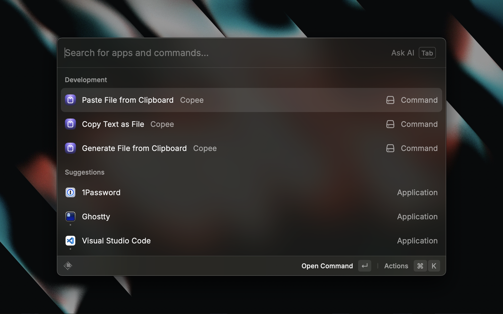

# Copee

Copee provides three commands:

### Copy Text as File
This copies the current selected text as file.

### Generate File from Clipboard
It generates and copies a text file from last entry in your clipboard.
      
### Paste File from Clipboard
It generates a text file from last entry in your clipboard and pastes it into the selected area.

## Preferences
- **File Name** is the name of the file that will be generated.
- **Show the file in Finder** if checked will open the finder when the file is created.
- **File Directory** the directory the file will be saved. By default and if empty or "\", the temp directory of the file system will be used.

