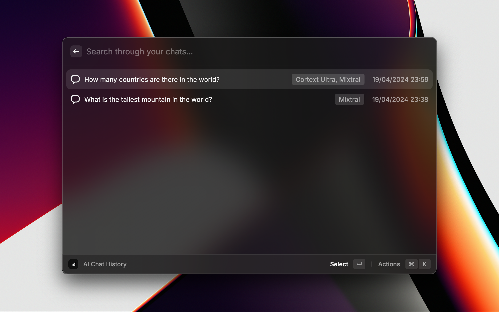

    

<h1 align="center">Corcel</h1>

<h3 align="center">
    AI Chat and Image Generation at your fingertips. 
    Use more AI powered applications on <a href="https://corcel.io">Corcel.io</a>
</h3>

## Getting Started

- Install the extension :)

- Generate an API key [here](https://app.corcel.io/dashboard/api-keys) and copy it to your clipboard

- When you open any command, you will be greeted with this screen. Paste in your API key. If you don't see this, you can always update this in the extension preferences.

- That's it! You are good to go.

## Features

### AI Chat

Chat with a variety of models hosted on the bittensor network. AI chat featues: Getting responses from different models while preserving context, a locally stored chat history, copy/paste question and answer, chat deletion etc.

### Generate AI Image

Generate, save and download images with a variety of models

## Preferences

You have customization options for chat and image generation. Some customizations are command specific while some are affect all commands in the extension.

### Extension preferences

| Title                      | Values                 | Default     | Description                                               |
| -------------------------- | ---------------------- | ----------- | --------------------------------------------------------- |
| API Key                    | _user-provided_        | _N/A_       | Your API Key from Corcel                                  |
| Chat Model                 | Cortext Ultra, Mixtral | Mixtral     | The model that will be used for generating chat responses |
| Image Download Destination | _user-defined path_    | ~/Downloads | All images you download, will go into this folder         |

### Image Generation Command preferences

| Title            | Values                           | Default | Description                                                                                                                                                                                                             |
| ---------------- | -------------------------------- | ------- | ----------------------------------------------------------------------------------------------------------------------------------------------------------------------------------------------------------------------- |
| Model            | Proteus, Dreamshaper, Playground | Proteus | Choose between Proteus, Playground and Dramshaper                                                                                                                                                                       |
| Number of Images | _1-3_                            | 2       | The default number of images generated at once. Note: value is clamped at 3                                                                                                                                             |
| Width            | _Multiples of 64 from 512-1344_  | 1024    | The width of generated images                                                                                                                                                                                           |
| Height           | _Multiples of 64 from 512-1344_  | 1024    | The height of generated images                                                                                                                                                                                          |
| Guidance Scale   | _1-3_                            | 2       | How similar the image will be to your prompt. Higher values make the image closer to your prompt, with slightly lower quality. Note: value is clamped at 3                                                              |
| Steps            | _0-1_                            | 0.3     | The closer this value is to 1, the more steps the model will take in the image generation process. Note: This value is converted and rounded to the actual engine values _Proteus/Dreamshaper: 6-12, Playground: 25-51_ |
