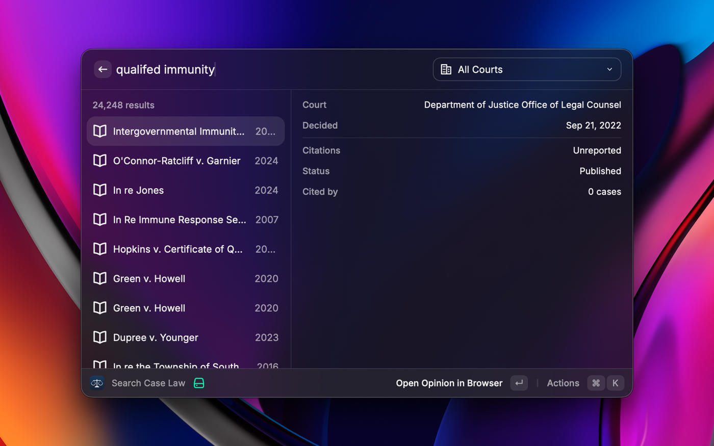
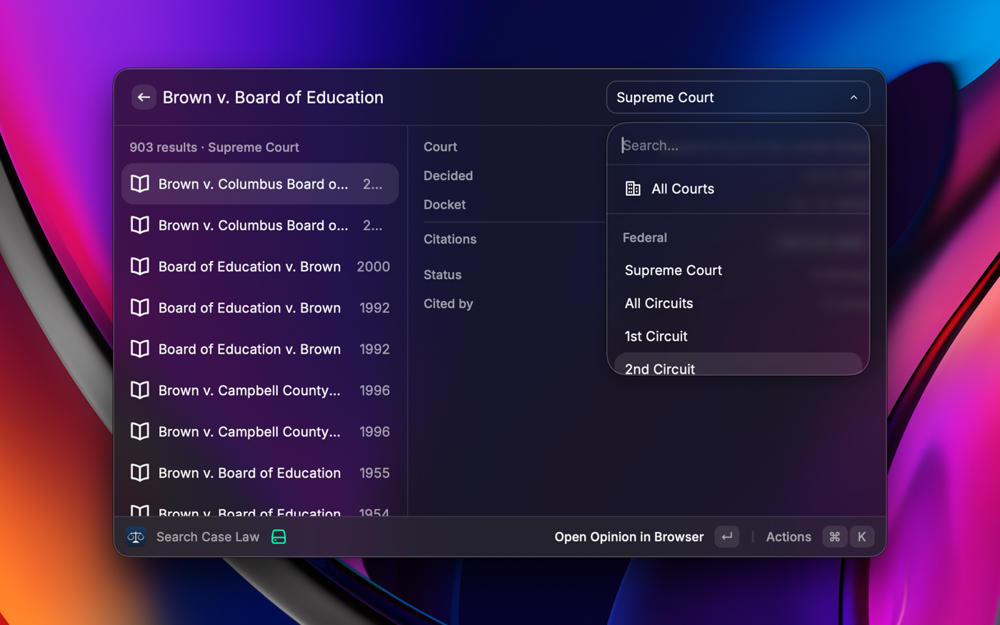

# CourtListener Search

Search [CourtListener](https://www.courtlistener.com)'s free database of US court opinions from Raycast, and open, copy, or cite a case without touching the browser.



## Setup

You need a CourtListener API token. It's free.

1. Create an account at [courtlistener.com](https://www.courtlistener.com/register/).
2. Copy your token from [courtlistener.com/profile/api-token/](https://www.courtlistener.com/profile/api-token/).
3. Paste it into the extension's preferences on first run.

Students and academics can request a free [EDU membership](https://www.courtlistener.com/help/api/rest/#permissions) for higher limits.

## Searching

Type a query and press `↵`. Results come back with the court, decision date, and citation.

Open the command with an empty search bar and your saved cases and recent searches are waiting instead — `↵` opens a saved case or re-runs a past search.

Searches run on `↵` rather than as you type, because the free tier allows only a handful of requests a minute.

### By citation

Type or paste a citation — `410 U.S. 113`, `125 F.4th 23`, even `Roe v. Wade, 410 U.S. 113 (1973)` — and the top row offers to look it up. You get the one case, not several thousand text matches. `⌘⇧↵` searches it as ordinary text instead.



### By meaning

`⌘⇧M` searches on what your query means rather than which of its words appear. Worth it for a question, pointless for a case name.

Asking *can police search a car after arresting the driver* the ordinary way turns up cases named *State v. Police* and *Turner v. Driver*. Asking by meaning turns up vehicle-search cases.

It takes a few seconds longer, so `↵` stays on the ordinary search. If one comes back empty, the other is offered. The option is hidden for citations and for advanced query syntax, which it can't read.

### Filtering

The dropdown narrows to a court: the Supreme Court, any federal circuit, all thirteen at once, any state court of last resort, or all of those together. `⌘⇧Y` sets how far back to look, `⌘⇧X` clears both.

Filters reset when you close the command, so you never come back tomorrow to quietly narrowed results.

Only published opinions are searched — an unpublished disposition won't appear even when CourtListener has it.

## On a result

| | |
|---|---|
| `↵` | Open the full opinion on CourtListener |
| `⌘⇧D` | Show or hide the detail pane |
| `⌘⇧P` | Save the case, or unsave it |
| `⌘⇧C` | Copy the citation |
| `⌘⇧N` | Copy the case name |
| `⌘R` | Search again, ignoring the cache |

The detail pane shows the court, decision and argument dates, docket number, judges, every parallel citation, publication status, and how many later cases cite it — alongside the passage your query matched, with your terms in bold.

A few courts also write a summary of the case, and where one exists it leads the pane. Most don't, so most cases won't have one.

## Saved cases and history

`⌘⇧P` keeps a case. Saved cases sit at the top of the landing page with their citation, ready to open or copy, and never expire.

Recent searches sit below them. `↵` runs one again, `⌘⌫` drops it, `⌘⇧⌫` clears them all. Typing filters the list, so a past search is usually a few characters away. The last 20 are kept for 30 days.

## Rate limits

CourtListener's free tier is tight, so the extension tries not to spend requests:

- Searches run on `↵`, never as you type.
- Results are cached for 30 minutes. Repeating a search inside that window costs nothing, and `⌘R` forces a fresh one. Published opinions don't change, so stale results aren't a real risk.
- Opening the command never fires a request, and neither does re-running a recent search that's still cached.
- Failed requests are never cached.
- Citation lookups are throttled separately by CourtListener, so checking a citation never eats a search.

Go over anyway and the extension says so plainly, and counts down how long you have to wait.

## Development

```bash
npm install
npm run dev
```

`npm run dev` opens the command in Raycast with hot reload. `npm run lint` runs the Raycast lint rules, and `npm run publish` opens a store submission PR against `raycast/extensions`.
