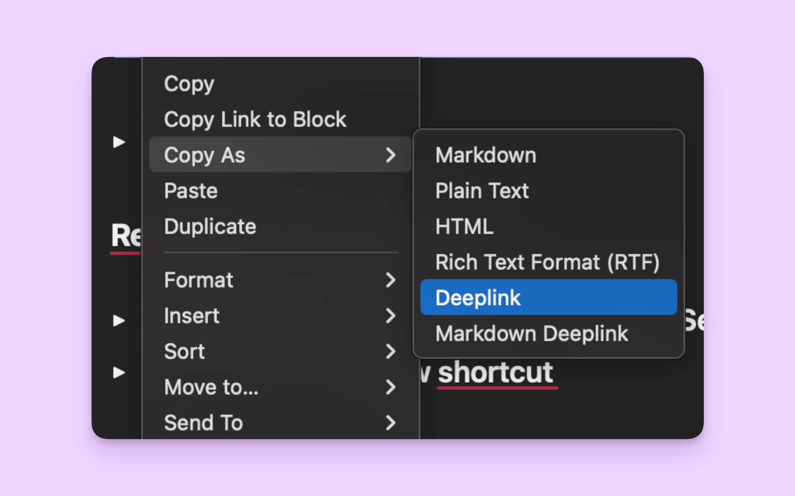

# Craft for Raycast

The Craft extension for Raycast brings powerful document search and daily notes management directly to your command bar, reducing context switching and improving productivity.

## Requirements

You need [Craft](https://www.craft.do/) installed on your Mac for this extension to work. The extension supports both regular and Setapp versions of Craft.

## Features

### 🔍 Block Search

Search through all your Craft documents across all locally available spaces with fast full-text search.

- Search document content, titles, and blocks
- Results from all spaces are included
- Jump directly to documents in Craft

### 📅 Daily Notes

Quick access to your daily notes with smart navigation.

- Browse daily notes by date
- Jump to today's note instantly
- Navigate to any date's daily note by exact date or natural expression (e.g., last Monday)

### ✍️ Add to Daily Note

Add content to your daily note without leaving Raycast.

- Quick text entry with basic markdown formatting (headlines, lists, links)
- Optional timestamp insertion with custom time formatting (HH:mm, h:mm A, etc.)
- Configurable content prefix and suffix
- Choose to add at beginning or end of note

### 🏷️ Manage Spaces

Organize your Craft spaces for better workflow.

- Rename your spaces
- Enable or disable spaces extension-wide
- Consistent space names across all commands
- Primary space cannot be disabled for safety

#### How to Find Your Space IDs

When you first open the Manage Spaces command, you'll see cryptic Space IDs like `1ab23c45-67de-89f0-1g23-hijk456789l0`. Here's how to identify which space is which:

1. **Open Craft** and navigate to the space you want to identify
2. **Right-click on any block** or document within that space
3. **Select "Copy As" → "Deeplink"** from the context menu
4. **Extract the Space ID** from the copied deeplink URL (the long string after `spaceId=`)

> **💡 Tip**: The tutorial will automatically show on your first visit to Manage Spaces, and you can access it anytime via the action menu (⌘K → "Show Space ID Tutorial").

Once you know which ID corresponds to which space, you can rename them for better organization.

## Commands

| Command | Description |
|---------|-------------|
| **Blocks Search** | Search across all your Craft documents and blocks |
| **Daily Notes** | Navigate to and manage your daily notes |
| **Add to Daily Note** | Add content to today's daily note |
| **Manage Spaces** | Rename spaces and control their visibility |

## Configuration

### Application Selection

If you have multiple versions of Craft installed (regular and Setapp), you can specify which one to use in the extension preferences.

### Search Preferences

- **Detailed View**: Toggle between compact and detailed search results
- Shows document content as a simplified preview

### Daily Note Formatting

Customize how timestamps and content are formatted:

- **Time Format**: Use patterns like `HH:mm` (14:30), `h:mm A` (2:30 PM), or `HH:mm:ss` (14:30:45)
- **Position**: Add content at the beginning or end of your daily note
- **Prefix/Suffix**: Customize text around your content

### Daily Notes Preferences

- **Append Position**: Choose whether new content goes at the beginning or end
- **Add Timestamp**: Automatically include current time with new entries
- **Content Prefix/Suffix**: Add custom text before and after your content

### Space Management

- **Custom Names**: Give your spaces names instead of using Space IDs
- **Space Filtering**: Use the dropdown in search commands to filter by specific spaces
- **Enable/Disable**: Hide unused spaces from all commands while keeping them accessible in Craft
- **Persistent Settings**: Your space preferences are saved and synchronized across all commands

## How It Works

The extension uses Craft's local SQLite database to provide fast, offline search across all your documents. It leverages full-text search (FTS5) for efficient querying and supports all spaces that Craft has synced locally.

Since Craft does not yet provide an API, all functions related to document creation are implemented through [Craft's URL Scheme](https://support.craft.do/hc/en-us/articles/360020168838-Using-URL-Scheme).

## Troubleshooting

### Search Results Not Appearing

Ensure Craft is installed and has synced your documents. The extension can only search through documents once the local database is set up.

### Multiple Craft Versions

If you have both regular and Setapp versions installed, specify your preferred version in the extension preferences under "Application to search in".

### Performance Issues

The extension performs best when Craft has finished syncing. Large document collections may take a moment to index initially.

### Space Management Issues

If renamed spaces don't appear correctly, try refreshing the extension or restarting Raycast. Space settings are stored locally and persist between sessions.

## Previous Developer / Maintainer
This extension was originally developed by [Vitaliy Kudryk](https://github.com/kudrykv) and is currently maintained by [Samuel François](https://github.com/sfkmk).

## Disclaimer
This project is not affiliated, associated, authorized or in any way officially connected with Craft Docs. The official website can be found at [https://www.craft.do](https://www.craft.do). "Craft Docs" as well as related names, marks, emblems and images are registered trademarks of their respective owners.
